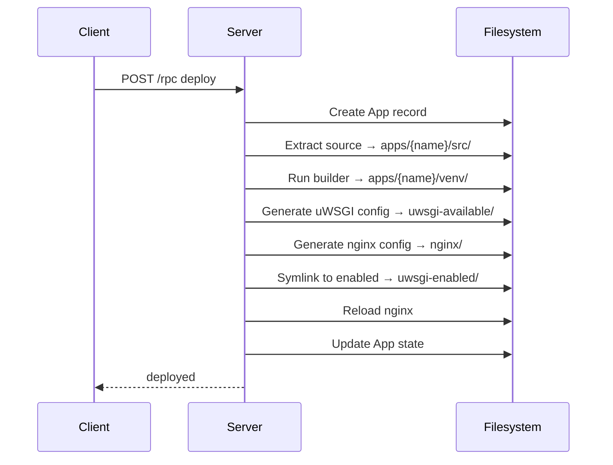
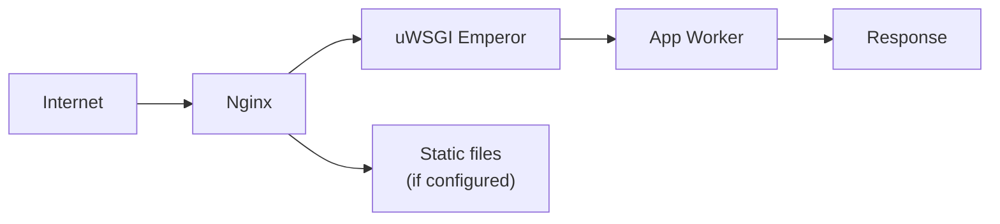

# hop3-server Deep Dive

This document provides detailed internal documentation for the hop3-server package. For a quick overview, see the [package overview](index.md).

## Architecture Overview

hop3-server is the central orchestrator for the Hop3 PaaS. It handles:

1. **API Layer** - JSON-RPC over HTTP via Litestar
2. **Command Handlers** - Business logic for each operation
3. **Deployment Pipeline** - Build and deploy applications
4. **Plugin System** - Extensible architecture via pluggy
5. **Process Management** - uWSGI configuration and lifecycle
6. **Proxy Configuration** - Nginx/Caddy/Traefik setup

## Module Structure

### Server Layer (`hop3/server/`)

The ASGI application built on Litestar:

```
server/
├── asgi.py              # Application factory
├── cli/                 # Server CLI (serve, db, git, plugins, setup, ...)
├── controllers/
│   ├── auth.py          # Authentication endpoints
│   ├── dashboard/       # Dashboard API
│   ├── rpc.py           # JSON-RPC endpoint
│   ├── stream.py        # Streaming / log-tail endpoint
│   └── root.py          # Root routes
├── security/
│   ├── tokens.py        # JWT token handling
│   └── rate_limit.py    # Request rate limiting
├── middleware/          # ASGI middleware
└── lib/
    ├── database.py      # DB session helpers
    └── scanner.py       # Command / plugin auto-discovery
```

### Command Layer (`hop3/commands/`)

RPC command handlers implementing business logic:

```
commands/
├── app.py       # Single-app operations (logs, deploy, restart, ...)
├── apps.py      # App listing / lifecycle across all apps
├── auth.py      # Authentication commands
├── config.py    # Environment variable management
├── services.py  # Addon / service management
├── git.py       # Git operations
├── domains.py   # Domain management
├── system.py    # Server status / info / cleanup
└── misc.py      # Utility commands
```

Each command is a `Command` subclass, registered with `@register` and
dispatched by its `name` tuple (the space-separated CLI path). Dependencies
are declared as dataclass fields and injected at construction:

```python
@register
@dataclass(frozen=True)
class AppsCmd(Command):
    """List all applications."""

    db_session: Session
    name: ClassVar[tuple[str, ...]] = ("app", "list")

    def call(self, *args):
        app_repo = AppRepository(session=self.db_session)
        ...
```

### ORM Layer (`hop3/orm/`)

SQLAlchemy models with Advanced Alchemy patterns:

```
orm/
├── app.py               # App model with deployment logic
├── env.py               # EnvVar model
├── backup.py            # Backup model
├── security.py          # User, Role models
├── addon_credential.py  # Addon credentials
├── repositories.py      # Repository pattern
└── session.py           # Session management
```

Key model: `App`:

```python
class App(Base):
    name: str
    run_state: AppStateEnum  # STOPPED, STARTING, RUNNING, STOPPING, FAILED
    port: int
    runtime: str  # e.g. "uwsgi", "docker-compose"

    # Paths
    @property
    def app_path(self) -> Path: ...
    @property
    def src_path(self) -> Path: ...
    @property
    def repo_path(self) -> Path: ...

    # Lifecycle
    def deploy(self) -> None: ...
    def start(self) -> None: ...
    def stop(self) -> None: ...
```

### Plugin System (`hop3/plugins/`, `hop3/core/`)

Pluggy-based extensibility:

```
core/
├── protocols.py     # Protocol definitions (Builder, Deployer, Addon, etc.)
├── hookspecs.py     # Hook specifications
└── plugins.py       # Plugin manager

plugins/
├── build/
│   ├── local_build/           # LocalBuilder
│   ├── nix/                   # Nix builder
│   └── language_toolchains/   # Python, Node, etc.
├── docker/                    # DockerBuilder
├── deploy/
│   ├── uwsgi/                 # UWSGIDeployer
│   └── static/                # StaticDeployer
├── proxy/
│   ├── nginx/                 # NginxVirtualHost
│   ├── caddy/                 # CaddyVirtualHost
│   └── traefik/               # TraefikVirtualHost
├── postgresql/                # PostgreSQL addon
├── mysql/                     # MySQL addon
├── redis/                     # Redis addon
├── s3/                        # S3/MinIO addon
└── oses/                      # OS implementations
```

### Deployment Pipeline (`hop3/deployers/`)

Orchestrates the deployment process:

```
deployers/
├── deployer.py           # Main do_deploy() orchestration
└── git_based_deployer.py # Git-based deployment flow
```

Deployment stages:

1. **Receive** - Accept git push or tarball upload
2. **Checkout** - Extract source to `src/` directory
3. **Build** - Run builder (LocalBuilder, DockerBuilder, or Nix builder)
4. **Configure** - Generate uWSGI and proxy configs
5. **Deploy** - Activate the application
6. **Verify** - Health check

### Runtime Management (`hop3/run/`)

uWSGI configuration generation:

```
run/
├── spawn.py              # Process spawning
├── reaper.py             # Reap leftover vassal processes on teardown
└── uwsgi/
    ├── settings.py       # uWSGI config generation
    └── worker.py         # Worker management
```

## Key Concepts

### Application States

```python
class AppStateEnum(Enum):
    STOPPED = 1   # Application is not running
    STARTING = 2  # Application is starting up (transitional)
    RUNNING = 3   # Application is running normally
    STOPPING = 4  # Application is shutting down (transitional)
    FAILED = 5    # Application failed to start or crashed
```

State transitions:

```
STOPPED → STARTING → RUNNING
RUNNING → STOPPING → STOPPED
any state → FAILED        (on error)
FAILED → STOPPED          (manual recovery)
FAILED → STARTING         (manual recovery)
```

### Dependency Injection

Uses Dishka for DI:

```python
# Providers define how to create services
class DatabaseProvider(Provider):
    @provide(scope=Scope.APP)
    def engine(self, config: HopConfig) -> Engine:
        return create_engine(config.database_url)

# Controllers receive dependencies
class AppController:
    def __init__(self, app_repo: AppRepository):
        self.app_repo = app_repo
```

### Configuration

Configuration sources (in order of precedence):

1. Environment variables (`HOP3_*`)
2. Config file (`hop3-server.toml` under `$HOP3_ROOT`)
3. Defaults

Key settings:

| Setting | Env Var | Default |
|---------|---------|---------|
| Root directory | `HOP3_ROOT` | `/home/hop3` |
| Database URI | `HOP3_DATABASE_URI` | `sqlite:///$HOP3_ROOT/hop3.db` |
| Secret key | `HOP3_SECRET_KEY` | (required) |
| Log level | `HOP3_LOG_LEVEL` | `INFO` |

## Data Flow

### Deployment Request



### Request Routing



## Testing

Testing follows ADR 043. There are three pytest layers under `tests/`. A test's layer is decided by what it *needs* (Docker, root, or host mutation), not by how complex it is, so duplication across layers is allowed:

- `a_unit/` - Unit tests; no Docker; counts toward coverage; tier `fast`.
- `b_integration/` - Integration tests; in-process, against a real in-memory database; no Docker; counts toward coverage; tier `check`.
- `c_e2e/` - End-to-end tests; real Docker deploys; no coverage; runs in the check tier (Docker) and nightly.

Markers are stamped from the directory by the root `conftest.py` (`fast` / `integration` / `e2e` / `needs_docker`), so selection works from anywhere:

```bash
uv run pytest -m fast                               # a_unit (the inner loop)
uv run pytest -m "not needs_docker"                 # everything except the Docker e2e layer
uv run pytest packages/hop3-server/tests/c_e2e      # just the Docker e2e layer
```

Make targets:

```bash
make test-fast          # unit, all packages, no Docker (< 1 min)
make test               # check tier: a_unit + b_integration, all packages, no Docker
make test-e2e           # the Docker e2e layer (c_e2e): real deploys, backups, git-push
make test-with-coverage # coverage on the in-process layers (a_unit + b_integration)
```

When a Docker e2e or app test fails, a diagnostic bundle is collected; run `hop3-test why <run-id>` to inspect it.

Key fixtures:

```python
# In-memory database for unit and integration tests
@pytest.fixture
def db_session():
    engine = create_engine("sqlite:///:memory:")
    ...

# Docker container for end-to-end tests
@pytest.fixture(scope="session")
def hop3_container():
    ...
```

## Performance Considerations

- **Database**: SQLite for single-server, PostgreSQL for scale
- **Caching**: Nginx proxy cache for static assets
- **Process model**: uWSGI emperor manages app workers
- **Connection pooling**: SQLAlchemy connection pool

## Security

- **Authentication**: JWT tokens with configurable expiry
- **Authorization**: Role-based access (admin, user)
- **Transport**: HTTPS via Nginx, with pluggable certificate engines (self-signed or certbot/Let's Encrypt)
- **Secrets**: Environment variables, never in code

## Debugging

Common issues and debugging approaches:

| Symptom | Check |
|---------|-------|
| App not starting | `uwsgi-enabled/<app>.ini`, uWSGI emperor logs |
| 502 errors | App health, uWSGI socket, nginx upstream |
| Deploy fails | Build logs in `apps/<name>/log/` |
| Database errors | Check migrations, connection string |

Useful commands:

```bash
# Check the uWSGI emperor service
systemctl status uwsgi-hop3

# View app logs
tail -f /home/hop3/apps/<name>/log/*.log

# Test nginx config
nginx -t

# Check database
sqlite3 /home/hop3/hop3.db ".tables"
```

## Future Work

See the NGI release plans (0.5, 0.6) for the current roadmap, including:

- Web dashboard
- Multi-server support
- Additional addon types
- Improved scaling
