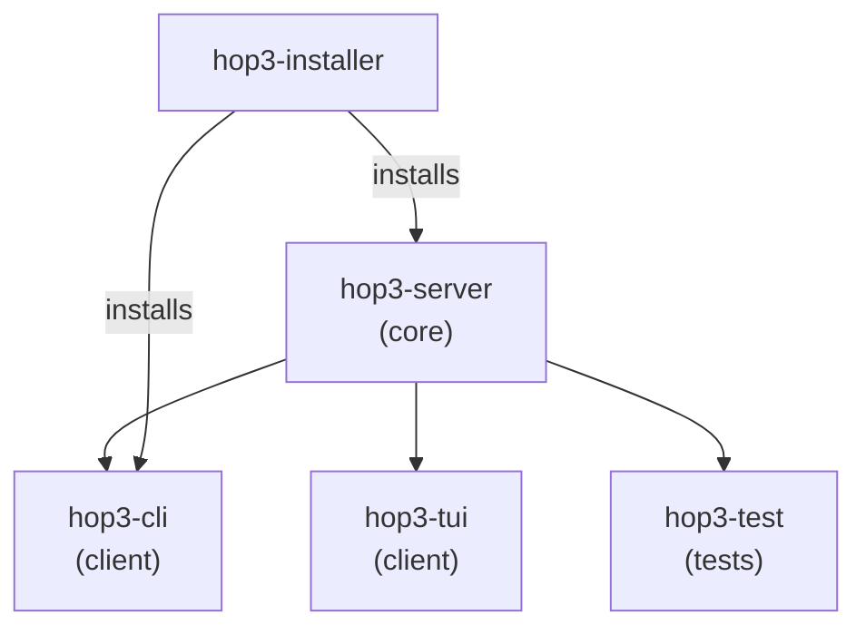

# Package Documentation

This section provides access to the technical deep-dive documentation for each Hop3 package. Each package keeps its own deep-dive in `packages/<package-name>/docs/internals.md`; the pages in this directory mirror that content so it is reachable from the main documentation site.

## Package Overview

| Package | Purpose | Entry Point | Documentation |
|---------|---------|-------------|---------------|
| [hop3-server](hop3-server.md) | Core platform server | `hop3-server` | [internals](hop3-server.md) |
| [hop3-cli](hop3-cli.md) | Command-line interface | `hop3` / `hop` | [internals](hop3-cli.md) |
| [hop3-installer](hop3-installer.md) | Installation toolkit | `hop3-install`, `hop3-deploy` | [internals](hop3-installer.md) |
| [hop3-tui](hop3-tui.md) | Terminal user interface | `hop3-tui` | [internals](hop3-tui.md) |
| [hop3-testing](hop3-testing.md) | Testing framework | `hop3-test` | [internals](hop3-testing.md) |

## Package Relationships



## Documentation Structure

Each package has:

```
packages/<package-name>/
├── README.md           # Quick overview, installation, usage
├── docs/
│   └── internals.md    # Technical deep-dive (mirrored here)
└── src/
```

The pages in this directory mirror each package's `internals.md`:
- `hop3-server.md` ← `packages/hop3-server/docs/internals.md`
- `hop3-cli.md` ← `packages/hop3-cli/docs/internals.md`
- etc.

## Quick Links

- **For Contributors**: Start with the package README, then read the internals doc
- **For Architecture**: See [System Architecture](../architecture.md)
- **For Plugin Authors**: See [Plugin Development](../plugin-development.md)
