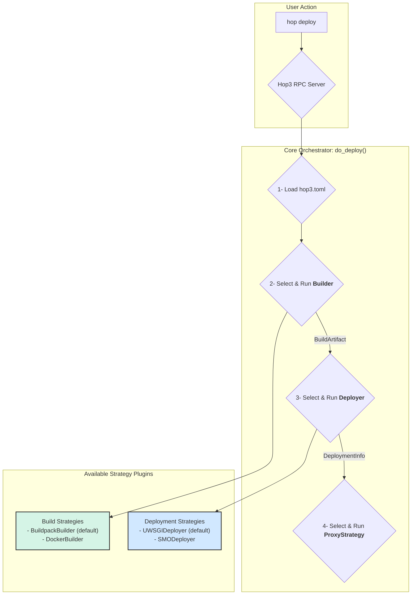

# ADR 020: Pluggable Architecture for Core Deployment Workflow

- **Status**: Final
- **Type**: Feature
- **Created**: 2024-10-01
- **Related-ADRs**: [021](./021-proxy-plugin-system.md), [022](./022-build-deploy-plugin-system.md), [028](./028-pluggy-dishka-integration.md), [030](./030-two-level-build-architecture.md)

## Introduction

This ADR documents the decision to refactor Hop3's core deployment mechanism from a monolithic, hardcoded process into a flexible, extensible, and configuration-driven system based on swappable plugins.

## Summary

We will deconstruct the monolithic `Deployer` class into three distinct, pluggable stages: **Build**, **Deploy**, and **Proxy**. Each stage will be governed by a **Strategy** interface, with concrete implementations provided as plugins. A central **Orchestrator** will manage the deployment workflow, selecting and executing the appropriate strategies based on application-specific configuration found in a `hop3.toml` file. This new architecture will be powered by a plugin system using `pluggy` and standard Python `entry_points` for discovery, enabling both core and third-party extensions.

## Context and Goals

### Context

The original Hop3 architecture combined the logic for building, deploying, and proxying applications into a single, tightly-coupled `Deployer` class. This design was rigid and difficult to extend. Supporting new build systems (e.g., Docker), deployment targets (e.g., Kubernetes, external orchestrators), or proxy servers would have required significant and invasive changes to the core Hop3 codebase. This limited developer flexibility and made it challenging to integrate Hop3 with external systems like the NEPHELE SMO, a key requirement for the H3NI project.

### Goals

1.  **Enable Extensibility:** Allow new build systems, deployment targets, and proxy servers to be added as plugins without modifying Hop3's core.
2.  **Increase Developer Flexibility:** Empower developers to choose the optimal toolchain for their application through simple configuration.
3.  **Improve Maintainability:** Decouple responsibilities to make the core codebase simpler, more focused, and easier to test and maintain.
4.  **Future-Proof the Platform:** Create a foundation that can easily adapt to new and emerging technologies in the cloud-native ecosystem.

## Tenets

*   **Separation of Concerns:** The process of turning code into a running application should be broken down into its logical, independent parts.
*   **Convention over Configuration:** The system should intelligently auto-detect the correct strategy where possible, but allow for explicit configuration when needed.
*   **Open for Extension, Closed for Modification:** The core system should be stable, with new functionality added via well-defined extension points.

## Decision

We will refactor the core deployment logic into a three-stage pipeline managed by a central orchestrator. Each stage will be implemented by a "Strategy" plugin that conforms to a specific interface (`Builder`, `Deployer`, `ProxyStrategy`). We will use the `pluggy` library to manage plugin discovery and execution via standard Python `entry_points`. Application-specific configuration will be managed through a `hop3.toml` file in the application's repository.

## Detailed Design

The new architecture is composed of several key concepts:

1.  **The Orchestrator (`do_deploy`):** This is the central function that controls the deployment pipeline. It is responsible for:
    *   Loading the application's configuration from `hop3.toml`.
    *   Calling the plugin manager to select the appropriate strategy for each stage.
    *   Executing the strategies in sequence: Build -> Deploy -> Proxy.
    *   Passing data between stages (`BuildArtifact` and `DeploymentInfo` data classes).

2.  **Strategies (Plugins):** These are classes that implement the logic for a specific stage. Each strategy must implement a specific Python `Protocol` (interface):
    *   **`Builder`**: Defines a `build()` method that takes source code and returns a `BuildArtifact` (e.g., a path to a built directory or a Docker image tag). Core builders are `NativeBuildPlugin` (the default, wrapping the per-language builders for Python, Node, Ruby, Go, Static, …) and `DockerBuilder`, with auto-detection through `accept()`.
    *   **`Deployer`**: Defines a `deploy()` method that takes a `BuildArtifact` and returns `DeploymentInfo` (e.g., the host/port or socket path of the running application). Core deployers are `UWSGIDeployer` (the default for dynamic apps), `StaticDeployer` (for static sites), and `DockerDeployer`, with auto-detection through `accept()`.
    *   **`ProxyStrategy`**: Defines a `configure()` method that takes `DeploymentInfo` to set up the reverse proxy. Core proxies are `NginxProxyPlugin` (the default), `CaddyProxyPlugin`, and `TraefikProxyPlugin`.

    The Build stage is itself decomposed along two axes (see [030-build-plugin-architecture.md](030-build-plugin-architecture.md)): the Builder (Level 1, *how* to build (local, Docker, or Nix) and the LanguageToolchain (Level 2, *what* to build) Python, Node, Go, …).

3.  **Plugin Management (`pluggy`):**
    *   A central `PluginManager` is initialized at application startup.
    *   It discovers all installed strategy plugins (from both the core Hop3 package and any third-party packages) via `pkgutil.walk_packages` and standard setuptools entry points (e.g., `"hop3.build_strategies"`). Core plugins export a module-level `plugin` instance so that auto-discovery can find them without explicit registration.
    *   The orchestrator uses the manager to get a list of available strategies for each stage.
    *   Strategies are defined as Python `Protocol` types (PEP 544, structural subtyping) rather than abstract base classes, for better IDE support and looser coupling between core and plugins.

4.  **Configuration (`hop3.toml`):**
    *   A TOML file placed in the root of an application's repository allows developers to explicitly select which strategy to use for each stage.
    *   Example: `[build] strategy = "docker"`.
    *   If a strategy is not specified, the orchestrator falls back to an **auto-detection** mechanism, where it calls an `accept()` method on each available strategy until one returns `True` (e.g., a `DockerBuilder` would check for the existence of a `Dockerfile`).
    *   Build and deploy strategies are selected per-application. Proxy selection, by contrast, is server-wide (via the `HOP3_PROXY_TYPE` environment variable), reflecting that one server runs a single reverse proxy for all applications it hosts.

The same plugin mechanism governs two further extension points beyond the core Build → Deploy → Proxy pipeline:

5.  **Addon plugins:** Backing services (PostgreSQL, Redis, …) are provided as plugins that manage a service's lifecycle and connection details. Connection credentials are persisted so they survive server restarts, with the following design:
    *   A `ServiceCredential` ORM model stores encrypted credentials in the database, with `CASCADE` delete on app removal.
    *   A `CredentialEncryption` helper performs Fernet AEAD encryption with PBKDF2-HMAC-SHA256 key derivation; the encryption key is supplied through the `HOP3_SECRET_KEY` environment variable, and a single encryptor instance is shared per process.
    *   Credentials are stored during `services:attach` (when an app context is available) rather than `services:create` (which has no app context). This key decision lets one service attach to multiple apps with separate credential records. They are decrypted on `services:detach` to find the env vars to remove, and removed across all apps on `services:destroy`.
    *   Security properties follow from this design: authenticated encryption (AEAD) detects tampering (`InvalidToken` on modification); credentials are encrypted at rest, so database backups cannot be decrypted without `HOP3_SECRET_KEY`; ciphertext uses URL-safe base64; and the shared encryptor is thread-safe.

6.  **OS plugins:** Operating-system setup is provided as plugins to support multiple distributions (Debian, Ubuntu, Arch, BSD, …) behind a common interface.

## Examples and Interactions

The following diagram illustrates the new deployment workflow.




**Scenario: Deploying a Dockerized App to NEPHELE SMO**

1.  A developer adds a `hop3.toml` to their repository:
    ```toml
    [build]
    strategy = "docker"
    [deploy]
    strategy = "smo"
    ```
2.  Upon `hop deploy`, the **Orchestrator** reads the config.
3.  It selects the **`DockerBuilder`** strategy, which runs `docker build` and returns a `BuildArtifact` like `{kind: "docker_image", location: "my-app:latest"}`.
4.  The orchestrator then selects the **`SMODeployer`** strategy, passing it the artifact. This plugin generates an Application Graph (HDAG) and POSTs it to the SMO's API. It returns `DeploymentInfo` provided by the SMO.
5.  Finally, the orchestrator uses the default **`NginxProxy`** to configure Nginx to route traffic to the application's ingress endpoint, as specified in the `DeploymentInfo`.

## Consequences

### Benefits

1.  **Extensibility:** The platform is now open to new technologies. Adding support for a new runtime like WebAssembly is as simple as creating and installing a new `Deployer` plugin.
2.  **Flexibility:** Developers have full control over their application's lifecycle, from build to deployment.
3.  **Maintainability:** The core codebase is significantly simplified. The complex logic is isolated within individual plugins, making them easier to develop, test, and debug.
4.  **Clear Integration Path:** Provides a clear, non-intrusive path for integrating with external systems like the NEPHELE SMO.

### Drawbacks

1.  **Increased Complexity for Plugin Developers:** Developers wishing to extend Hop3 must now understand the plugin architecture, the `pluggy` system, and the specific strategy interfaces.
2.  **Potential for Configuration Errors:** The flexibility of `hop3.toml` introduces a new potential source of user error if strategies are misconfigured or incompatible strategies are selected.

## Lessons Learned

The initial monolithic design, while simple to start with, quickly became a bottleneck for innovation and integration. It confirmed that for a platform intended to be part of a larger ecosystem, designing for extensibility from the outset is important. However, the effort required to refactor the core was not significant, meaning that there is nothing wrong in prototyping with a monolith and eventually using a decoupled, plugin-based architecture later in a project's lifecycle.

## Alternatives

1.  **Hardcoded Conditional Logic:** We could have added `if/else` blocks to the existing `Deployer` to handle different cases (e.g., `if dockerfile_exists: do_docker_build()`). This was rejected as it would lead to an unmaintainable, monolithic function and would not be extensible by third parties.
2.  **Simple Class-Based Inheritance:** We considered a simpler system where new deployers would inherit from a base `Deployer` class. This was rejected because it lacked a formal discovery mechanism and would still require modifications to the core to register new deployer types. The `pluggy` and `entry_points` system provides a much more robust and standard solution for a true plugin ecosystem.

## Prior Art

This architectural pattern is well-established and draws inspiration from numerous successful projects:
*   **`pytest`:** The testing framework `pytest` is a prime example of a powerful core extended by a rich ecosystem of plugins using `pluggy`.
*   **Heroku Buildpacks:** The concept of auto-detecting an application's needs and applying a specific build process is directly inspired by Heroku's buildpack system.
*   **HashiCorp Plugins:** Many HashiCorp tools (like Terraform) use a plugin-based architecture to support different providers (cloud, services, etc.), demonstrating the pattern's effectiveness at scale.

## Unresolved Questions

*   How to best handle versioning and dependency management between plugins and the Hop3 core.

## Future Work

*   Expand the strategy interfaces to include more lifecycle hooks (e.g., `post_deploy`, `pre_stop`).
*   Create more core plugins for common technologies (e.g., `HelmDeployer`).

## References

*   [pluggy Documentation](https://pluggy.readthedocs.io/)
*   [Python Entry Points Specification](https://packaging.python.org/en/latest/specifications/entry-points/)
*   [Architectural Decision Records by Michael Nygard](http://thinkrelevance.com/blog/2011/11/15/documenting-architecture-decisions)
