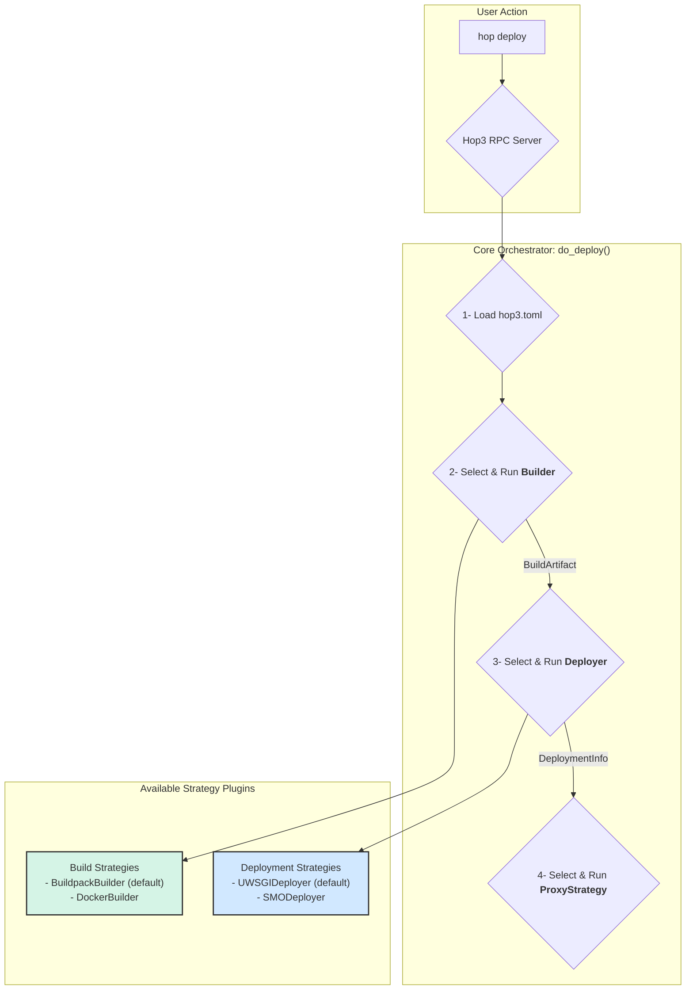

# ADR 020: Pluggable Architecture for Core Deployment Workflow

**Status**: Final
**Type**: Feature
**Created**: 2024-10-01
**Updated**: 2026-04-14
**Related-ADRs**: 021, 022, 028, 030

## Revisions

- v1.1: Cross-reference added to ADR 030, which extended the decomposition in this ADR by splitting "Build" into Builder (Level 1, how to build — local/Docker/Nix) and LanguageToolchain (Level 2, what to build — Python/Node/Go/…) (2026-04-14).
- v1.0: Original final version (2024-10-01)

## Introduction

This ADR documents the decision to refactor Hop3's core deployment mechanism from a monolithic, hardcoded process into a flexible, extensible, and configuration-driven system based on swappable plugins.

## Summary

We will deconstruct the monolithic `Deployer` class into three distinct, pluggable stages: **Build**, **Deploy**, and **Proxy**. Each stage will be governed by a **Strategy** interface, with concrete implementations provided as plugins. A central **Orchestrator** will manage the deployment workflow, selecting and executing the appropriate strategies based on application-specific configuration found in a `hop3.toml` file. This new architecture will be powered by a plugin system using `pluggy` and standard Python `entry_points` for discovery, enabling both core and third-party extensions.

## Context and Goals

### Context

The original Hop3 architecture combined the logic for building, deploying, and proxying applications into a single, tightly-coupled `Deployer` class. This design was rigid and difficult to extend. Supporting new build systems (e.g., Docker), deployment targets (e.g., Kubernetes, external orchestrators), or proxy servers would have required significant and invasive changes to the core Hop3 codebase. This limited developer flexibility and made it challenging to integrate Hop3 with external systems like the NEPHELE SMO, a key requirement for the H3NI project.

### Goals

1.  **Enable Extensibility:** Allow new build systems, deployment targets, and proxy servers to be added as plugins without modifying Hop3's core.
2.  **Increase Developer Flexibility:** Empower developers to choose the optimal toolchain for their application through simple configuration.
3.  **Improve Maintainability:** Decouple responsibilities to make the core codebase simpler, more focused, and easier to test and maintain.
4.  **Future-Proof the Platform:** Create a foundation that can easily adapt to new and emerging technologies in the cloud-native ecosystem.

## Tenets

*   **Separation of Concerns:** The process of turning code into a running application should be broken down into its logical, independent parts.
*   **Convention over Configuration:** The system should intelligently auto-detect the correct strategy where possible, but allow for explicit configuration when needed.
*   **Open for Extension, Closed for Modification:** The core system should be stable, with new functionality added via well-defined extension points.

## Decision

We will refactor the core deployment logic into a three-stage pipeline managed by a central orchestrator. Each stage will be implemented by a "Strategy" plugin that conforms to a specific interface (`Builder`, `Deployer`, `ProxyStrategy`). We will use the `pluggy` library to manage plugin discovery and execution via standard Python `entry_points`. Application-specific configuration will be managed through a `hop3.toml` file in the application's repository.

## Detailed Design

The new architecture is composed of several key concepts:

1.  **The Orchestrator (`do_deploy`):** This is the central function that controls the deployment pipeline. It is responsible for:
    *   Loading the application's configuration from `hop3.toml`.
    *   Calling the plugin manager to select the appropriate strategy for each stage.
    *   Executing the strategies in sequence: Build -> Deploy -> Proxy.
    *   Passing data between stages (`BuildArtifact` and `DeploymentInfo` data classes).

2.  **Strategies (Plugins):** These are classes that implement the logic for a specific stage. Each strategy must implement a specific Python `Protocol` (interface):
    *   **`Builder`**: Defines a `build()` method that takes source code and returns a `BuildArtifact` (e.g., a path to a built directory or a Docker image tag).
    *   **`Deployer`**: Defines a `deploy()` method that takes a `BuildArtifact` and returns `DeploymentInfo` (e.g., the host/port or socket path of the running application).
    *   **`ProxyStrategy`**: Defines a `configure()` method that takes `DeploymentInfo` to set up the reverse proxy.

3.  **Plugin Management (`pluggy`):**
    *   A central `PluginManager` is initialized at application startup.
    *   It uses `setuptools` entry points (e.g., `"hop3.build_strategies"`) to discover all installed strategy plugins from both the core Hop3 package and any third-party packages.
    *   The orchestrator uses the manager to get a list of available strategies for each stage.

4.  **Configuration (`hop3.toml`):**
    *   A TOML file placed in the root of an application's repository allows developers to explicitly select which strategy to use for each stage.
    *   Example: `[build] strategy = "docker"`.
    *   If a strategy is not specified, the orchestrator falls back to an **auto-detection** mechanism, where it calls an `accept()` method on each available strategy until one returns `True` (e.g., a `DockerBuilder` would check for the existence of a `Dockerfile`).

## Examples and Interactions

The following diagram illustrates the new deployment workflow.




**Scenario: Deploying a Dockerized App to NEPHELE SMO**

1.  A developer adds a `hop3.toml` to their repository:
    ```toml
    [build]
    strategy = "docker"
    [deploy]
    strategy = "smo"
    ```
2.  Upon `hop deploy`, the **Orchestrator** reads the config.
3.  It selects the **`DockerBuilder`** strategy, which runs `docker build` and returns a `BuildArtifact` like `{kind: "docker_image", location: "my-app:latest"}`.
4.  The orchestrator then selects the **`SMODeployer`** strategy, passing it the artifact. This plugin generates an Application Graph (HDAG) and POSTs it to the SMO's API. It returns `DeploymentInfo` provided by the SMO.
5.  Finally, the orchestrator uses the default **`NginxProxy`** to configure Nginx to route traffic to the application's ingress endpoint, as specified in the `DeploymentInfo`.

## Consequences

### Benefits

1.  **Extensibility:** The platform is now open to new technologies. Adding support for a new runtime like WebAssembly is as simple as creating and installing a new `Deployer` plugin.
2.  **Flexibility:** Developers have full control over their application's lifecycle, from build to deployment.
3.  **Maintainability:** The core codebase is significantly simplified. The complex logic is isolated within individual plugins, making them easier to develop, test, and debug.
4.  **Clear Integration Path:** Provides a clear, non-intrusive path for integrating with external systems like the NEPHELE SMO.

### Drawbacks

1.  **Increased Complexity for Plugin Developers:** Developers wishing to extend Hop3 must now understand the plugin architecture, the `pluggy` system, and the specific strategy interfaces.
2.  **Potential for Configuration Errors:** The flexibility of `hop3.toml` introduces a new potential source of user error if strategies are misconfigured or incompatible strategies are selected.

## Lessons Learned

The initial monolithic design, while simple to start with, quickly became a bottleneck for innovation and integration. It confirmed that for a platform intended to be part of a larger ecosystem, designing for extensibility from the outset is crucial. However, the effort required to refactor the core was not significant, meaning that there is nothing wrong in prototyping with a monolith and eventually leveraging the value of adopting a decoupled, plugin-based architecture later in a project's lifecycle.

## Alternatives

1.  **Hardcoded Conditional Logic:** We could have added `if/else` blocks to the existing `Deployer` to handle different cases (e.g., `if dockerfile_exists: do_docker_build()`). This was rejected as it would lead to an unmaintainable, monolithic function and would not be extensible by third parties.
2.  **Simple Class-Based Inheritance:** We considered a simpler system where new deployers would inherit from a base `Deployer` class. This was rejected because it lacked a formal discovery mechanism and would still require modifications to the core to register new deployer types. The `pluggy` and `entry_points` system provides a much more robust and standard solution for a true plugin ecosystem.

## Prior Art

This architectural pattern is well-established and draws inspiration from numerous successful projects:
*   **`pytest`:** The testing framework `pytest` is a prime example of a powerful core extended by a rich ecosystem of plugins using `pluggy`.
*   **Heroku Buildpacks:** The concept of auto-detecting an application's needs and applying a specific build process is directly inspired by Heroku's buildpack system.
*   **HashiCorp Plugins:** Many HashiCorp tools (like Terraform) use a plugin-based architecture to support different providers (cloud, services, etc.), demonstrating the pattern's effectiveness at scale.

## Unresolved Questions

*   How to best handle versioning and dependency management between plugins and the Hop3 core.

## Future Work

*   Expand the strategy interfaces to include more lifecycle hooks (e.g., `post_deploy`, `pre_stop`).
*   Create more core plugins for common technologies (e.g., `HelmDeployer`).
*   Implement explicit strategy selection via `hop3.toml` configuration.

## Implementation Status

The core architecture described in this ADR has been implemented, with the following components operational:

1. **Three-Stage Pipeline**: Build → Deploy → Proxy pipeline.
2. **Plugin System**: `pluggy`-based plugin manager with auto-discovery via `pkgutil.walk_packages` and setuptools entry points.
3. **Strategy Protocols**: All strategies implemented as Python `Protocol` types (PEP 544) for structural subtyping.
4. **Build Strategies**: `NativeBuildPlugin` (default, wraps legacy builders for Python, Node, Ruby, Go, Static, etc.) and `DockerBuilder`, with auto-detection via the `accept()` method.
5. **Deployment Strategies**: `UWSGIDeployer` (default for dynamic apps), `StaticDeployer` (for static sites), and `DockerDeployer`, with auto-detection via the `accept()` method.
6. **Proxy Strategies**: `NginxProxyPlugin` (default), `CaddyProxyPlugin`, and `TraefikProxyPlugin`, selected server-wide via the `HOP3_PROXY_TYPE` environment variable.

### Extensions Beyond ADR

The implementation includes value-add features beyond the original ADR scope:

1. **Addon**: Plugin system for managing backing services (PostgreSQL, Redis) with encrypted credential persistence.
2. **OS**: Plugin system for multi-distribution OS support (Debian, Ubuntu, Arch, BSD, etc.).
3. **Server-wide Proxy Configuration**: Proxy selection is server-wide (via `HOP3_PROXY_TYPE`), not per-application, reflecting the practical reality that one server uses one reverse proxy for all applications.
4. **Protocol-based Design**: Using Python `Protocol` instead of ABC for better IDE support and more Pythonic code.

#### Service Credential Persistence

The Addon system has been extended with a credential persistence layer so that service connection details survive server restarts and are managed through the service lifecycle.

**Architecture:**
- **ServiceCredential ORM Model**: Stores encrypted credentials in the database with CASCADE delete on app removal.
- **CredentialEncryption Helper**: Fernet AEAD encryption with PBKDF2-HMAC-SHA256 key derivation (100K iterations).
- **Singleton Encryptor**: Single encryption instance per process for performance.
- **HOP3_SECRET_KEY**: Environment variable provides the encryption key (required for production).

**Lifecycle Management:**
1. **services:create** - Service created but credentials not yet stored (no app context).
2. **services:attach** - Credentials encrypted and stored when service attached to app.
3. **services:detach** - Credentials decrypted to find env vars to remove, then deleted.
4. **services:destroy** - All credentials across all apps removed before service destruction.

**Security Properties:**
- Authenticated Encryption with Associated Data (AEAD) via Fernet.
- Credentials encrypted at rest in SQLite database.
- Database backups safe (cannot decrypt without HOP3_SECRET_KEY).
- Tampering detection built-in (InvalidToken on modification).
- URL-safe base64 encoding (Fernet standard).
- Thread-safe singleton encryptor.

**Key Design Decision:** Credentials are stored during `services:attach` (when app context is available) rather than `services:create` (no app context), allowing one service to be attached to multiple apps with separate credential records.

### Notable Architectural Decisions

1. **Protocol over ABC**: The implementation uses Python `Protocol` (structural typing) instead of abstract base classes, providing better IDE support and more flexibility.
2. **Module-level Plugin Instances**: Core plugins export a `plugin` instance at module level for simple auto-discovery via `pkgutil.walk_packages`.
3. **Server-wide Proxy Config**: Unlike build/deploy strategies (which are per-app), proxy configuration is server-wide, matching real-world deployment patterns.

## References

*   [pluggy Documentation](https://pluggy.readthedocs.io/)
*   [Python Entry Points Specification](https://packaging.python.org/en/latest/specifications/entry-points/)
*   [Architectural Decision Records by Michael Nygard](http://thinkrelevance.com/blog/2011/11/15/documenting-architecture-decisions)
