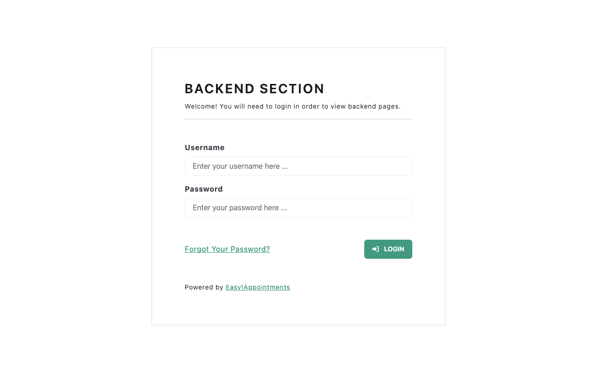
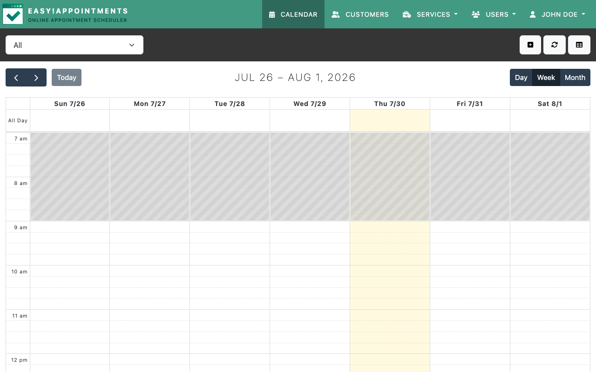

# Experience Report: Easy!Appointments

Open source appointment scheduling. Packaged for Hop3 across the native, Docker and Nix build paths, and published in the signed catalog.

## What this app exercised

Not yet written. The earlier report recorded deployment status only, and did not say which edge of the platform this application was chosen to probe.

## What broke

- CodeIgniter lacks an artisan-style CLI for running migrations, so database schema creation must be handled through other means (direct SQL or auto-install endpoints).
- Docker deployments need explicit DB schema auto-creation since there is no migration CLI to call at startup.
- The app returns HTTP 200 only after the initial data seed has been applied, which complicates health-check validation.
- MySQL race conditions in Docker are a recurring theme across PHP apps and always require a wait loop.

## What the platform gained

Not yet written — the earlier report did not record whether this application forced a change to Hop3 or merely confirmed one.

## Cost

Not recorded. The earlier reports did not track effort, and it cannot be reconstructed after the fact.

## Deployment variants

### Native

- **Builder/Toolchain:** local/php
- **Addons:** MySQL
- **Build steps:** composer install

### Docker

- **Base image:** debian:trixie-slim
- **Addons:** MySQL

### Nix (hand-crafted)

No recipe for this variant.

### Nix (template-generated)

- **Template:** `php-app`
- **Key config:** needs composer
- **Addons:** MySQL

## Verification

`apps/easy-appointments/check.py` runs against the deployed application and asserts, in order:

1. the login page is served
1. it is Easy!Appointments' own page, not an installer

It signs in with the credential Hop3 generated — the `[probe]` account where the recipe declares one, otherwise the `[admin]` credential, which is the weaker claim because the operator owns it.

## Reproduce

```bash
hop3 catalog install easy-appointments
hop3 app check --app easy-appointments
```

## Open

- **nix-gen (not-attempted):** its sign-in is driven by the browser harness, so a run without `--screenshots` cannot reach a verdict.
- **docker (not-attempted):** a recipe exists, but no run has measured it at the sign-in bar.
- The earlier report's cross-method comparison is retained below but predates every status above:

  > Native and Nix deployments work cleanly once composer dependencies are installed. Docker required extra work to handle MySQL startup ordering and automatic schema creation, making it the most complex method for this app despite the app itself being relatively simple.

## Screenshots



