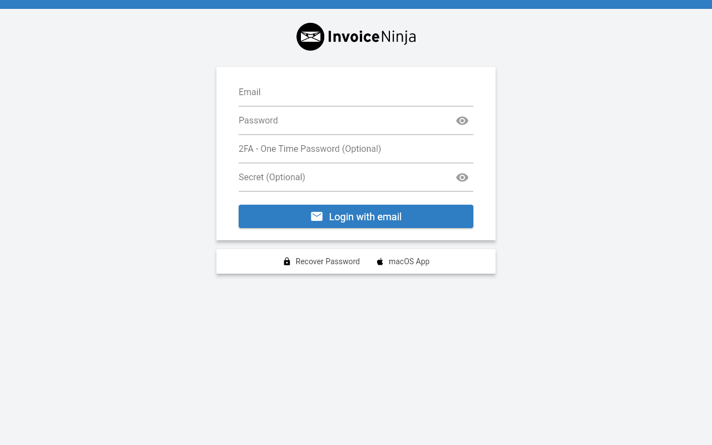

# Experience Report: Invoice Ninja

Free open-source invoicing platform. Packaged for Hop3 across the native, Docker and Nix build paths, and published in the signed catalog.

## What this app exercised

Not yet written. The earlier report recorded deployment status only, and did not say which edge of the platform this application was chosen to probe.

## What broke

- Laravel apps need careful APP_KEY handling: the key must be exactly 32 bytes base64-encoded, and newline corruption is a recurring issue across deployment methods.
- The `composer --ignore-platform-reqs` flag is needed when the installed PHP version does not exactly match the version specified in composer.json, which is common in containerized environments.
- npm asset compilation adds a second toolchain dependency (Node.js), increasing build complexity similar to Go/Node hybrid apps.
- Docker failures caused by `set -e` killing the entrypoint on non-fatal migration errors are subtle and hard to diagnose without logs.

## What the platform gained

Not yet written — the earlier report did not record whether this application forced a change to Hop3 or merely confirmed one.

## Cost

Not recorded. The earlier reports did not track effort, and it cannot be reconstructed after the fact.

## Deployment variants

### Native

- **Builder/Toolchain:** local/php
- **Addons:** MySQL
- **Build steps:** composer install + npm build for frontend assets

### Docker

- **Base image:** debian:trixie-slim
- **Addons:** MySQL

### Nix (hand-crafted)

- **Template equivalent:** php-app
- **Addons:** MySQL

### Nix (template-generated)

- **Template:** `php-app`
- **Key config:** nodejs dependency, artisan migrations, .env generation
- **Addons:** MySQL

## Verification

`apps/invoice-ninja/check.py` runs against the deployed application and asserts, in order:

1. the probe-or-admin credential signs in
1. the built frontend is actually served
1. a wrong password is refused

It signs in with the credential Hop3 generated — the `[probe]` account where the recipe declares one, otherwise the `[admin]` credential, which is the weaker claim because the operator owns it.

## Reproduce

```bash
hop3 catalog install invoice-ninja
hop3 app check --app invoice-ninja
```

## Open

- **nix-gen (not-attempted):** the run lost the Hop3 server mid-build; the application was never tested.
- **docker (not-attempted):** a recipe exists, but no run has measured it at the sign-in bar.
- **nix (not-attempted):** the hand-crafted recipe exists and has not been run at the sign-in bar.
- The earlier report's cross-method comparison is retained below but predates every status above:

  > Native and Nix are comparable once dependencies are resolved, though both require managing PHP and Node toolchains. Docker was the most problematic method due to compounding issues (MySQL races, APP_KEY corruption, strict error handling, PHP version mismatches), but is now stable after targeted fixes.

## Screenshots


