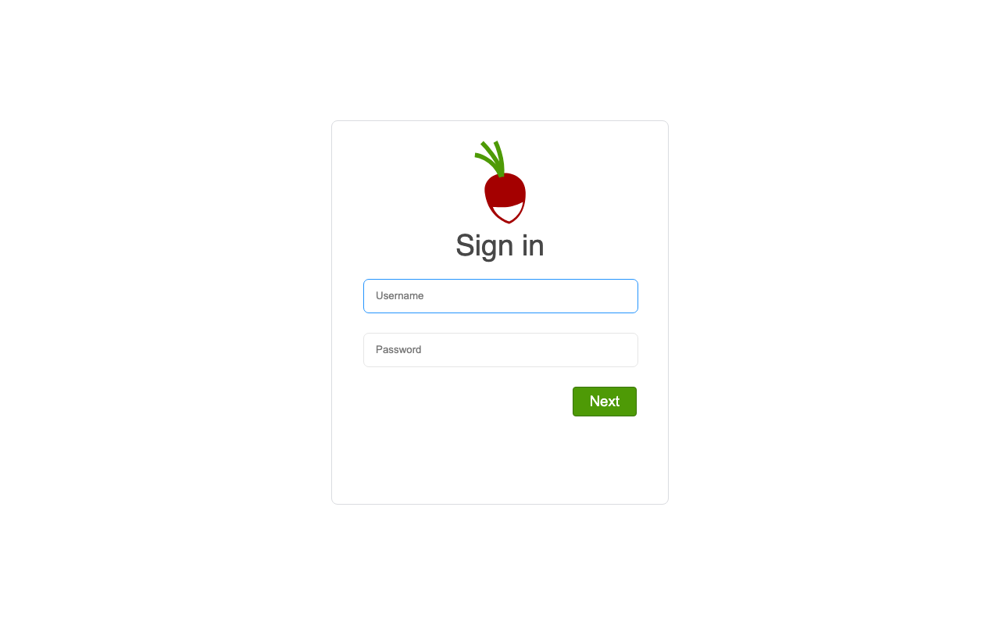

# Experience Report: Radicale

A simple CalDAV and CardDAV server. Packaged for Hop3 across the native, Docker and Nix build paths, and published in the signed catalog.

## What this app exercised

Authentication with no user store: an account is a line in an htpasswd file, so both accounts are created by writing that file. Also the app that showed a file the server reads at startup cannot be created by a post-deploy command.

## What broke

- The nixpkgs-wrapper template is ideal for apps already packaged in nixpkgs, avoiding any custom build logic.
- File-based storage means no addon complexity, making this the simplest app to deploy across all methods.
- Simplest Python app to package: pip install plus a config file is all that is needed.

## What the platform gained

The screenshot harness no longer photographs a page it has not signed into; Radicale's two images were byte-identical and were being filed as proof.

## Cost

Not recorded. The earlier reports did not track effort, and it cannot be reconstructed after the fact.

## Deployment variants

### Native

- **Builder/Toolchain:** local/python
- **Addons:** None
- **Build steps:** pip install

### Docker

- **Base image:** debian:trixie-slim
- **Addons:** None (htpasswd auth configured)

### Nix (hand-crafted)

- **Template equivalent:** nixpkgs-wrapper
- **Addons:** None

### Nix (template-generated)

- **Template:** `python-venv`
- **Key config:** Uses nixpkgs package directly (no custom build)
- **Addons:** None

## Verification

`apps/radicale/check.py` runs against the deployed application and asserts, in order:

1. the probe-or-admin credential signs in
1. a wrong password is refused

It signs in with the credential Hop3 generated — the `[probe]` account where the recipe declares one, otherwise the `[admin]` credential, which is the weaker claim because the operator owns it.

## Reproduce

```bash
hop3 catalog install radicale
hop3 app check --app radicale
```

## Open

- **docker (not-attempted):** a recipe exists, but no run has measured it at the sign-in bar.
- **nix (not-attempted):** the hand-crafted recipe exists and has not been run at the sign-in bar.
- The earlier report's cross-method comparison is retained below but predates every status above:

  > All methods pass without issues. Radicale's zero-addon, file-based design makes it the lowest-friction app in the set. The only difference across methods is auth configuration (htpasswd in Docker vs none elsewhere).

## Screenshots



Only the sign-in page. Radicale's `.web` interface renders identically once authenticated, so a second image would prove nothing — the pair that used to be here was byte-identical.
