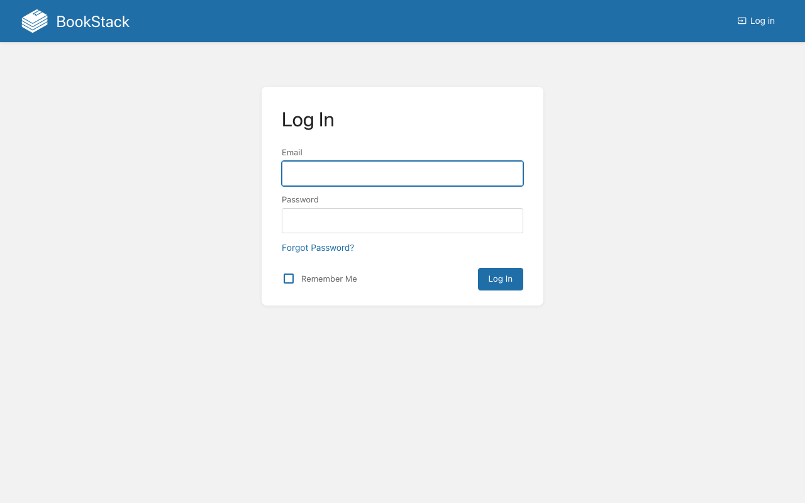
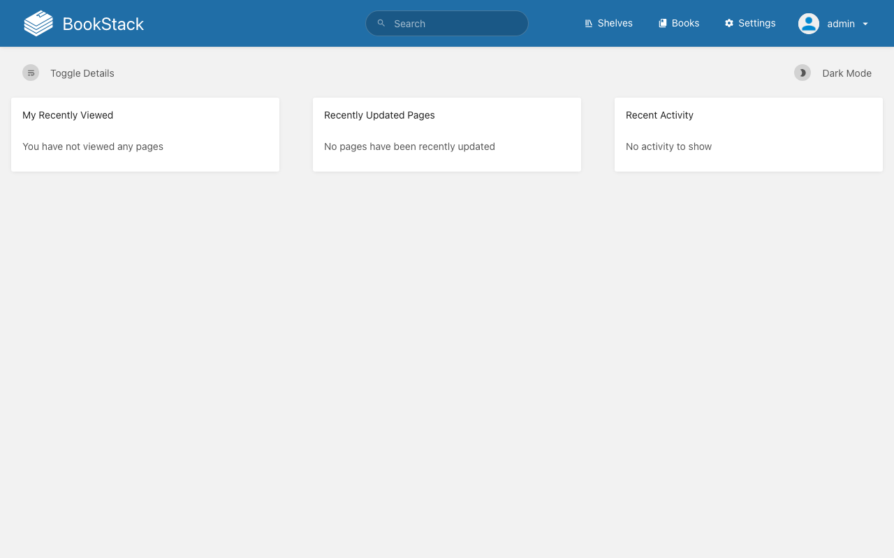

# Experience Report: BookStack

Simple, self-hosted documentation platform.

## What this app exercised

Laravel under Nix, where PHP's `__DIR__` resolves symlinks and lands back in the read-only store; the first app to need the tree copied rather than linked, which is now `needs-writable-dir`. Also the corpus's clearest case of an application that authenticates on the email while offering a username.

## What broke

**The credential in the recipe was not the credential in the app.** BookStack seeds `admin@admin.com` / `password` when it migrates, and for a long time nothing replaced it: the deployed instance had an administrator whose password is documented upstream, while the operator was handed a generated one that did not work.

**A hidden migration failure.** The hand-written Nix wrapper ran `artisan migrate --force 2>/dev/null || true`, so an app with no schema reported a successful start.

**BookStack authenticates on the EMAIL**, and `username` is only a display name. A credential reader handed both picks the username and is rejected as if the password were wrong; which is why the recipe declares `login = "email"`. The generated variant dropped that line and failed in exactly that way while its own `check.py`, which names the email field directly, kept passing.

**PHP's `__DIR__` resolves symlinks**, so a Nix store path reached through one lands back in the read-only store. The tree has to be copied.

## What the platform gained

`needs-writable-dir`, and the `login` key in `[admin]`; which tells anything reading a credential which field the app actually authenticates on. `make-nix-variants.py` now refuses to generate a variant whose sign-in field differs from its native counterpart, because this app is where that drift was found.

## Deployment variants

**Native** downloads the release and runs `composer install`; **Docker** builds from `debian:bookworm-slim`; **Nix** copies the tree writable (PHP resolves `__DIR__` through symlinks into the store) and generates `.env` from the addon's variables. The template variant uses `php-app` with `needs-writable-dir`.

## Verification

`apps/bookstack/check.py` signs in with the `[admin]` credential, reaches a page only a session can, and confirms a wrong password is refused. It has no `[probe]` account, so it signs in as the operator's administrator; the weaker claim, since that password can be changed out from under it.

## Reproduce

```bash
hop3 catalog install bookstack
hop3 app check --app bookstack
```

## Open

## Screenshots



