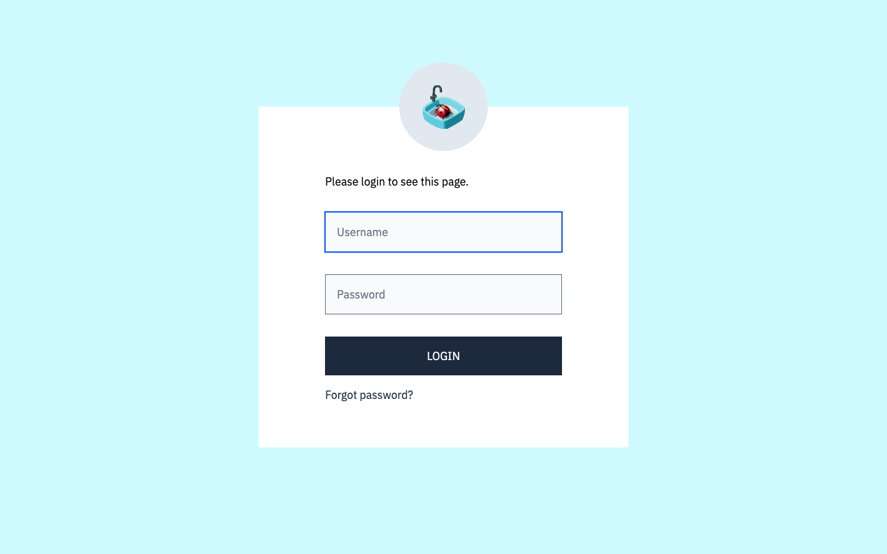
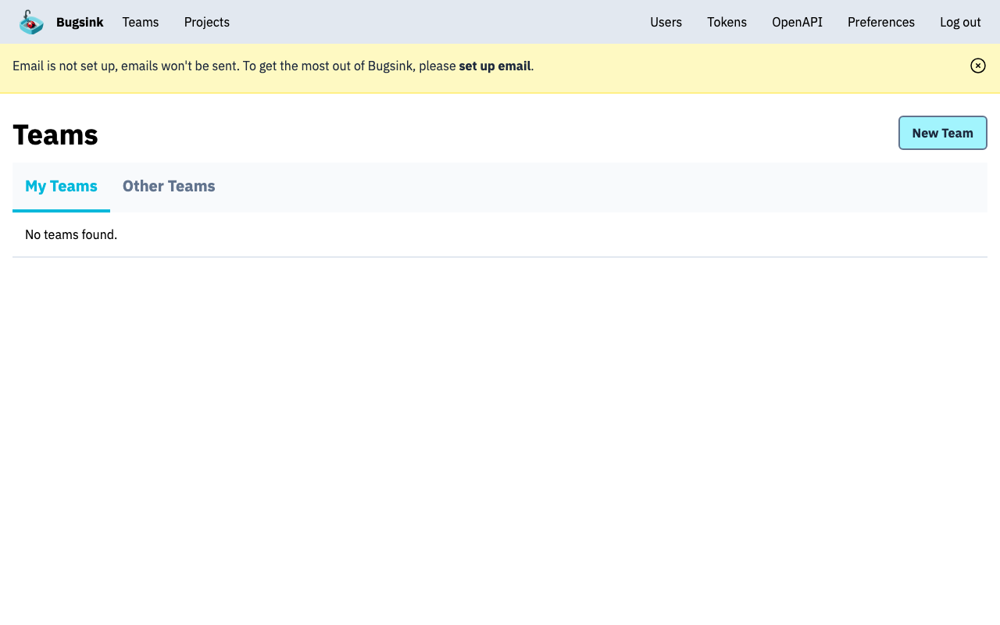

# Experience Report: Bugsink

Self-hosted error tracking, Sentry SDK-compatible.

## What this app exercised

Two processes from one recipe: a web worker and `snappea`, a background queue that keeps its own separate database. It is also the app that showed `[run.workers]` and a second `migrate --database=` are both needed before a post-login page works.

## What broke

Everything below is from the Nix template variant; the native one has been clean.

**The bootstrap had nowhere to run.** A Nix app's build artifact reported the read-only store path as its working directory, so `[run] before-run` (where every native recipe keeps its first-run setup) could not be used at all. The recipe compensated with a `pre-exec` block in the generated wrapper that re-implemented part of the setup and skipped the rest.

**Two different secrets, both unstable.** `SECRET_KEY` was `$(head -c 32 /dev/urandom | base64)` in the wrapper's exports, which the wrapper re-evaluates on *every start*: a new Django signing key per restart, invalidating every session. Separately, `pre-exec` minted its own key into `bugsink_conf.py`, which lives under `src/` and is wiped and regenerated on each deploy.

**No administrator was ever created**, so the smoke test reported "the sign-in did not establish a session" against an application that was working correctly and simply had no account.

**`psycopg` could not load `libpq`.** Once `before-run` worked, `migrate` died with `ImproperlyConfigured: Error loading psycopg2 or psycopg module`. The recipe declares `nix-runtime-libs`, but that became a single `LD_LIBRARY_PATH` export *inside the wrapper*, so the app process had the libraries and nothing else did. The same failure then reappeared one layer along, in `[probe].create`, because the create commands did not receive the artifact's runtime environment either.

**`DATABASE_URL` was composed in `[nix.env-exports]`**, which is also wrapper-only. `[probe].create` had `PGUSER` and `PGHOST` but not the URL, and Django failed building a connection.

## What the platform gained

`before-run` for Nix applications now runs in the app's own directory with the artifact's runtime environment applied (`working_dir`, and `nix-runtime-libs` reaching more than the wrapper). Before that a Nix app had nowhere to run a first-run bootstrap, and psycopg could not load `libpq` outside the wrapper.

## Cost

Most of the time went to two platform gaps rather than the app: `before-run` had no usable working directory for a Nix app, and the declared runtime libraries reached only the wrapper.

## Deployment variants

Two processes in every variant: gunicorn, plus the `snappea` worker that drains a queue living in a second database. **Nix** vendors pure-Python `psycopg` v3 (the binary wheels bake a hash-pinned `libkrb5` absent from a Nix-built venv) and emits `LD_LIBRARY_PATH` for the libraries it dlopens. It is the first consumer of `nix-runtime-libs`.

## Verification

`apps/bugsink/check.py` signs in with the `[probe]` account, which Hop3 owns and rotates, reaches a page only a session can, and confirms a wrong password is refused.

## Reproduce

```bash
hop3 catalog install bugsink
hop3 app check --app bugsink
```

## Open

- **nix:** no screenshot (sign-in verified over HTTP).
- **nix-gen:** a 180 s start timeout in one 19-app run (three isolated deploys since came up in 15–29 s). `check-catalog.py` writes a failing app's full output to `check-failures/<app>.log` for diagnosis.

## Screenshots

 
