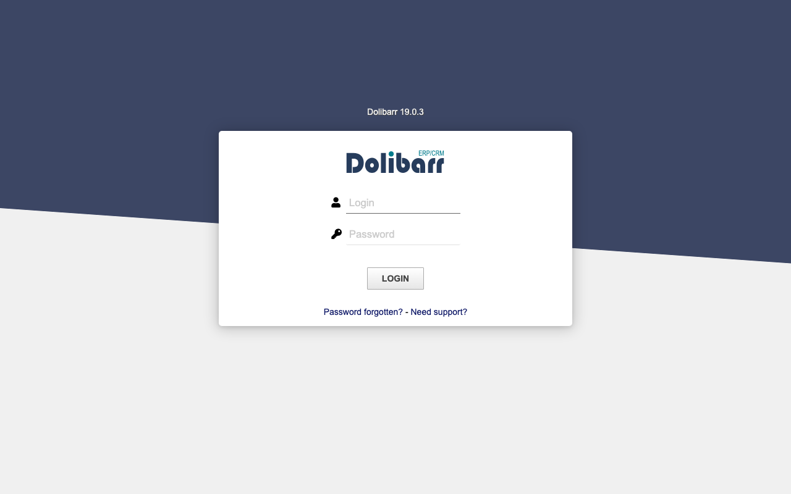
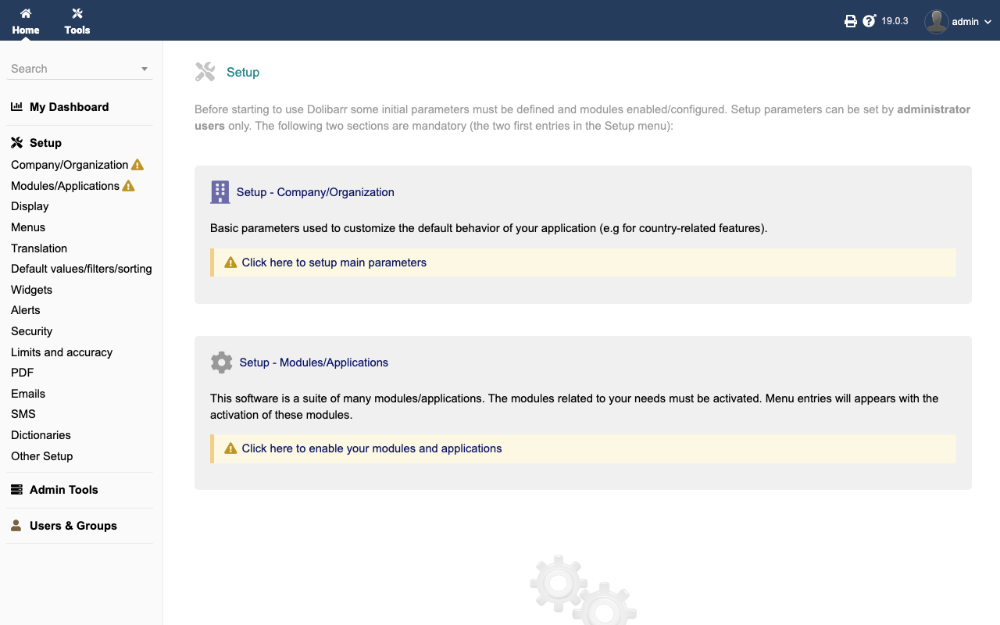

# Experience Report: Dolibarr

Open source ERP and CRM for small and medium businesses.

## What this app exercised

An application with **no installer CLI at all**. It was listed as a permanent deferral for that reason, and the question it forced (can a browser wizard be driven headlessly, or is a whole class of business software out of reach?) is the one it was kept for.

## What broke

**It was never installed.** The application deployed, started, and answered every request (the login page included) with *"Dolibarr config file content seems to be not correctly defined. Please run dolibarr setup by calling page /install"*. Under Nix it was served straight out of the read-only store, so it could not have been installed even in principle.

Dolibarr ships **no installer CLI**, only a browser wizard, which is why it was once listed as a permanent deferral. Each wizard step also reads its inputs from `$argv` under the PHP CLI, so the same steps a browser drives can be driven from a script; that is how it is installed now, in every variant.

**Its steps can print an error and still exit 0**, so the bootstrap verifies the admin row exists rather than trusting the exit code.

## What the platform gained

Nothing in the platform; the answer was a technique. Driving a browser wizard's steps through the PHP CLI is now the pattern for any application that ships no installer, and Matomo uses it too. Both were permanent deferrals before it.

## Deployment variants

Its web root is `htdocs`, not the `public` most PHP frameworks assume. **Native** and both **Nix** variants drive the browser wizard's steps from the CLI through the same script; **Docker** does the same at entrypoint. Postgres rather than MySQL, which makes it the corpus's test of that addon against a PHP toolchain.

## Verification

`apps/dolibarr/check.py` signs in with the `[admin]` credential, reaches a page only a session can, and confirms a wrong password is refused. It has no `[probe]` account, so it signs in as the operator's administrator: the weaker claim, since that password can be changed out from under it.

## Reproduce

```bash
hop3 catalog install dolibarr
hop3 app check --app dolibarr
```

## Open

## Screenshots



