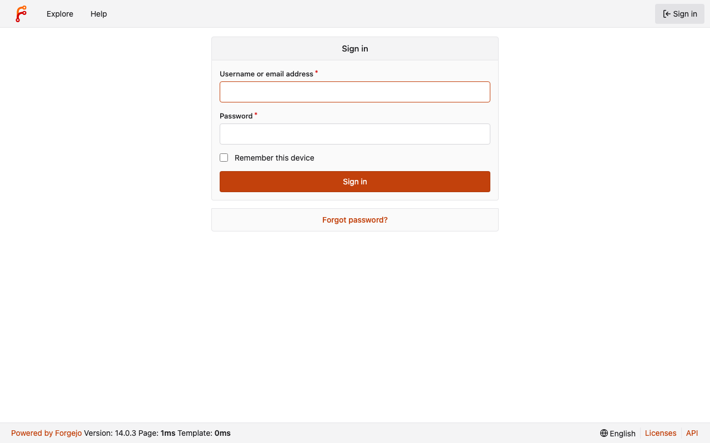
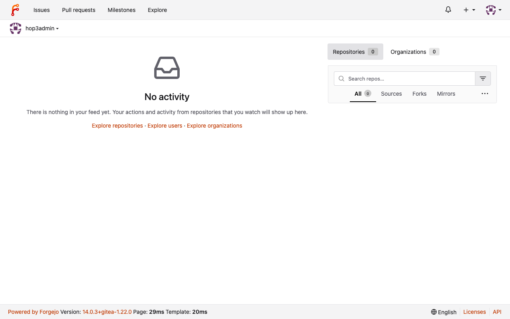

# Experience Report: Forgejo

Self-hosted Git service (community fork of Gitea).

## What this app exercised

Same shape as Gitea. Showed that a Go binary is named after its module path (`forgejo.org`), independent of the project name.

## What broke

Shared with Gitea, whose report describes the same four defects; only the last is specific to Forgejo.

**The admin bootstrap could not find the binary.** `[admin].create` was copied from the native recipe, which calls `./forgejo`. That path works when the binary sits in the source tree; it fails when the command runs from the app's source directory and the binary is in the Nix store. It failed with `sh: ./forgejo: not found` after a 220-second build, and the deploy correctly refused to leave an app with no administrator.

**`$out/bin` holds only the generated wrapper**, which execs one fixed subcommand, so putting it on `PATH` does not help. The application's own derivation is a different store path.

**Three signing secrets rotated on every restart.** `SECRET_KEY`, `INTERNAL_TOKEN` and `JWT_SECRET` were minted with `$(head -c 32 /dev/urandom | base64)` inside a config file the wrapper rewrites at each start.

**The binary is called `forgejo.org`.** `buildGoModule` names the output after the module path element; Miniflux's binary is `miniflux.app` for the same reason. Every `forgejo …` invocation in the recipe had to be `forgejo.org …`.

**Open registration.** `DISABLE_REGISTRATION = true` lives in the native recipes' shell scripts, and no Nix variant carries a `scripts/` directory, so both Nix builds put an internet-facing forge online on which the first visitor could register. It is now declared in the config each variant generates, and a `GET /user/sign_up` on a deployed instance answers with the disabled notice rather than a form.

**The sign-in bar does not catch this.** An application with open registration signs in, refuses a wrong password, and passes every check in the corpus. Reading the native recipe beside the Nix one found it, using the same method that closed the last four failures. The bar is a floor.

## What the platform gained

Nothing beyond what Gitea contributed; the two share their defects and their fixes. Its own finding is smaller and specific: nixpkgs renames Forgejo's server binary to `gitea`, so the two Nix packagings of one application do not share a command line.

## Deployment variants

**Nix (hand-crafted)** takes nixpkgs' `forgejo`, whose `generic.nix` renames the server binary to `gitea` in preInstall; **Nix (template-generated)** compiles from source with `go-source`, and `buildGoModule` names it after the module path element, `forgejo.org`. One application, two Nix packagings, two different binaries.

## Verification

`apps/forgejo/check.py` signs in with the `[probe]` account, which Hop3 owns and rotates, reaches a page only a session can, and confirms a wrong password is refused.

## Reproduce

```bash
hop3 catalog install forgejo
hop3 app check --app forgejo
```

## Open

## Screenshots

 
