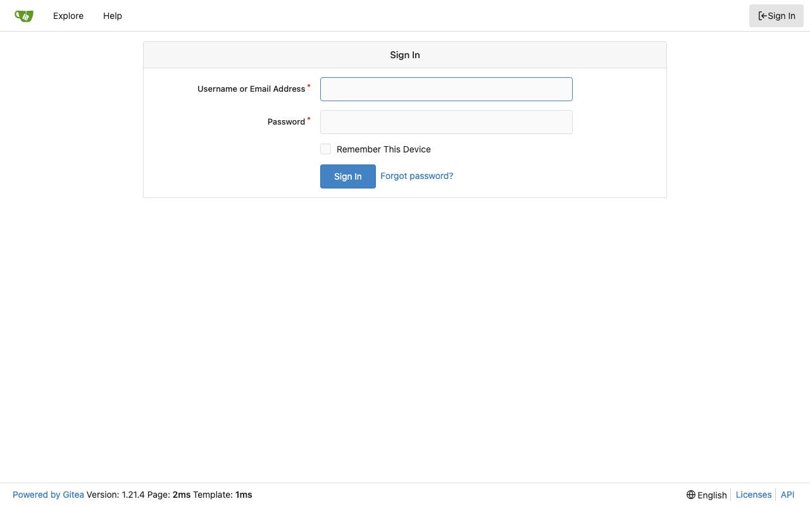
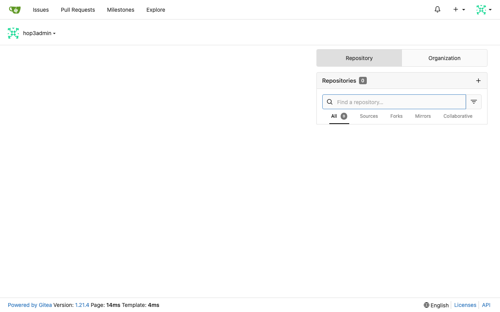

# Experience Report: Gitea

Self-hosted Git service.

## What this app exercised

A Go source build with a JavaScript frontend, and an app whose own CLI must be reachable to create the administrator. It is the first consumer of `go-static-dirs` for source assets that are not the compiled frontend.

## What broke

**The admin bootstrap named a path that does not exist.** `[admin].create` came from the native recipe as `./gitea admin user create`, which is correct in a source tree holding the binary and meaningless under Nix. Both Nix variants failed with `sh: ./gitea: not found` after a full build.

**Three signing secrets rotated on every restart.** `SECRET_KEY`, `INTERNAL_TOKEN` and `JWT_SECRET` were minted with `$(head -c 32 /dev/urandom | base64)` inside a config file the wrapper rewrites at each start. `SECRET_KEY` encrypts 2FA secrets and stored credentials, `INTERNAL_TOKEN` authenticates git hooks to the web process, `JWT_SECRET` signs OAuth2 grants. Rotating them makes encrypted data undecryptable and invalidates every token, silently, on a restart nobody connected to it.

**`ROOT_URL` was `http://localhost`**, which is what Gitea puts in clone URLs, redirects and OAuth callbacks.

**Two traps are Gitea's own**, shared with Forgejo: `admin` is a reserved username it refuses, and `admin user create` prints the refusal while **exiting 0**. Verifying the account exists is the only reliable check.

**Open registration shipped in every Nix variant.** `DISABLE_REGISTRATION = true` lives in the native recipes' shell scripts, and no Nix variant carries a `scripts/` directory; so both Nix builds put an internet-facing forge online on which the first visitor could register. It is now declared in the config each variant generates, and a `GET /user/sign_up` on a deployed instance answers with the disabled notice rather than a form.

The sign-in bar does not catch this: an application with open registration signs in perfectly, refuses a wrong password, and passes every check in the corpus. Reading the native recipe beside the Nix one found it, the same method that closed the last four failures; it is the clearest evidence that the bar is a floor.

## What the platform gained

`${pkg}`, a stable binding for the application's own derivation, so a recipe can put the app's CLI on `PATH` without knowing the app id. `$out/bin` holds only the generated wrapper.

## Deployment variants

**Native** downloads the release binary; **Nix (hand-crafted)** wraps nixpkgs' `gitea`; **Nix (template-generated)** compiles from source with `go-source`, building the JavaScript frontend alongside. All three generate `custom/conf/app.ini` from the addon's variables.

## Verification

`apps/gitea/check.py` signs in with the `[probe]` account, which Hop3 owns and rotates, reaches a page only a session can, and confirms a wrong password is refused.

## Reproduce

```bash
hop3 catalog install gitea
hop3 app check --app gitea
```

## Open

Nothing open.

## Screenshots



