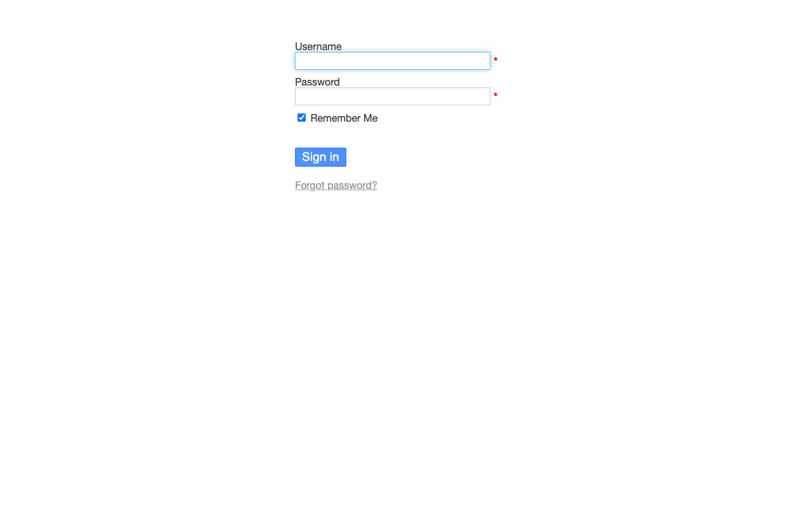
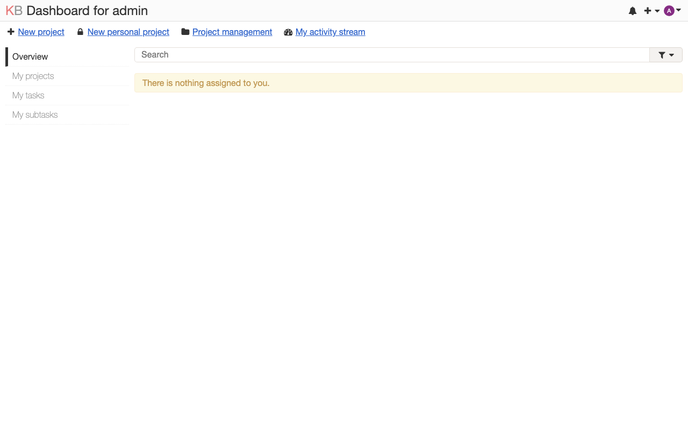

# Experience Report: Kanboard

Kanban project management software.

## What this app exercised

The plainest PHP application in the set, with no composer and no build step, which makes it a control: anything that breaks here points to the platform, rather than the application. It earned that role by breaking twice, both times in the transport rather than the application.

## What broke

**It was served out of the read-only store**, so it could not write its database, its config or its uploads, and had no account anyone could sign in as.

**A PHP warning killed the session.** Kanboard's default log driver writes to a file and warns *to the response* when it cannot: output ahead of the headers, which suppresses `Set-Cookie`. The login POST then has no session to carry, and Kanboard reports that as **"The username is required"**: an application-level message describing a transport-level failure. Pinning `LOG_DRIVER = stderr` is the fix, and the working variants had it all along.

**There is no `cli user:reset-password` subcommand.** The call to one sat inside a `|| true` and did nothing at all, leaving the shipped `admin`/`admin` in place. The password has to be written through Kanboard's own container.

**`PLUGIN_INSTALLER` defaults on**, which lets a signed-in administrator install arbitrary remote code.

## What the platform gained

Nothing directly. Its value was diagnostic: because the app is so plain, its failures pointed straight at the platform and at what a check can and cannot see. "The username is required" describing a suppressed `Set-Cookie` is the example that keeps being useful.

## Deployment variants

No composer, no build step: the simplest PHP app here. Every variant writes `config.php` from the addon's variables and serves with PHP's built-in server. The **Nix** ones copy the tree writable first, since Kanboard writes its database, uploads and sessions inside it.

## Verification

`apps/kanboard/check.py` signs in with the `[admin]` credential, reaches a page only a session can, and confirms a wrong password is refused. It has no `[probe]` account, so it signs in as the operator's administrator: the weaker claim, since that password can be changed out from under it.

## Reproduce

```bash
hop3 catalog install kanboard
hop3 app check --app kanboard
```

## Open

## Screenshots



