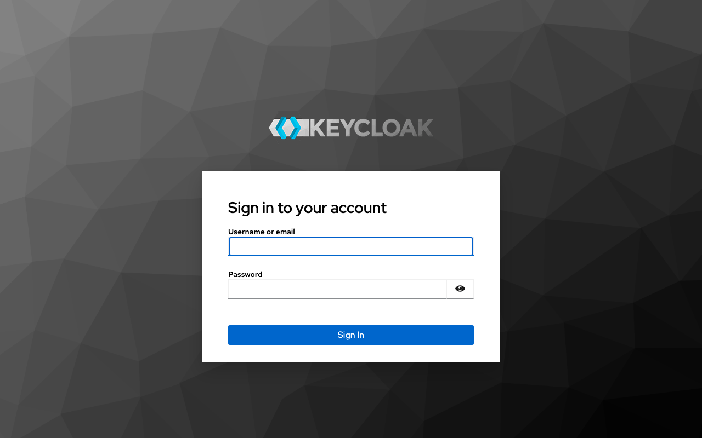
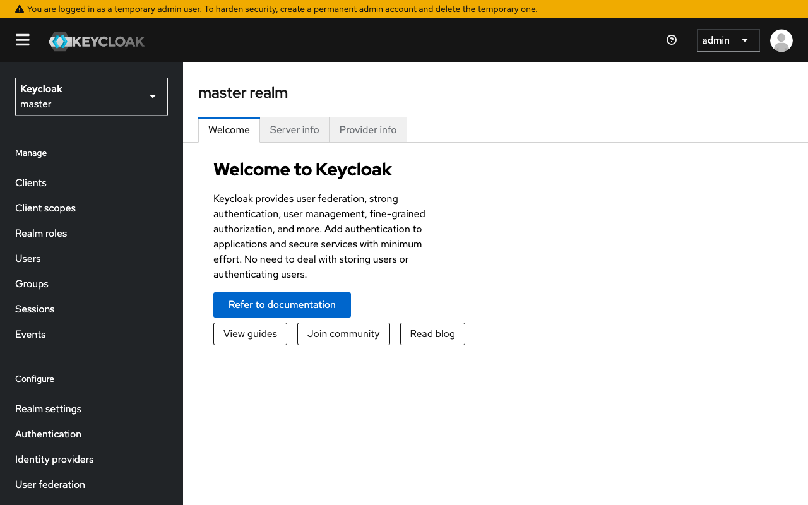

# Experience Report: Keycloak

Enterprise SSO / OIDC / SAML identity and access management. Packaged for Hop3 across the native, Docker and Nix build paths, and published in the signed catalog.

## What this app exercised

An identity provider with no login form to post: its check obtains an OIDC token instead. Also the first consumer of `writable-home-at-runtime`.

## What broke

**The generated Nix expression did not evaluate.** `extra-paths` referenced `${keycloak}`, but the let-binding is derived from the app id, so in the `keycloak-nixgen` variant it is `keycloak_nixgen`. The recipe had been made by copying and renaming, which renamed the binding underneath it. Nix failed at *build* time with `undefined variable 'keycloak'`, pointing at a generated line nobody wrote.

**The realm shipped with a published administrator password.** `KC_BOOTSTRAP_ADMIN_PASSWORD = "changeme"` was a literal in the recipe, and nothing mapped Hop3's generated credential onto it. The deployed instance had an administrator whose password is in the repository, while the operator was handed one that did not work — and the smoke test reported only the second half of that.

## What the platform gained

Not yet written — the earlier report did not record whether this application forced a change to Hop3 or merely confirmed one.

## Cost

Not recorded. The earlier reports did not track effort, and it cannot be reconstructed after the fact.

## Deployment variants

### Native

Not yet described.

### Docker

Not yet described.

### Nix (hand-crafted)

Not yet described.

### Nix (template-generated)

- **Template:** `nixpkgs-wrapper`

## Verification

`apps/keycloak/check.py` runs against the deployed application and asserts, in order:

1. the generated admin credential obtains a token
1. a wrong password is refused

It signs in with the credential Hop3 generated — the `[probe]` account where the recipe declares one, otherwise the `[admin]` credential, which is the weaker claim because the operator owns it.

## Reproduce

```bash
hop3 catalog install keycloak
hop3 app check --app keycloak
```

## Open

- **docker (not-attempted):** a recipe exists, but no run has measured it at the sign-in bar.
- **nix (not-attempted):** the hand-crafted recipe exists and has not been run at the sign-in bar.

## Screenshots

 
