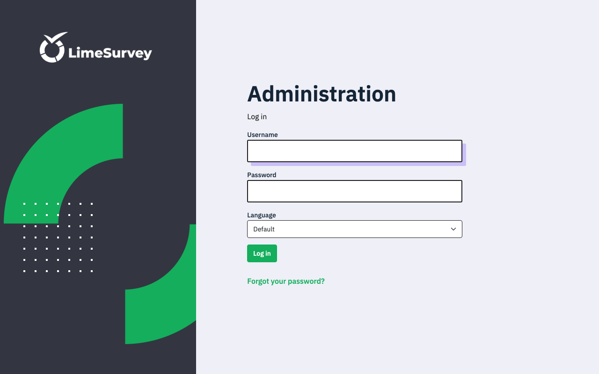
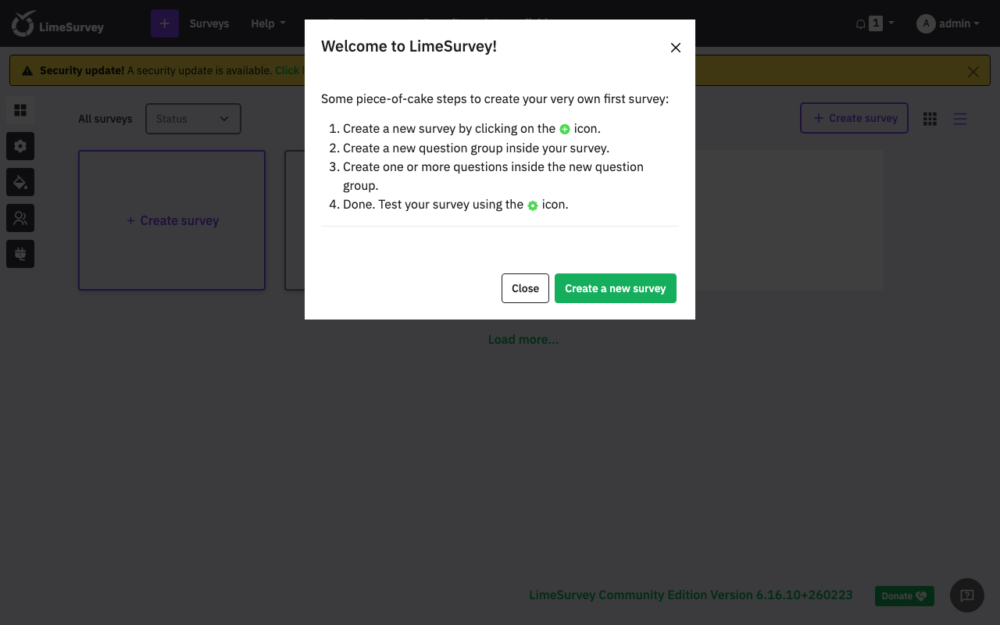

# Experience Report: LimeSurvey

Professional online survey and data collection tool.

## What this app exercised

A JavaScript-rendered admin UI that cannot be signed into over HTTP, so verification has to be deferred to a browser. It is the reason a run without `--screenshots` reports some apps as unverifiable, outside the pass/fail count.

## What broke

**The recipe installed it with a published password.** `console.php install admin password123 Admin admin@example.com`, with the result discarded by `2>/dev/null || true`: a known credential on every deployment *and* a failed install reported as success, in one line.

**Its admin UI is rendered by JavaScript**, so a form POST returns LimeSurvey's "JavaScript deactivated" notice and no HTTP sign-in is possible; verification defers to the browser, as above.

**The URL format determines whether the login form appears.** Without `urlManager` set to `urlFormat: path` and `showScriptName: true`, LimeSurvey builds its URLs in a form where the JavaScript that renders the login is fetched from paths that do not resolve: the page loads and the form never appears.

## What the platform gained

The runner's vocabulary for *unverifiable*: an application whose sign-in only a browser can drive is reported as such. A login page being served is not enough to count it as a pass.

## Deployment variants

Unlike most of the PHP set, this uses Postgres. Every variant installs through `application/commands/console.php install`, which creates the schema and the administrator in one call; there is no separate migration step and the credential mapping is the whole bootstrap.

## Verification

`apps/limesurvey/check.py` signs in with the `[admin]` credential, and confirms a wrong password is refused. It has no `[probe]` account, so it signs in as the operator's administrator: the weaker claim, since that password can be changed out from under it.

## Reproduce

```bash
hop3 catalog install limesurvey
hop3 app check --app limesurvey
```

## Open

Nothing open.

## Screenshots



