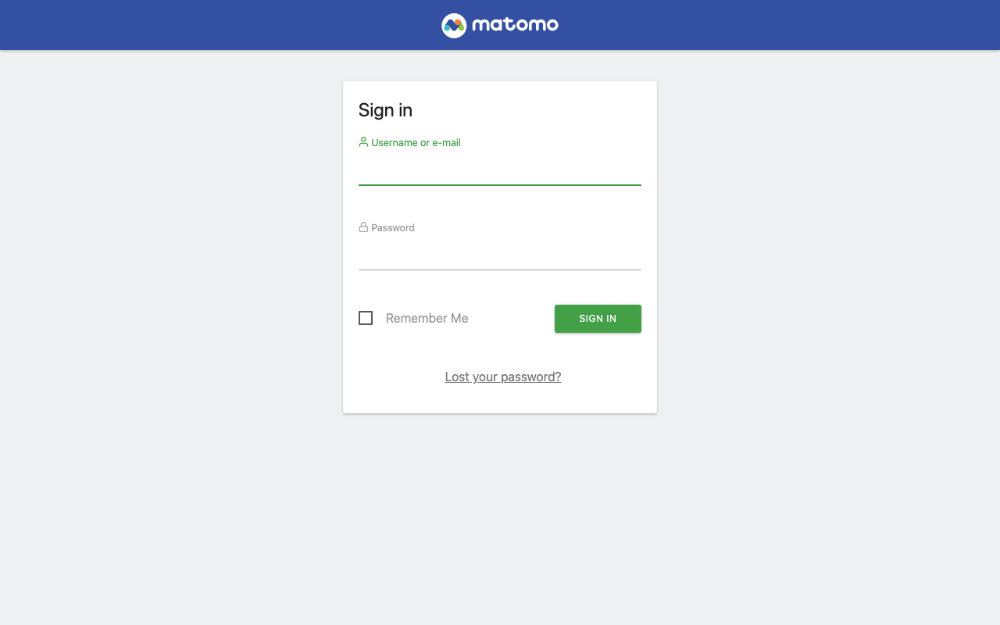
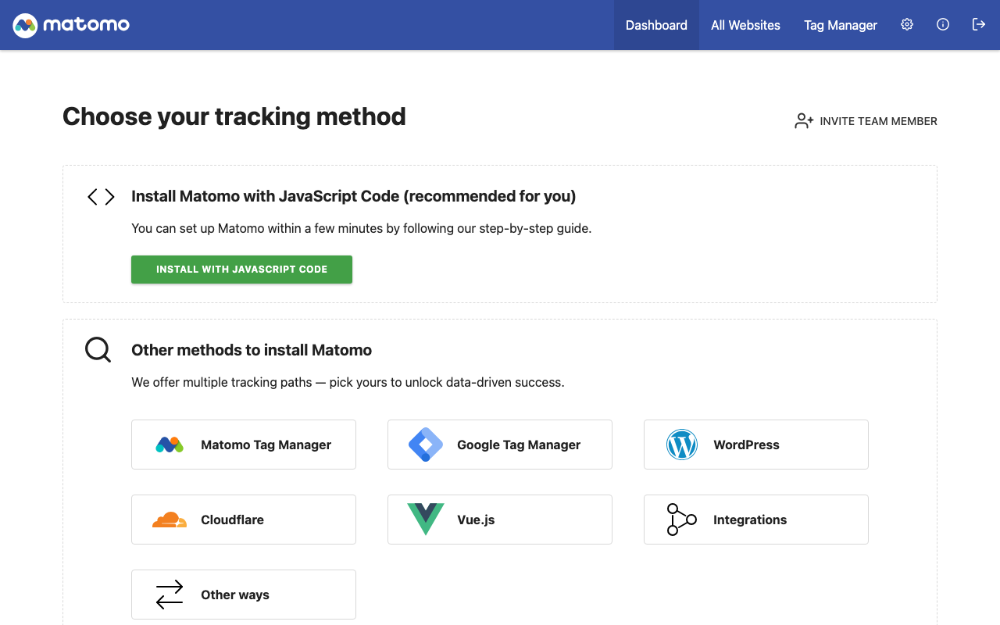

# Experience Report: Matomo

Open source web analytics platform.

## What this app exercised

An application with no user-creation CLI. Its installer is a browser wizard, so the account is made by driving Matomo's own model classes from PHP.

## What broke

**Matomo 5 has no installation CLI.** Its Installation plugin is a browser wizard, and there is no console command for it or for creating a superuser. The app was once listed as a permanent deferral for that reason. The headless installer written for it performs the same steps the wizard performs, each guarded separately so it is idempotent *and* resumable: a run that created the schema and then failed skips the schema on the next deploy and goes on. Checking only "do the tables exist?" would declare a half-installed database finished.

**Installing is not enough.** The schema the installer writes is not necessarily at the code's version, and until `console core:update` has run Matomo answers every request with a 302 to `?module=CoreUpdater`, including the login page a check posts to.

**Without a stable `salt`**, every redeploy signs every visitor out; it is what Matomo signs sessions and cookies with.

**A marker that could never match.** Its check keyed on `module=Login&action=logout`, and the served HTML escapes the ampersand. The assertion looked exact and was unsatisfiable.

## What the platform gained

`[probe].create` is now required. A probe account Hop3 cannot create is one it can never offer to a check; the optional form silently did nothing.

## Deployment variants

Every variant runs the same headless installer, because Matomo ships none. **Native** and **Docker** call it from `before-run`; the **Nix** ones from the wrapper, after the tree is writable. All follow it with `console core:update`.

## Verification

`apps/matomo/check.py` signs in with the `[probe]` account, which Hop3 owns and rotates, reaches a page only a session can, and confirms a wrong password is refused.

## Reproduce

```bash
hop3 catalog install matomo
hop3 app check --app matomo
```

## Open

Nothing open.

## Screenshots



