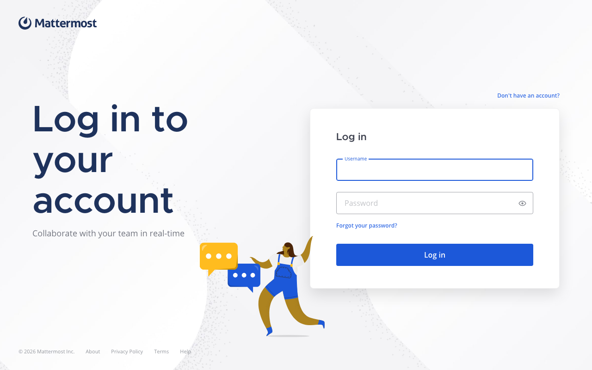
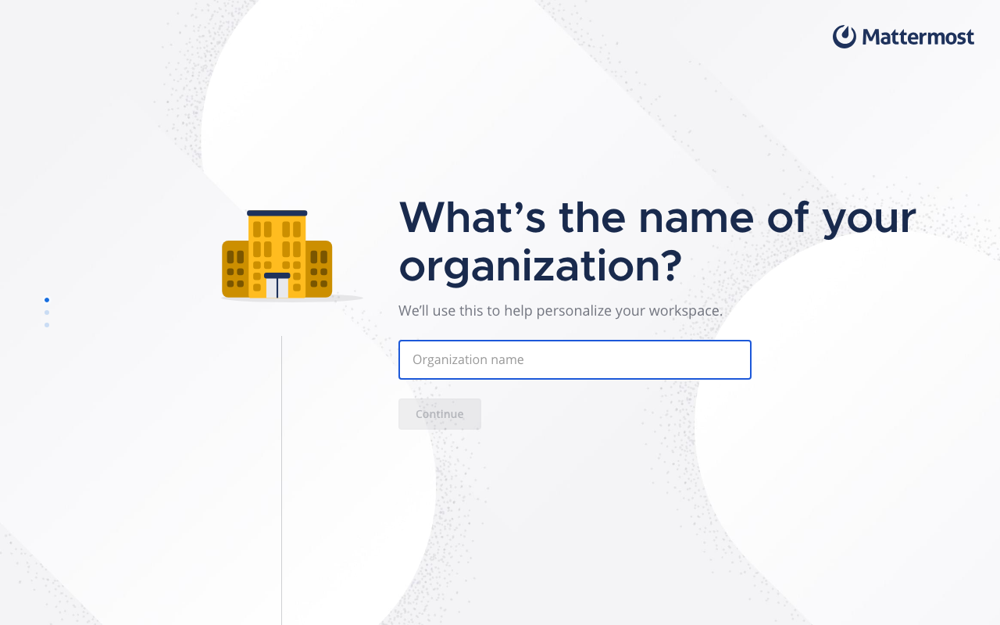

# Experience Report: Mattermost

Open source team collaboration platform.

## What this app exercised

A nixpkgs derivation does not carry the tools its application's documentation assumes.

## What broke

**Every `mmctl --local` call in the account bootstrap exited 127.** The `mattermost` package's `bin/` holds only `mattermost`; `mmctl` is a separate package and has to be asked for by name.

**`SiteURL` pinned to localhost** left the webapp loading against an origin the visitor does not have. The REST check (a POST to `/api/v4/users/login`) passed throughout, so the failure was visible only to a browser.

**Its assets live beside the binary**, which under Nix means the read-only store; they have to be linked into the writable working directory before the server starts.

## What the platform gained

`[nix.let-extra]`, which lets a recipe pull a second nixpkgs package into its derivation. Vikunja and Keycloak both use it now.

## Deployment variants

**Nix (hand-crafted)** wraps nixpkgs' `mattermost` and pulls `mmctl` in as a second package; **Nix (template-generated)** does the same through `[nix.let-extra]`. Both link the shipped assets into the working directory, since Mattermost resolves them relative to its binary.

## Verification

`apps/mattermost/check.py` signs in with the `[probe]` account, which Hop3 owns and rotates, and confirms a wrong password is refused.

## Reproduce

```bash
hop3 catalog install mattermost
hop3 app check --app mattermost
```

## Open

- **nix, nix-gen:** no screenshot. The browser harness finds no password field at `/login` within 15 s; with `SiteURL` corrected, the "open in the app or the browser" interstitial it knew how to click through no longer appears, so that route's output remains undiagnosed. The sign-in itself is verified over the REST API.

## Screenshots



