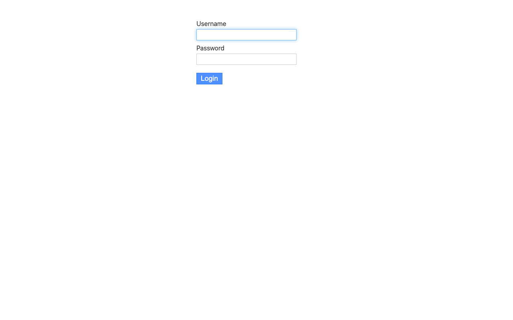

# Experience Report: Miniflux

Minimalist and opinionated RSS reader.

## What this app exercised

An app that creates its own administrator at first start from injected environment variables, with no command for Hop3 to run.

## What broke

**It shipped a published administrator password.** `ADMIN_PASSWORD="${ADMIN_PASSWORD:-changeme}"` appeared in three places in the hand-written Nix recipe (the wrapper, `runtime.json`, and the derivation's `env` attrset), so removing it from one changed nothing. Miniflux creates its administrator at first start from `CREATE_ADMIN` plus those variables, which means the credential mapping *is* the bootstrap; there is no post-deploy command to fix it afterwards.

**`buildGoModule` names the binary after the module path element**, so the artefact is `miniflux.app`. Nothing in the app id predicts that.

## What the platform gained

Nothing in the platform. It contributed a pattern instead: where an application creates its administrator at first start from environment variables, the credential mapping *is* the bootstrap and there is no post-deploy command to correct it later.

## Deployment variants

A single binary configured entirely through environment variables: `DATABASE_URL` and little else. **Native** builds from source with make; the **Nix** variants take nixpkgs' package and compile from source respectively, which makes this the cleanest side-by-side of the two Nix strategies in the corpus.

## Verification

`apps/miniflux/check.py` signs in with the `[admin]` credential, reaches a page only a session can, and confirms a wrong password is refused. It has no `[probe]` account, so it signs in as the operator's administrator: the weaker claim, since that password can be changed out from under it.

## Reproduce

```bash
hop3 catalog install miniflux
hop3 app check --app miniflux
```

## Open

## Screenshots



