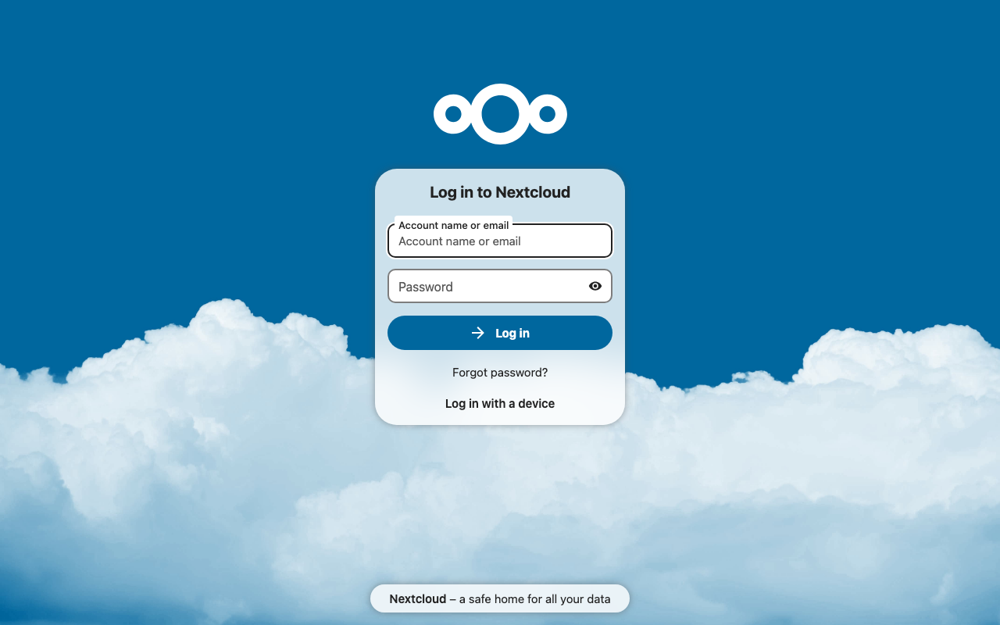
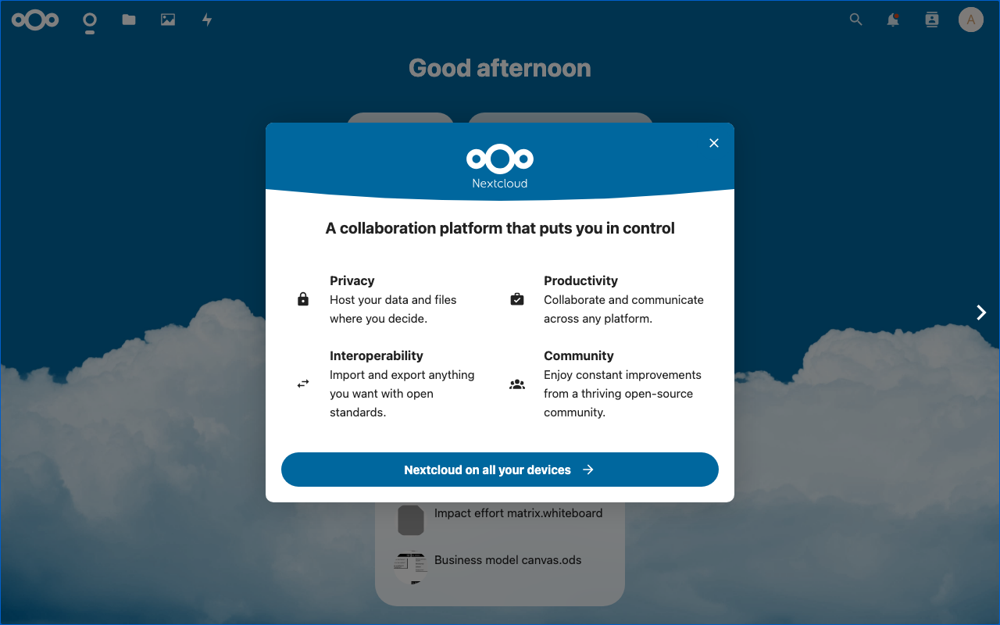

# Experience Report: Nextcloud

Self-hosted productivity platform.

## What this app exercised

The heaviest PHP dependency surface in the corpus (extensions, a cron worker, background jobs) and the app whose failing bootstrap first showed that `admin.create` reporting an exit status is not enough to diagnose anything.

## What broke

**It answered `GET /login` with 400 because it was never installed**: the writable tree was materialised when the app started, which is after `before-run`, so a correctly ported bootstrap ran in a directory that did not yet hold the application.

**`occ user:add` takes no `--email`.** The recipe passed one, the command failed, and the failure was invisible from the outside: Hop3 had already generated and displayed a credential for an account that did not exist. This is what made `admin.create` report its command's output rather than only an exit status.

**It keeps a hidden password input in its signed-in markup**, which had the screenshot harness call a successful sign-in a refusal. Counting only *visible* fields is what a person looking at the image would do.

## What the platform gained

`admin.create` reports its command's output rather than only an exit status, which is what revealed the `occ user:add --email` mistake, and the screenshot harness counts only *visible* password fields, because Nextcloud keeps a hidden one in its signed-in markup.

## Deployment variants

The most extension-hungry app in the set, and under Nix each one is declared explicitly. `occ maintenance:install` drives first-run setup in every variant. **Docker** diverges deliberately: Postgres plus Redis where the others use MySQL, as a test of addon divergence across variants.

## Verification

`apps/nextcloud/check.py` signs in with the `[probe]` account, which Hop3 owns and rotates, reaches a page only a session can, and confirms a wrong password is refused.

## Reproduce

```bash
hop3 catalog install nextcloud
hop3 app check --app nextcloud
```

## Open

Nothing open.

## Screenshots



