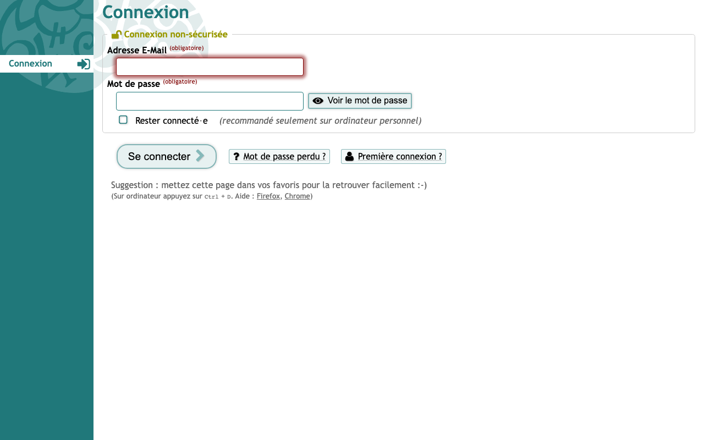
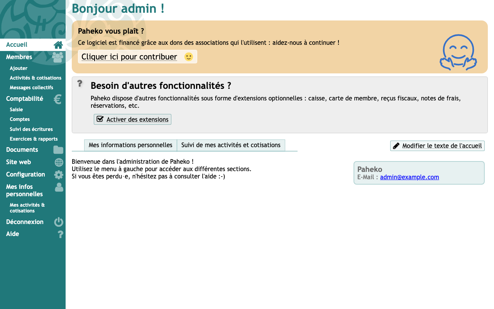

# Experience Report: Paheko

Nonprofit accounting and association management.

## What this app exercised

A PHP application that resolves its own public URL from `$_SERVER`, which is wrong behind a TLS-terminating proxy, and whose login form routes on the submit button's name.

## What broke

**The login form was never processed.** The sign-in POST returned 200 with the form re-rendered and no error text. A correct password, a wrong password, and a deliberately *omitted* CSRF token all produced identical responses: a form that inspects its input returns different errors for different failures; this one returned none. The cause: Paheko routes on the submit control's name (`$form->runIf('login', …)`), and the check posted only the form's hidden fields. A browser sends the button it clicked. The check omitted it, so `runIf` never matched.

**It advertised itself over plain HTTP.** Paheko resolves its own public URL from `$_SERVER`, and behind Hop3 it is reached over HTTP by the proxy that terminates TLS; it rendered `data-url="http://…"` on an HTTPS deployment. `HOP3_PUBLIC_URL` is injected for exactly this and the recipe was not using it. Fixing it did not fix the sign-in. It was a real defect and a wrong hypothesis at the same time.

**The Nix package was missing part of the application.** Both Nix variants died at every start on `require_once .../KD2/ErrorManager.php: No such file or directory`. Paheko vendors the KD2 framework into its release tarball and does not commit it, so a package built from the git tag is missing those files. Only the release archive supplies them. The release archive also has a flat layout where the tag put everything under `src/`.

**Its config declared global constants.** With the application finally present, `config.local.php` was writing bare `const DATA_ROOT` and friends, but Paheko reads `Paheko\DB_FILE`, so every setting was silently ignored and its defaults won. The file needs `namespace Paheko;` and guarded `defined() || define()`, because it is loaded with a plain `require` and a second bootstrap in one process turns the redefinition warning into a fatal.

## What the platform gained

The checking library's form handling: `form_fields` now sends the submit control, because Paheko routes on which button was pressed and a browser sends the one it clicked. Every app's check benefited.

## Deployment variants

Every variant takes the upstream *release* archive, for the reason above: only it carries the vendored KD2 framework. SQLite, no addon.

## Verification

`apps/paheko/check.py` signs in with the `[admin]` credential, reaches a page only a session can, and confirms a wrong password is refused. It has no `[probe]` account, so it signs in as the operator's administrator: the weaker claim, since that password can be changed out from under it.

## Reproduce

```bash
hop3 catalog install paheko
hop3 app check --app paheko
```

## Open

- **nix:** no screenshot: the capture hangs on a ServiceWorker registration, as it does for the template-generated variant. The sign-in is verified over HTTP.
- **nix-gen:** no screenshot. The capture times out after 60 s with no requests outstanding and a failed ServiceWorker registration in the page errors: the renderer is stuck, and resource starvation was ruled out. The sign-in itself is verified over HTTP.

## Screenshots

 
