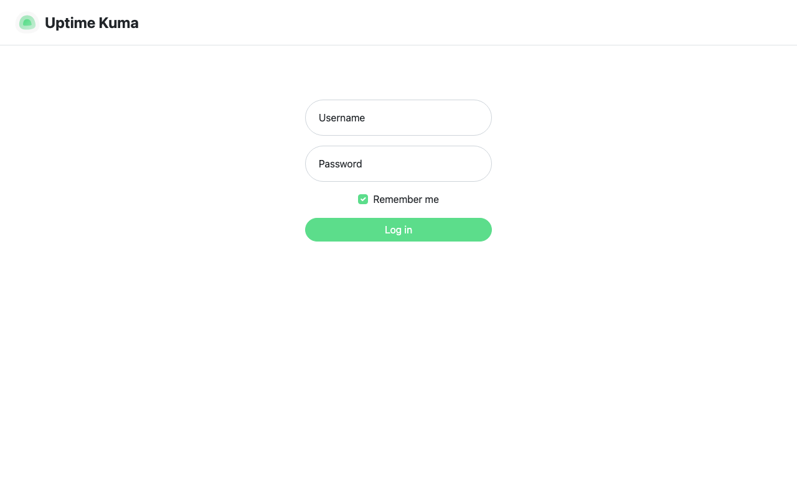

# Experience Report: Uptime Kuma

Self-hosted uptime monitoring with a web UI and status pages. Packaged for Hop3 across the native, Docker and Nix build paths, and published in the signed catalog.

## What this app exercised

An app that authenticates over socket.io rather than HTTP, so its check drives the application's own bundled client through node.

## What broke

**The smoke test accused a working application for a week.** It reported "the credential Hop3 generated was refused"; the credential signs in through a browser without trouble. The probe drives the app's own bundled socket.io client through node, and every wait in it resolved on its own timeout:

- the connect wait resolved whether or not a socket opened;
- the next wait left `offered` as `null`, and the check asked only whether it was `'setup'` — `null` is not `'setup'`, so *"the server offers a login, not its setup wizard"* passed **without a socket ever being opened**;
- the login then timed out, and a timeout was returned as `false`, which the check rendered as a refusal.

Three silent fallbacks stacked into an accusation. Making them fail loudly also fixed the app: the probe had been emitting `login` before the server announced `loginRequired`, and a wait that must succeed cannot race ahead of it.

**The probe account was created only when the admin was.** `createProbeUser()` sat after an early `return` in the branch that creates the administrator, so any instance with an existing user row got no probe — undetectably, because nothing verified it.

**The JavaScript lived inside a Python string.** The probe was an embedded literal in `check.py`; a `\'` in the Python source arrived at node as a bare quote and killed the whole probe with a `SyntaxError`, after a full deploy. It is a `scripts/probe.js` file now, which is what `node --check` can read.

## What the platform gained

The catalog driver now separates 'the run could not verify this' from 'this application failed'.

## Cost

Not recorded. The earlier reports did not track effort, and it cannot be reconstructed after the fact.

## Deployment variants

### Native

Not yet described.

### Docker

No recipe for this variant.

### Nix (hand-crafted)

No recipe for this variant.

### Nix (template-generated)

No recipe for this variant.

## Verification

`apps/uptime-kuma/check.py` runs against the deployed application and asserts, in order:

1. the server offers a login, not its setup wizard
1. the probe-or-admin credential signs in
1. a wrong password is refused

It signs in with the credential Hop3 generated — the `[probe]` account where the recipe declares one, otherwise the `[admin]` credential, which is the weaker claim because the operator owns it.

## Reproduce

```bash
hop3 catalog install uptime-kuma
hop3 app check --app uptime-kuma
```

## Open

Nothing outstanding.

## Screenshots


