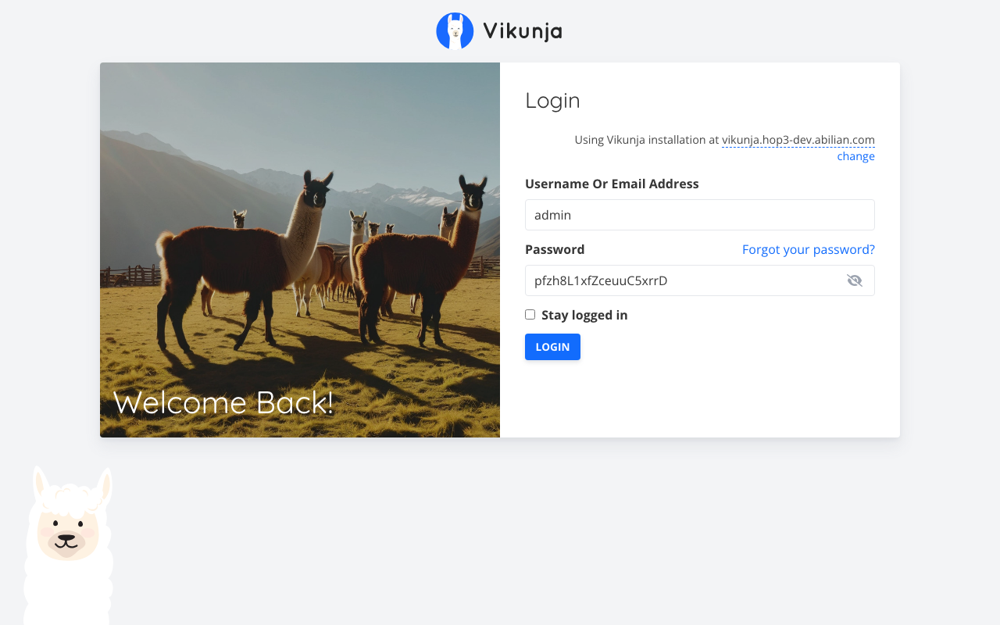

# Experience Report: Vikunja

Open source task and project management.

## What this app exercised

Two toolchains in one derivation: a Vue frontend built offline from a committed lockfile and embedded into a Go binary at compile time. `go-frontend-pnpm` is validated. Wrapper-only environment is invisible to the commands that bootstrap an app.

## What broke

**The accounts were created against the wrong database.** Every setting was an `export VIKUNJA_*` inside the generated wrapper, so only the server process saw it; `[admin].create` runs outside the wrapper. `vikunja user create` therefore found no database configuration, said so in its own log on every run (*"No config file found, using default or config from environment variables"*), and wrote the accounts to Vikunja's defaults instead of the app's Postgres. A sign-in then answered *"Wrong username or password"* for the admin and 412 for the probe: two symptoms, one cause, and a day spent treating them as two problems.

**`publicurl` is what the browser is told to call.** Pinned to localhost, the Vue frontend aimed its API calls at the visitor's own machine, failed to reach `/api/v1/info`, and rendered an error where the login form should be, while the application answered its own API check perfectly.

**The binary is not named after the app.** Built from source it is `api`; from nixpkgs it is `vikunja`.

## What the platform gained

`go-frontend-pnpm`, and the `${pkg}` binding it shares with the forges. Anything exported inside the generated wrapper is invisible to `before-run` and to `create`.

## Deployment variants

The only recipe here that builds two toolchains into one derivation: the Vue frontend is built offline from a committed pnpm lockfile and copied into `frontend/dist` before the Go compile, because Vikunja `go:embed`s it. **Nix (hand-crafted)** takes nixpkgs' package instead: the same 0.24.6, differently built, with the binary named `vikunja` where the source build produces `api`.

## Verification

`apps/vikunja/check.py` signs in with the `[probe]` account, which Hop3 owns and rotates, and confirms a wrong password is refused.

## Reproduce

```bash
hop3 catalog install vikunja
hop3 app check --app vikunja
```

## Open

Nothing open.

## Screenshots



