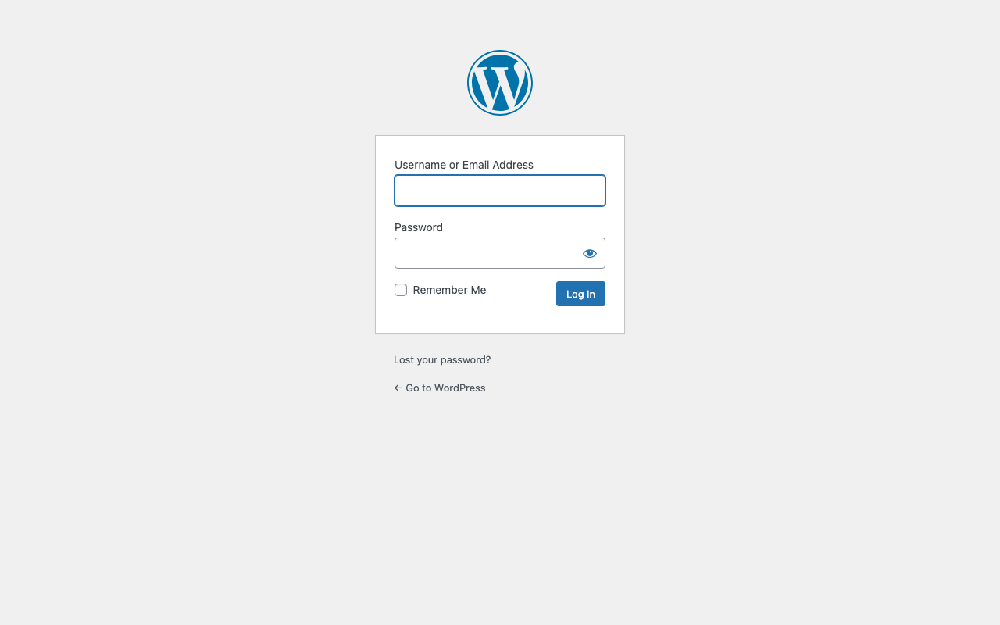
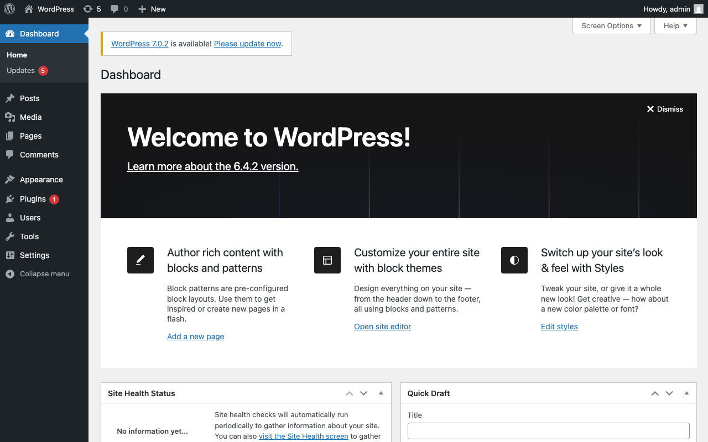

# Experience Report: WordPress

Popular open source content management system.

## What this app exercised

Nothing new. It is the control that says the common path is boring: `getenv()` configuration, no build step, and nothing any variant had to work around. A corpus needs one of these to make the others legible.

## What broke

Nothing broke that was WordPress's doing. It reads its configuration through `getenv()` in `wp-config.php`, which makes it unusually clean to express in every build path, and the template variant needed nothing the others did not.

The one failure was ordering, and it was ours: the Docker variant started Apache before MySQL was accepting connections and returned a 500. A wait loop fixed it. The same shape now recurs across enough recipes to qualify as a platform pattern, and the fix belongs in the platform catalogue.

## What the platform gained

Nothing. It is a confirmation.

## Deployment variants

No composer and no build step in any variant. `wp-config.php` reads through `getenv()`, so configuration is an environment bridge rather than a generated file, and `wp core install` creates the administrator.

## Verification

`apps/wordpress/check.py` signs in with the `[probe]` account, which Hop3 owns and rotates, reaches a page only a session can, and confirms a wrong password is refused.

## Reproduce

```bash
hop3 catalog install wordpress
hop3 app check --app wordpress
```

## Open

## Screenshots



