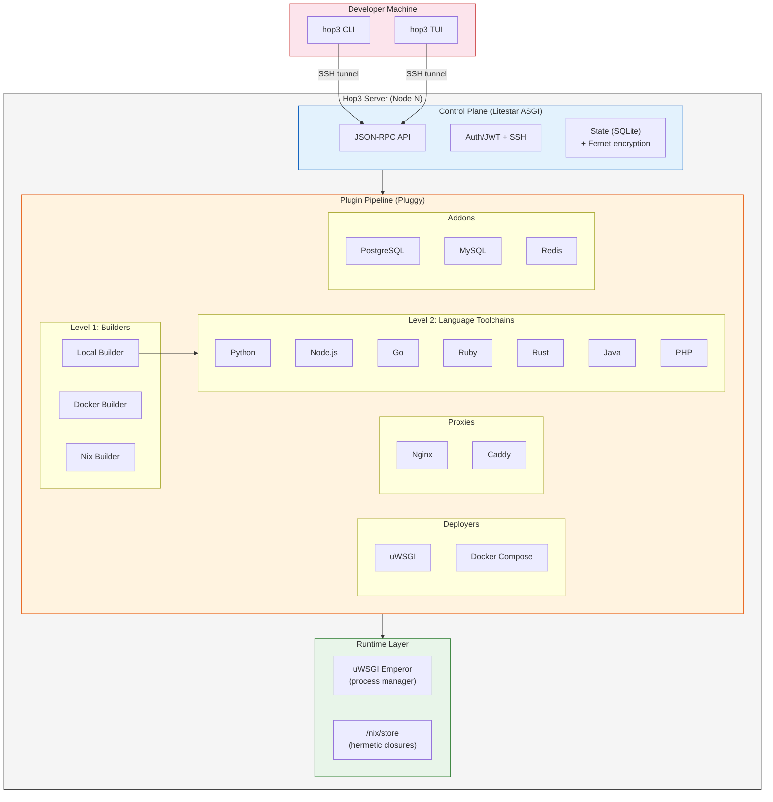
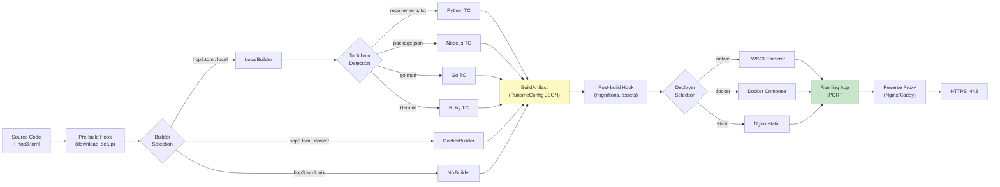

# Hop3: A Sovereignty-First PaaS for Single-Server Deployment, with a Nix-Based Reproducible Build Path

## Abstract

Mainstream application orchestration has converged on container clusters built around distributed consensus stores. For single-server deployments — common in small-to-medium organisations, at the network edge, and wherever digital sovereignty rules out external control planes — the overhead of this paradigm is disproportionate to the problem. We present **Hop3**, an open-source Platform-as-a-Service designed for autonomous single-server operation. Hop3 provides a Heroku-style developer experience (git-push deployment, automatic language toolchains, managed backing services) without requiring Docker or Kubernetes, running on commodity hardware with a small control-plane footprint. The system is structured around a decoupled control plane (JSON-RPC over SSH, Litestar ASGI, local SQLite or PostgreSQL state, Fernet-encrypted secrets) and a plugin-driven build and deployment pipeline supporting ten language toolchains. An integration with the Nix package manager [10] provides hermetic builds with eleven parametrisable templates that generate `hop3.nix` expressions from a declarative `hop3.toml` spec; every template builds offline in the Nix sandbox against a dependency set vendored from a committed lockfile, and 30 of 30 template-generated recipes rebuild bit-for-bit identically. We state four design requirements (determinism, bounded overhead, autonomy, encrypted secrets), describe the architecture against these requirements, and report a 99-variant application corpus drawn from 30+ distinct upstream projects across Docker, native, hand-crafted-Nix and template-generated-Nix deployment strategies, of which a 20-application golden set is additionally verified through each application's authenticated interface. Preliminary measurements over this set quantify the design: a blank server reaches a running, verified application in about nine minutes; the control plane holds 185 MB, 7.8× lighter than a lean K3s carrying the same workload; and Nix closure sizes, cross-application deduplication (21–36%) and update deltas are measured against the equivalent upstream Docker images. The paper closes with a discussion of two extension paths: a richer multi-service application model (per ADR 038) for apps such as Mastodon and AppFlowy that exceed the current single-process-tree assumption, and a longer-term direction toward multi-node operation along the lines reviewed by Vaño et al. [21] for edge-native deployments.

## 1. Introduction

The dominant paradigm for application deployment has shifted toward container orchestration systems, with Kubernetes emerging as the de facto standard [4]. However, this paradigm imposes significant infrastructure overhead — consensus-based control planes, container runtimes, and service meshes — that is disproportionate for the common case of deploying web applications on a single server [4], [5]. Meanwhile, the proliferation of IoT devices and the demand for data locality have driven interest in edge and fog computing [1], [2], where workloads run on resource-constrained nodes at the network periphery.

Hop3 addresses the gap between heavyweight cloud-native orchestrators and manual provisioning scripts. It provides a self-contained PaaS that deploys and manages web applications on a single server, implementing the Twelve-Factor App methodology [6] without requiring Docker or Kubernetes. The system is designed with the following priorities:

- **Simplicity:** A single-server deployment model that eliminates distributed systems complexity.
- **Sovereignty:** Self-hosted infrastructure where the operator retains full control over data and configuration [16], [17].
- **Reproducibility:** Hermetic builds via Nix integration, reducing environment drift across deployments [8], [10].

**Contributions.** This is a systems engineering paper; the contributions are concrete artefacts, a conceptual positioning, and a demonstration that they compose.

1. A control-plane architecture that operates without distributed consensus (etcd/Raft), with a single-process ASGI core that serves the full JSON-RPC CLI surface for a multi-application deployment.
2. A plugin-driven deployment pipeline factored along two independent axes — *builder* (Local, Docker, Nix) and *language toolchain* (Python, Node, Go, Ruby, Rust, Java, PHP, Clojure, Elixir, .NET) — which bounds integration complexity as new languages or build strategies are added.
3. A template-based scheme for generating Nix expressions from a declarative `hop3.toml` specification, covering eleven common packaging patterns, each sealing its ecosystem's package manager behind a vendored dependency set, and a three-tier taxonomy classifying the resulting artefacts by provenance.
4. A 99-variant application corpus, drawn from 30+ upstream projects, deployed end-to-end on a remote VPS through each of the four build strategies, with per-variant diagnostic logs automatically collected on failure.
5. A conceptual positioning of Nix-based deployment as a *fourth path* alongside containers, microVMs and unikernels — dependency-closure isolation without OS-level virtualisation — extending the post-container taxonomy of Vaño et al. [21] (§2.5, Table 2).

## 2. Background and Related Work

### 2.1 Edge and Fog Computing

Edge computing pushes workloads to the network periphery for low-latency processing [1], [2]. Fog computing extends this to a continuum of micro-datacenters and local servers bridging edge devices to the cloud [3]. Satyanarayanan [1] identifies the key challenges: limited bandwidth to the cloud, high variability in network conditions, and the need for autonomous operation. Moreschini et al. [19] formalize the "cloud continuum" spanning centralized datacenters through fog nodes to extreme edge devices. Puliafito et al. [22] survey fog architectures for IoT, noting that most assume container-based deployment models ill-suited for constrained hardware.

### 2.2 Heavyweight and Lightweight Orchestration

Kubernetes provides high availability through distributed consensus (Raft/etcd) but imposes substantial baseline resource consumption. Morabito et al. [5] demonstrate that the overhead of API servers, kubelets, and service meshes often exceeds the available resources of edge gateways. Lightweight distributions — K3s, MicroK8s, k0s — reduce this overhead but retain fundamental container-runtime dependencies. Koziolek and Eskandani [20] benchmark these distributions, finding that even K3s requires 500+ MB RAM for the control plane alone. Vaño et al. [21] review cloud-native orchestration at the edge, concluding that container-centric approaches introduce avoidable complexity for single-node deployments.

### 2.3 PaaS Heritage

The PaaS model, pioneered by Heroku and formalised in the Twelve-Factor App methodology [6], provides a developer-centric deployment interface: push source code, and the platform handles building, running and scaling. Cloud Foundry and OpenShift extended this to enterprise contexts [7]. Dokku and Piku (both open-source) adapt the PaaS model to a single server; we are not aware of a peer-reviewed description of either, but the codebases themselves stand as the reference. Two more recent entrants occupy the same single-server niche: **CapRover** wraps a web GUI around Docker Swarm — introducing distributed-systems dependencies even for single-node use — and **Coolify** offers a polished Vercel-style self-hosted experience, Docker-based, with no reproducible-build story. Hop3 is in the same design space and departs from all four in four places: (i) the build pipeline is factored into builder × language-toolchain rather than exposing buildpacks directly; (ii) Nix integration gives an alternative build strategy with stronger hermeticity than the native buildpack/toolchain path; (iii) a single uniform plugin architecture spans builders, toolchains, addons and proxies; and (iv) per-variant deployment diagnostics are collected automatically on failure. Table 1 summarises the comparison.

| Property | Dokku | Piku | CapRover | Coolify | **Hop3** |
|----------|-------|------|----------|---------|----------|
| Docker required | Yes | No | Yes | Yes | Optional |
| Language toolchains | Via buildpacks | 3 | Via Docker | Via Docker | 10 native + Docker + Nix |
| Reproducible builds | No | No | No | No | **Yes (Nix)** |
| Plugin architecture | Yes | No | Yes | Limited | **Yes (Pluggy)** |
| SBOM generation | No | No | No | No | **Yes (Python; pluggable)** |
| External dependencies | Docker Hub | None | Docker Hub, Swarm | Docker Hub | **None (with Nix)** |
| Web UI | Via plugins | No | Yes | Yes | Web planned; TUI (production) |
| Multi-server | No | No | Yes (Swarm) | Yes | No (by design) |

*Table 1: Hop3 against the direct single-server-PaaS competitors. "Optional" Docker means Docker is one build strategy among three, not a prerequisite. SBOM generation is currently a Python-ecosystem proof-of-concept behind a pluggable interface.*

### 2.4 Reproducible Builds and Deployment

Reproducible builds ensure that given identical source code, the build process produces bit-for-bit identical outputs [8]. Lamb and Zacchiroli [8] argue this is essential for software supply chain integrity. Fourné et al. [9] study adoption barriers, finding that tooling complexity is the primary obstacle.

The Nix package manager [10] provides a purely functional deployment model where each package is identified by a cryptographic hash over its declared build inputs. Dolstra [10] shows that this model gives a solid foundation for three operational properties: all dependencies are declared (no hidden references to the host system), upgrades and rollbacks compose cleanly (new store paths are added atomically and old ones kept), and multiple versions coexist without path conflicts. These are properties of the model and of the Nix store design; they are not by themselves equivalent to *deterministic builds*, which require an additional property of each individual derivation [8]. NixOS [11] extends the model to system configuration; Disnix [12] extends it to distributed multi-machine deployment; GNU Guix [13] offers a parallel implementation based on the same principles.

### 2.5 Container Alternatives and the Design Space of Post-Container Deployment

The assumption that containers are the only viable deployment abstraction is increasingly challenged from multiple directions. Vaño et al. [21], in their review of cloud-native orchestration at the edge, identify three post-container trends: WebAssembly/WASI [15], microVMs (Kata, Firecracker), and unikernels such as Unikraft [14]. Their Table 1 organises the field around Kubernetes-derived orchestrators (KubeEdge, OpenYurt, SuperEdge, K3s, …) and treats these three alternatives as emerging substitutes for the container baseline.

We argue that this taxonomy is incomplete. A fourth path is available — *dependency-level reproducibility without OS-level virtualisation* — and it predates all three: it is the Nix deployment model [10], treated as a deployment abstraction rather than a developer-environment tool. Under this path, applications run as ordinary Unix processes, and isolation is provided by the *closure of their declared dependencies* rather than by a runtime sandbox. Table 2 below positions all five families — the container baseline and four alternatives — against each other.

| Approach | Isolation mechanism | App changes required | Kernel-level cost |
|----------|---------------------|----------------------|-------------------|
| Containers (runc, crun, …) | Namespaces + cgroups | None | Shared kernel |
| microVMs (Kata, Firecracker) | Lightweight hypervisor | None | One kernel per VM |
| Unikernels (Unikraft, Nabla) | Library-OS compiled with the app | Re-compile against unikernel libOS | No host kernel; bare hypervisor |
| WebAssembly/WASI | Bytecode sandbox | Compile to Wasm | Shared kernel + Wasm runtime |
| **Nix-based deployment (this paper)** | Content-addressed dependency closure | None | Shared kernel, no sandbox |

The trade-offs are real: Nix does not give the runtime isolation of containers or unikernels. What it does give — and no alternative in the Vaño taxonomy does — is hermeticity of *build inputs* without imposing any runtime isolation cost. For the single-server PaaS case, where multi-tenant isolation is not a requirement but reproducibility, bandwidth-efficient updates and clean rollback are, this trade-off is favourable. The rest of this paper develops that argument.

### 2.6 Digital Sovereignty

European policy initiatives increasingly emphasise digital sovereignty — the ability of organisations and nations to control their own digital infrastructure [16], [17]. Floridi [16] argues for hybrid control regimes that balance global interoperability with local autonomy; Pohle and Thiel [17] survey how "digital sovereignty" has been mobilised in EU policy discourse. The concrete implication for infrastructure software is a demand for self-hostable stacks that do not assume a hyperscaler control plane; Hop3 is one answer within that space. We return to sovereignty in §7.4, where we characterise it as a set of technical invariants a platform architecture can enforce or weaken, rather than as a hosting location.

### 2.7 Infrastructure as Code

Rahman et al. [18] map the landscape of Infrastructure-as-Code (IaC) research, identifying declarative configuration as the dominant paradigm. Hop3's `hop3.toml` format sits in that tradition: the operator declares the application's language, entry point, addons and port, and the platform derives the rest.

## 3. Problem Definition

### 3.1 System Model

Let a server node $N$ possess bounded compute capacity $C_N$, memory $M_N$, and network bandwidth $B_N$. An application $A_i$ is defined by its source code $S_i$ and a declarative configuration $C_i$ (a `hop3.toml` file specifying runtime, dependencies, and backing services).

A deployment function $D$ maps source and configuration to an execution environment:

$$D: (S_i, C_i) \rightarrow E_i$$

where $E_i$ is the running application instance on $N$.

### 3.2 Requirements

We require that $D$ satisfies:

**R1. Determinism (desired, build-path-dependent).** The deployment function $D$ should be single-valued: for a fixed source $S$ and configuration $C$, successive invocations of $D(S, C)$ should produce *functionally equivalent* environments (equal-responding services under equal input). Under the Nix build path this is strengthened by Nix's hermeticity guarantees: the closure $\Delta(S, C)$ of declared build inputs is content-addressed, so a build invoked with the same derivation inputs sees the same inputs on every invocation. Bit-for-bit identity of the *outputs* additionally requires the derivation itself to be deterministic (no embedded timestamps, no parallel-order dependence, etc.); that is an orthogonal property of each derivation, addressed by the reproducible-builds community [8]. Under the Docker or native build paths, R1 is satisfiable only as a policy discipline (pinned base images, frozen package indexes) and is not guaranteed by the system.

**R2. Bounded overhead.** The control plane resource consumption must be bounded independently of the number of managed applications:

$$\text{mem}(\text{control plane}) \leq k, \quad k \ll M_N$$

**R3. Autonomy.** $N$ must be capable of rebuilding, restarting, or rolling back $E_i$ without connectivity to external infrastructure.

**R4. Security.** Secrets required by $E_i$ are encrypted at rest using authenticated encryption (Fernet AEAD) with locally-generated keys:

$$\text{secret}_{\text{stored}} = \text{Enc}_{K_N}(\text{secret}_{\text{plaintext}})$$

where $K_N$ is node-local and never transmitted.

### 3.3 Comparison with Existing Approaches

The following table positions Hop3 against three existing approaches against requirements R1–R4. The "bounded overhead" column gives control-plane memory: a cited order of magnitude for Kubernetes, and first-party measurements on identical hardware for K3s, Docker Compose and Hop3 (§6.4). The other cells characterise the system as designed, not as measured.

| Property | Kubernetes | K3s | Docker Compose | Hop3 |
|----------|-----------|-----|----------------|------|
| R1 (Determinism) | Not by design (images are mutable) | Not by design | Not by design | Under the Nix build path (hermetic inputs); not under Docker or native |
| R2 (Control-plane memory, order of magnitude) | GBs (consensus store + API server) | Hundreds of MB–GB — [20] report 500+ MB; we measure ~1.2 GB (cgroup) / ~900 MB (system RAM) for lean K3s on identical hardware (§6.4) | Tens of MB — we measure ~27 MB (dockerd, §6.4) | ~185 MB (cgroup) / ~205 MB (PSS), measured (§6.4) |
| R3 (Autonomy) | No (requires quorum of etcd nodes) | Partial (single-node mode possible) | Yes | Yes |
| R4 (Encrypted secrets at rest) | Yes (sealed secrets) | Yes | No | Yes (Fernet AEAD) |
| Multi-language native builds | No | No | No | Yes (ten toolchains) |

## 4. The Hop3 Architecture

Hop3 is structured as a modular, plugin-driven system with four distinct layers.

### 4.1 Architecture Overview

Figure 1 shows the layered structure of a Hop3 deployment: a developer machine communicates over an SSH tunnel with a single server node $N$; the node runs a Litestar ASGI control plane, a Pluggy-based plugin pipeline, and a runtime layer combining uWSGI Emperor for process supervision with a Nix store for hermetic closures.



*Figure 1: Hop3 system architecture. The CLI and TUI establish SSH tunnels to the server's Litestar ASGI control plane; the plugin pipeline resolves build and deployment strategy dynamically per application; the runtime layer couples uWSGI process supervision with a Nix store for hermetic closures.*

Figure 2 shows the deployment flow from a `git push` through builder selection, toolchain execution, artefact materialisation, deployer selection and proxy configuration:



*Figure 2: Deployment flow. The builder and toolchain are selected from `hop3.toml`; both Docker and Nix strategies bypass the toolchain step. All strategies converge on a `BuildArtifact` (carrying a `RuntimeConfig` JSON) consumed by the deployer. The reverse proxy is configured last and terminates TLS.*

### 4.2 Control Plane

The control plane is implemented as a single-process ASGI application (Litestar framework), providing:

- **JSON-RPC API** for command dispatch from the CLI and TUI clients.
- **Authentication** via JWT tokens over SSH tunnels, with magic-link browser login as an alternative.
- **State management** using SQLAlchemy with SQLite (single-server) or PostgreSQL (scalable), with Fernet AEAD encryption for secrets at rest.

Because Hop3 targets single-server deployment, it eliminates the need for distributed consensus (etcd/Raft), leader election, and cross-node state synchronization. This architectural choice directly satisfies R2 (bounded overhead) and R3 (autonomy).

### 4.3 Plugin Pipeline

The deployment pipeline uses the Pluggy hook specification framework to dynamically compose build, deploy, and proxy strategies:

**Two-level build architecture:**

- *Level 1 — Builders* orchestrate **how** to build: LocalBuilder (native toolchains), DockerBuilder (containerized builds), NixBuilder (hermetic Nix builds).
- *Level 2 — Language Toolchains* execute **what** to build: Python, Node.js, Go, Ruby, Rust, Java, PHP, Clojure, Elixir, .NET.

This separation allows the same application source to be built natively (direct compilation on the server), in a Docker container (isolation), or via Nix (reproducibility), depending on the operator's requirements.

**Build Artifact contract:** Every build produces a `BuildArtifact` containing a `RuntimeConfig` with workers, environment variables, and PATH configuration. This artifact is persisted as JSON and consumed by the deployer, creating a clean separation between build and run phases.

**Deployers** manage the application runtime: uWSGI (process management with automatic restart), Docker Compose (containerized apps), or static file serving (nginx).

**Proxies** configure reverse proxy routing: Nginx, Caddy, or Traefik, with automated TLS certificate management.

**Addons** provision backing services: PostgreSQL, MySQL, and Redis, with connection credentials injected as environment variables.

### 4.4 Configuration Model

Applications are configured via `hop3.toml`, a declarative format that extends the Twelve-Factor App [6] convention:

```toml
[build]
builder = "nix"          # or "local", "docker"

[run]
start = "gunicorn app:app --bind $BIND_ADDRESS:$PORT"
before-run = "python manage.py migrate"

[env]
DEBUG = "false"

[env.computed]
DATABASE_URL = "postgresql://${PGUSER}:${PGPASSWORD}@${PGHOST}:${PGPORT}/${PGDATABASE}"

[[addons]]
type = "postgres"
```

The `[env.computed]` section supports variable interpolation, resolving the common problem of mapping platform-injected variables (e.g., `PGHOST`) to application-expected names (e.g., `DATABASE_URL`).

## 5. Nix Integration for Deterministic Deployment

### 5.1 Motivation

Native toolchain builds (R1 partial) depend on the server's installed packages, which may drift over time. Docker builds provide isolation but not reproducibility — the same `Dockerfile` can produce different images on different days due to mutable base images and rolling package repositories. Nix provides hermetic builds where every dependency is cryptographically pinned [10].

### 5.2 Architecture

Each Nix-built application provides a `hop3.nix` file — a Nix expression that evaluates to a package containing the application and all its dependencies. The NixBuilder plugin:

1. Evaluates `nix-build hop3.nix -A package` to produce a Nix store path.
2. Reads `$out/hop3/runtime.json` from the built package for worker commands, environment variables, and PATH entries.
3. Produces a `BuildArtifact` consumed by the standard deployer pipeline.

### 5.3 Reproducibility: What We Inherit and What We Add

Hop3 inherits its reproducibility properties from Nix. The underlying model — content-addressed storage of derivations identified by a cryptographic hash over their declared inputs — is established by Dolstra's purely functional deployment model [10] and the surrounding literature (NixOS [11], Disnix [12], Guix [13]). We do not restate or re-prove it here. The relevant caveat for any consumer of this model is that input-hash equality captures *hermeticity* (the build sees the same inputs) but not *deterministic build behaviour* (the build produces the same outputs from the same inputs); the latter is an additional property that derivations may or may not satisfy [8], and is the subject of the wider reproducible-builds effort.

What Hop3 adds, against this background, is:

1. **A pipeline that produces Nix derivations from a higher-level declarative spec** (`hop3.toml`). The eleven templates in §5.4 take a small structured input — a package name, an exec target, environment overrides, addon dependencies — and emit a `hop3.nix` expression. The templating step is a pure function; identical `hop3.toml` inputs produce identical Nix expressions, and any non-determinism downstream is a property of Nix itself, not of the Hop3 wrapper.

2. **A runtime contract** (`$out/hop3/runtime.json`) that decouples what a Nix-built artefact *is* from how Hop3 *runs* it. The contract specifies the worker commands, environment variables, and PATH entries; the Nix build produces the JSON, and the Hop3 deployer consumes it. This separation lets the deployer evolve independently of any individual application's Nix expression.

3. **A uniform vendoring pattern that makes every template hermetic**, generalising `buildGoModule`'s `vendorHash` across six ecosystems. A fixed-output derivation runs only the package manager's fetch step against a committed lockfile — the sole point of network access, and content-addressed, so the dependency set is fixed by a hash — after which the application builds in the sealed sandbox with the network off (`pip --no-index`, `composer` offline autoload, `pnpm --frozen-lockfile --ignore-scripts`, `bundlerEnv` from a bundix `gemset.nix`, `gradle.fetchDeps`). Package managers that resolve dependencies at build time are the standard obstacle to hermetic Nix packaging; the pattern removes it without per-ecosystem tooling.

4. **A reproducibility taxonomy for the templates.** Because sandbox purity is uniform, the tiers classify *provenance* rather than hermeticity: Tier 1 wraps a package nixpkgs already builds from source, Tier 2 builds the application from source in Hop3 against a hash-pinned dependency set, Tier 3 fetches an upstream release artefact by digest. Tiers 1 and 2 are auditable to source and Tier 3 is not, while all three rebuild bit-for-bit. The tier is declared on the template and inherited by every application selecting it, so an auditor reads a per-application label off a checkout rather than trusting a hand-maintained table. Tier 1 is preferred where available, since it also inherits nixpkgs' architecture coverage and security updates.

**Update bandwidth.** When a deployed application moves from $v_1$ to $v_2$, only the changed store paths ($\Delta(A_{v_2}) \setminus \Delta(A_{v_1})$, where $\Delta$ is the transitive closure of build dependencies) need be transferred; pinned dependencies are unchanged and stay in the target's store. §6.4 quantifies this for the Tier-1 subset: a source-only bump re-sends the application's own path (tens of MB, well below the full closure). Whether that beats a Docker layer-level update is application-class-dependent — it does for large shared runtimes, but not for statically-linked single-binary applications whose upstream image is already minimal, where the two are comparable. The unconditional Nix disk win we measure is cross-application deduplication, not per-update bandwidth (§6.4).

**Possible future theoretical work.** A formal characterisation of the *templating step* — proving that the template scheme is a sound encoding of a meaningful subset of build configurations, and analysing the soundness/completeness trade-off of automatically generated `hop3.nix` files — would be a useful piece of theory in its own right, but it is not attempted here.

### 5.4 Current Status

Both Nix integration phases are implemented. Phase 1 supports applications that ship an explicit `hop3.nix` expression; 23 applications in the evaluation corpus follow this path. Phase 2 auto-generates `hop3.nix` from a declarative `hop3.toml` spec via one of eleven templates; 20 further applications in the evaluation corpus follow this path, and the template-generated corpus has since grown to 31 recipes. The two paths coexist: an operator starts from a template and may "eject" to a hand-crafted expression for finer control.

| Template | Tier | Build |
|---|---|---|
| `nixpkgs-wrapper` | 1 | wraps an existing nixpkgs package |
| `php-app` | 2 | `composer.lock` → vendored FOD, offline autoload |
| `python-venv` | 2 | hash-pinned `requirements.txt` → vendored wheel set, `--no-index` |
| `go-source` | 2 | `buildGoModule` with a `vendorHash` |
| `node-pnpm-install` | 2 | `pnpm fetch` FOD, `--frozen-lockfile --ignore-scripts` |
| `ruby-bundler` | 2 | `bundlerEnv` from a bundix `gemset.nix` |
| `java-gradle` | 2 | Gradle against a committed `deps.json` |
| `java-war`, `node-prebuilt` | 3 | upstream artefact fetched by digest |
| `prebuilt-binary`, `prebuilt-archive` | 3 | upstream artefact fetched by digest |

Recipes pin nixpkgs to a single commit (nixos-24.11), with one exception: an application that entered nixpkgs later can override the pin for itself, which `etherpad` does (a nixos-25.05 revision), because the package does not exist in the default. So the corpus is evaluated against *two* pins rather than one, and "the pinned nixpkgs" should be read accordingly. The mechanism is per-application and validated at parse time — a malformed revision is refused rather than interpolated into the expression — and any recipe may use it.

The distribution over the 31 template-generated recipes is 6 Tier-1, 23 Tier-2, 2 Tier-3. It moved substantially during the project: applications initially packaged as Tier-3 wrappers were migrated to source builds as the vendoring pattern reached each ecosystem, leaving only the two whose upstream ships no buildable source for the packaged version — and which nixpkgs itself packages from the upstream artefact. Each migration was a one-line template change in `hop3.toml` rather than a rewrite, which is the property the declarative spec exists to provide. The two generic prebuilt templates are retained with no current consumer: they remain the fast path for packaging an application without lockfile work, and the only path for proprietary software distributed as a binary, for which no source build is possible in principle.

Remaining work for subsequent releases includes Nix-based addon provisioning (PostgreSQL, Redis as Nix-managed services rather than OS packages) and a systematic treatment of multi-service applications under a single Nix closure (per ADR 038).

## 6. Evaluation

Hop3 is evaluated along two axes: **application coverage** — the breadth of real software the platform deploys and operates correctly (§6.1) — and the **architectural requirements** R1–R4 (§6.2). §6.3 compares the three build strategies; §6.4 states the quantitative benchmark protocol and the measurements available at the time of writing.

### 6.1 Application Coverage

Hop3 maintains a corpus of application variants covering four deployment strategies applied to a common set of open-source applications, so that cross-strategy comparisons remain meaningful. The counts below (April-2026 snapshot) reflect variants deployed end-to-end on a remote VPS (Ubuntu 24.04, 4 vCPU, 16 GB RAM) via the automated test harness.

| Strategy | Count | Notes |
|----------|-------|-------|
| Native uWSGI (language toolchains) | 27 | Python, Node, Go, Ruby, Rust, Java, PHP |
| Docker Compose (upstream Dockerfile) | 29 | Apps whose upstream publishes a Dockerfile |
| Hand-crafted Nix (`hop3.nix` written by operator) | 23 | Explicit dependency control |
| Template-generated Nix (from `hop3.toml`) | 20 | Nine templates (see §5.4); auto-derived from a lockfile-equivalent manifest |
| **Total variants** | **99** | Drawn from 30+ distinct upstream applications |

The corpus exercises seven of the ten implemented language toolchains (Python, Node, Go, Ruby, Rust, Java, PHP); the Clojure, Elixir and .NET toolchains are implemented but not represented in this application set.

**Functional verification of the golden set.** A deployment that returns HTTP 200 is a weak bar: a landing page, a placeholder, or an installation wizard all return 200. A curated **golden set of 20 applications**, advertised as production-ready, is therefore verified through a stronger functional bar — each is exercised through its *authenticated* interface (a real login using platform-generated admin credentials driven against the application's own auth surface), checked for **redeploy-safety** (generated secrets stay stable and persisted data survives a source-replacing redeploy), and confirmed to serve application-specific content rather than a placeholder. **18 of the 20 clear this bar on a blank-slate run**: BookStack, Bugsink, Easy Appointments, Forgejo, Gatus, Gitea, Invoice Ninja, Isso, Kanboard, Keycloak, LimeSurvey, Mattermost, Miniflux, Nextcloud, Paheko, Radicale, Vikunja and WordPress. The two not yet cleared — **Matomo** and **Dolibarr** — ship only browser-wizard installation and await a headless-installer driver; they are deferred rather than reported as working.

The application set covers the categories relevant to small-to-medium businesses, agencies and non-profits — content management (WordPress, Ghost, Wiki.js, HedgeDoc), collaboration (Etherpad, CryptPad, Nextcloud), analytics (Matomo), project management (Kanboard, Focalboard, Vikunja), code forges (Gitea), CRM (Dolibarr, Invoice Ninja), and federated messaging (Matrix Synapse).

Two applications are explicitly deferred with documented upstream-blocker analysis: **Monica** (Laravel Mix / webpack 5 incompatibility, fixed in Monica v5 beta) and **SonarQube** (bundled Elasticsearch requires kernel-level `vm.max_map_count` tuning, outside the PaaS scope). Documented exclusions of this kind are a deliberate choice: the alternative — silently partially-working apps — would erode the reliability claim.

### 6.2 Requirements Evidence from the Test Harness

The test harness provides direct evidence for each of R1–R4:

- **R1 (Determinism, Nix path):** **30 of 30** template-generated recipes rebuild bit-for-bit identically, measured rather than asserted. Each recipe is built and then rebuilt with `nix build --rebuild`, which compares the second output against the first; the check runs on a freshly-provisioned x86_64 host with nixpkgs pinned at `50ab793` (nixos-24.11). The first audit of the same corpus returned 25 of 30, and every closed gap was fixed in the template rather than in the application, so recipes added afterwards inherit the property: build-verification timestamps and prune markers stripped from the pnpm store, `dontFixup` to stop stdenv writing an interpreter store-path into vendored scripts, `RECORD` rewriting in the Python wheel set, strict validation in the composer FOD. The pinning is a property of the 0.7 line and postdates the April-2026 snapshot from which the §6.4 timings are drawn. One recipe added after the check (redmine, `ruby-bundler`) is outside the reported figure; it is covered by the standing gate but has not yet been through a corpus-wide run.

  The result covers all three tiers, which the earlier taxonomy did not permit: once every template vendors its dependency set into a fixed-output derivation and builds offline, a Tier-2 source build is as deterministic as a Tier-1 nixpkgs wrapper, and a Tier-3 wrapper is deterministic because a digest-pinned download trivially yields the same bytes. Determinism therefore no longer distinguishes the tiers, and reporting it as though it did would overstate what Tier 1 buys. The property is claimed for x86_64 only: a vendored dependency set is resolved per platform, so the committed lockfiles fix one architecture, and a second requires vendoring a second set.

  A bit-identical rebuild is evidence about the build, never about the running application. Three applications in this corpus rebuilt deterministically while failing to start — an uncompiled native addon, a locale tree absent from a static root, a process manager scoped to a test-only dependency group — none of which a hash comparison can see. The advertised gate is accordingly the conjunction of the rebuild check and a clean deploy verified over HTTP.
- **R2 (Bounded overhead):** the control plane runs as a small fixed set of Litestar ASGI processes (a master and its workers); per-application resident memory is dominated by the application process, not by Hop3. Measured on the dev deployment with one application, the control plane holds ~205 MB PSS across two processes (~110 MB for the largest single process); §6.4 reports this and the protocol that extends it to a curve against application count.
- **R3 (Autonomy):** the deployment target operates without connectivity to external control planes; build artifacts are materialised on disk (`BuildArtifact` JSON) so that `restart` and `rollback` operations require no network.
- **R4 (Encrypted secrets):** addon credentials are encrypted at rest with Fernet AEAD and a node-local key (`HOP3_SECRET_KEY`); the key is never transmitted over RPC.

### 6.3 Deployment Strategy Comparison

| Strategy | Build Determinism | Container Required | Native Performance | Disk Overhead |
|----------|------------------|-------------------|-------------------|---------------|
| Native toolchain | No — pinned, not sealed (host network and system libraries) | No | Yes | Low |
| Docker | No — pinned base and app version, not sealed (`RUN` steps have network; images embed timestamps) | Yes | No (cgroup overhead) | Base-image-dependent (small for scratch/Alpine) |
| Nix | Yes, measured at all three tiers (30/30 bit-identical rebuilds, x86_64) | No | Yes | Larger per-app; deduplicated across apps |

The §6.4 measurements refine the disk column: for statically-linked applications a minimal Docker image can be *smaller* than the equivalent Nix closure per application, while the Nix store deduplicates shared paths across co-hosted applications.

**Deploy cost across strategies (measured).** We ran the full four-variant matrix over the 20-application golden set — 80 cells on a single blank-slated server, each application deployed and then verified through its HTTP surface before teardown. This is the first like-for-like deploy-cost comparison across the three build strategies; timings are wall-clock from `deploy` to a verified response, and only successful cells contribute to the statistics.

| Variant | Deployed | Failed | No recipe | Median | Mean | Range |
|---------|---------:|-------:|----------:|-------:|-----:|-------|
| native | 17 | 2 | 1 | 98 s | 107 s | 85–179 s |
| docker | 20 | 0 | 0 | 163 s | 194 s | 91–521 s |
| nix | 16 | 1 | 3 | 110 s | 117 s | 87–202 s |
| nix-gen | 19 | 1 | 0 | 116 s | 155 s | 92–429 s |

*Table 4: Deploy time and coverage by build strategy, 20 golden applications × 4 variants (n=1 per cell).*

The result runs against the common expectation that Nix dominates deploy cost. Both Nix paths land within 12–18% of the native toolchain (110 s and 116 s against 98 s) and are **1.4–1.5× faster than Docker** at the median, with native 1.7× faster; Docker's mean is worse than its median (194 s) and carries a long tail (521 s for Vikunja, 398 s for Directus), because each application's image is constructed from a base image on every deploy, whereas a Nix deploy materialises paths that a warm store already holds. Docker is nonetheless the only strategy with complete coverage (20/20); the Nix paths account for all four missing recipes, which is itself the honest cost of the Nix path — hand-written closures do not exist for every application.

Two caveats bound these numbers. They are **n=1 per cell**: no repeats, no confidence intervals. And all four variants ran sequentially on one box in the order native → docker → nix → nix-gen, so later variants inherit a warmer page cache and warmer package caches; we did not isolate that ordering effect, and it plausibly flatters the Nix rows relative to native. Timings also include the harness's verification and teardown, so they bound the true deploy cost from above.

**Failure taxonomy.** Four of the 80 cells failed, and their causes separate cleanly into platform defects and harness artefacts rather than a single reliability figure. `native/bugsink` was rejected by the platform's own pinning gate (*"has unpinned requirements"*) — a genuine recipe defect, and the gate behaving correctly. `nix/bugsink` and `nix-gen/gitea` were both recorded as start-timeouts (270 s and 299 s), but the retained diagnostic bundles show the two are not the same kind of event, which is why we inspected them rather than raising the bounds. `nix-gen/gitea` was crash-looping, not slow: it aborted at boot registering a cron task because its locale files were absent, and the supervisor was throttling restarts — no timeout would have admitted it. The Go build placed only the compiled frontend under the application's static root, while gitea resolves both its frontend and its `options/` tree (locales, licence and label templates) there; that is a packaging defect, since fixed. `nix/bugsink` never bound its port and emitted no application-side traceback, so its bundle does not determine a cause. Re-deploying the *identical* store path to the same host afterwards succeeded in eighteen seconds, serving correctly, so the failure is not deterministic: it did not reproduce in isolation, and we attribute it to the conditions of that cell — it built a forty-five package virtualenv including compiled Rust and mypyc extensions on a host already thirty deployments into the run — rather than to a defect in the application or its recipe. A single passing re-run does not prove the absence of a fault, so we count the cell as failed and report it as unexplained; what it does establish is that per-cell results here are not fully independent of the order in which they run, which is the same caveat that attaches to the timings. `native/wordpress` returned HTTP 200 and was, on inspection of the captured response, correctly installed and serving its default post; the harness truncated the body at a 16 KB fetch limit *before* matching, and WordPress 6.4's block theme inlines more than that into `<head>` alone, so the asserted marker never reached the matcher — a defect in the measurement apparatus, not in the deployment or in the assertion. (The limit has since been raised, and a `contains` miss against a body that hit the limit now reports that it may be a false negative rather than asserting absence.) Counting only the genuine deployment defect, 79 of 80 cells behaved correctly; we report the raw 72/80 as well, since which of these one counts as a failure is a judgement the reader should be able to make.

### 6.4 Quantitative Benchmark Protocol and Preliminary Measurements

The quantitative evaluation is conducted over the 20-application golden set (§6.1). The protocol below — fixed hardware, kernel, pinned nixpkgs commit, and comparison set — is stated in full so that the measurements are reproducible by third parties. The figures reported in this section come from a **preliminary, single-sample run** taken partly on the project's development host and partly on freshly-provisioned cloud instances of the same class; they are not a full protocol run, and each subsection states which cells it covers and which remain outstanding. The protocol, the raw measurement data and the measurement harness are archived with the artifact (§9). The deploy-cost comparison reported in §6.3 (Table 4) is an exception to the "preliminary" caveat in one respect: it was taken as a single contiguous run on the dedicated benchmark host, blank-slated by an OS rebuild immediately beforehand, over the corpus fixed in the committed pre-registration; it remains n=1 per cell. The suite measures:

- **Build-and-install-from-scratch time** — wall-clock from a freshly-provisioned blank server to a functionally-ready application, per application and per build strategy, decomposed into provision / build / deploy / first-healthy phases.
- **Second-instance install time and disk delta** — the marginal cost of standing up a second instance of the same application, which under the Nix path reuses the already-materialised closure.
- **Disk footprint** — per-application and deduplicated across the golden set (`nix path-info -rS` / `du /nix/store` versus `docker image inspect` / `docker system df`).
- **Nix closure versus Docker image size, and update delta** — the compressed transfer required to move an application from one version to the next (the closure set-difference versus the changed Docker layers), for both a source-only and a dependency change.
- **Reproducibility** — a byte-identical rebuild check (`nix build --rebuild`, comparing `narHash`) across every template-generated recipe, reported per tier and per template.
- **Control-plane footprint versus application count** — resident memory at 0, 1, 5, 10 and 20 applications, reported as a fitted per-application slope, measured against K3s [20] and Docker Compose under an identical workload.

Baselines (Dokku, Docker Compose, K3s) are measured on independently-provisioned hosts under the same workloads, so the comparison is like-for-like.

A preliminary run gives the following measured figures — closure sizes and per-process memory on the dev deployment (8 vCPU, 16 GB, Linux 6.8), and the build-install timings and baseline comparison on freshly-provisioned cpx41 boxes of the same class (8 vCPU, 16 GB, x86_64); nixpkgs is pinned to nixos-24.11, with one exception noted in §5.4.

**Control-plane footprint.** With one application deployed, the control plane holds **205 MB PSS** (258 MB RSS) across its two ASGI processes. This is higher than an earlier single-process estimate of ~100 MB, and is precisely why a measured curve against application count, rather than a single figure, is required to support the boundedness claim (R2).

**Closure versus image size.** For six golden-set applications spanning Go and Java, the uncompressed Nix runtime closure and the matching upstream Docker image are:

| Application | Nix closure | Store paths | Docker image | Nix update delta† |
|-------------|-------------|-------------|--------------|-------------------|
| Miniflux 2.2.8 | 54.8 MB | 8 | 12.3 MB | 19.4 MB |
| Vikunja 0.24.6 | 109.6 MB | 8 | 36.4 MB | 74.2 MB |
| Mattermost 9.11.16 | 245.8 MB | 9 | 424.9 MB | 79.8 MB |
| Gitea 1.22.6 | 483.8 MB | 94 | 71.4 MB | 97.8 MB |
| Forgejo 11.0.1 | 505.3 MB | 93 | 75.1 MB | 112.8 MB |
| Keycloak 26.1.4 | 1149.8 MB | 157 | 239.2 MB | 164.1 MB |

*Table 3: Nix runtime closure versus upstream Docker image (uncompressed), nixpkgs nixos-24.11. † the bytes re-sent on a source-only version bump — the application's own store path; pinned dependencies are unchanged and are not re-transferred.*

There is no universal size winner. The Nix closure is *larger* than a minimal (scratch/Alpine) upstream image — dramatically so for the static-Go apps and for Keycloak, which ships the full JDK as store paths — but *smaller* than a fat upstream image: Mattermost's closure is 246 MB against a 425 MB image. Per-application size tracks how minimal the upstream image is, not the packaging model. The Nix disk advantages that hold regardless are **cross-application deduplication** and reproducibility. Deduplication depends on runtime homogeneity: the union closure saves **36% across the four Go applications** (which share glibc, git and bash) but **21% across all six** (Java and Go share little) — still a real saving that grows with the number of co-hosted applications sharing a runtime. The **update delta** (the application's own store path, re-sent on a source-only bump) is 19–164 MB, below the full closure; but for applications whose upstream image is already minimal it is comparable to, or larger than, re-pulling that image, so the bandwidth advantage of the Nix delta (§5.3) is real only where the runtime graph is large and shared. A first reproducibility check confirms the R1 story for this subset: rebuilding Miniflux from source (`nix build --rebuild`) yields a byte-identical `narHash`.

**Build-and-install time.** On a freshly-provisioned x86_64 VPS (Hetzner cpx41, 8 vCPU, 16 GB), a blank server reaches a running, HTTP-verified application in **528 s (≈ 9 min)** end to end — operating-system dependencies, all language toolchains, the Hop3 control plane, and the first application (Radicale), fully automated. With the platform and toolchains already installed, deploying a further application takes **131–177 s** and is largely independent of the build strategy: native Go (Gitea 131 s, Miniflux 160 s), native Python (Radicale 173 s), Nix-generated (Forgejo 139 s) and Docker (Gitea 146 s, Isso 177 s) all fall in the same band. The build itself is not the bottleneck for these applications; the fixed pipeline cost — dependency reconciliation, health verification and teardown — dominates, so the choice of builder barely moves the total. (Each per-application figure is a full deploy-verify-teardown cycle and therefore bounds the deploy cost from above.) The control-plane resident set with no application deployed holds steady at ~196 MB PSS, consistent with the ~205 MB measured with one application (§6.2).

**Control-plane footprint versus the baselines.** We measured control-plane memory as the systemd-service cgroup `memory.current` — one metric applied to every stack. Its absolutes are soft: it charges page cache, and it charges only pages first faulted in by the cgroup, so it can fall either side of the resident set. Docker Compose (`dockerd`) uses **27 MB** with no container and **65 MB** with one; a lean K3s (Traefik, servicelb and metrics-server disabled, v1.36.2) uses **1183 MB** idle and **1441 MB** with one pod; Hop3 (`hop3-server` + `hop3-rootd`) uses **185 MB** with one application deployed. Compared like for like — same metric, same workload — Hop3's control plane is **7.8× lighter than K3s** with one workload deployed (185 MB against 1441 MB), and 6.4× lighter than an idle K3s; both exceed the 500+ MB reported by Koziolek & Eskandani [20]. K3s additionally consumes ~916 MB of whole-system RAM as reported by `free`, a figure that includes the kernel and base OS; we compute no ratio from it, since no matching whole-system measurement of a Hop3 box was taken. The Docker Compose and K3s figures were taken on freshly-provisioned cpx41 boxes; the Hop3 figure was taken on the project's development host of the same class (8 vCPU, 16 GB) — a long-lived host accumulates page cache, so this figure is if anything pessimistic. Hop3 is heavier than a bare `dockerd` (185 MB against 65 MB, a 2.8× gap), as expected: Docker Compose offers a container runtime, not the API surface, state store, build pipeline and reverse-proxy management that Hop3 carries. The comparison confirms R2's premise — a consensus-based control plane is the overhead a single-server PaaS avoids.

The remaining cells — the second-instance (warm-cache) timing, the version-to-version update deltas measured across two releases, the memory-versus-application-count curve, and a Dokku baseline — are the subject of the accompanying measurement release. (The corpus-wide reproducibility check reported under R1 in §6.2 closes what was previously the largest of these gaps.) The harness (`hop3-bench`) and the raw measurements are part of the public artifact (§9).

## 7. Discussion

### 7.1 Trade-offs

**Single-node scope.** By optimising for single-node autonomy, Hop3 forgoes built-in multi-node orchestration. High availability must be handled at the network layer (DNS failover, load balancers) or via future extensions. For the target deployment scenario (single VPS, self-hosted infrastructure, small-to-medium organisations) this is a deliberate choice; for workloads requiring sub-minute failover across nodes, Hop3 is not a suitable substrate.

**Python runtime.** The control plane is implemented in Python (with Litestar/ASGI), which trades raw performance for development velocity and ecosystem breadth. The control plane is not in the application's critical path — it orchestrates deployment and management, not request handling.

**Nix learning curve.** Writing `hop3.nix` files requires familiarity with the Nix expression language, which has a well-documented learning curve [9]. Phase 2 of the Nix integration (auto-generating Nix expressions from lockfiles) is designed to mitigate this.

**The generator's reach is narrower than the platform's.** Almost every template packages software *fetched from elsewhere* — a release tarball, a registry package, a nixpkgs attribute, an upstream binary — which is what the evaluation corpus consists of, and what shaped the template set. An operator deploying their own application, the git-push case the platform otherwise centres on, is a different shape: the source is already present. Two templates support it today (`go-source`, `ruby-bundler`, the latter by construction); for the rest, a first-party application can reach the Nix path only through a hand-written expression, which is the barrier the generator exists to remove. The gap is a consequence of validating against third-party software: the corpus never exercised the case, so the templates never grew it. We report it as a limitation of the present system rather than of the approach — the change is mechanical (build the recipe directory instead of a fetched archive) and does not affect the reproducibility argument, since the dependency-pinning machinery is unchanged either way.

**Evaluation gap.** §6.4 reports a preliminary, single-sample measurement run: the control-plane footprint against K3s and Docker Compose baselines, closure and image sizes with update deltas across six applications, cross-application deduplication, a Tier-1 reproducibility check, and build-and-install timings. Its limitations are statistical and are the principal remaining work. Every figure is one sample with no reported spread; R2 is defined as memory bounded *independently of application count*, yet rests on two points one application apart rather than a curve; and the baselines are K3s and Docker Compose, whereas §2.3 identifies Dokku, Piku, CapRover and Coolify as the closest peers — none of which we measure. The determinism check supporting R1 is the exception: it covers the whole template-generated corpus (§6.2), and is a pass/fail property per recipe rather than a quantity needing a confidence interval. Completing the suite means repeated samples with confidence intervals, the memory-versus-count curve, second-instance measurements, and those single-server PaaS baselines.

### 7.2 Relationship to Edge-Native Deployment

Hop3 is a single-server PaaS by design, not an edge-native system. We do not claim membership in the edge-native research conversation surveyed by Vaño et al. [21] — that field has a coherent set of problems (heterogeneous device fleets, intermittent connectivity, K8s-derived control planes adapted to constrained hardware) that Hop3 does not directly address. We note three architectural properties relevant to that conversation, each as a precondition rather than as a demonstrated result:

- The control plane is small enough to run on constrained hardware; a precise footprint under representative workloads is part of the planned benchmark (§6.4).
- The single-server model operates without external dependencies at steady state; a node can redeploy or roll back without uplink connectivity.
- Under the Nix build path, an application update transfers only the changed store paths, not a full image; §6.4 measures this delta at tens of MB for the Tier-1 subset, though for minimal single-binary images its advantage over a Docker layer-level update is modest, and the clearer disk benefit is cross-application deduplication.

A multi-node edge variant of Hop3 would require: (i) a gossip-based or eventually-consistent state-synchronisation protocol between nodes; (ii) workload-placement policies that account for node heterogeneity and intermittent connectivity; (iii) conflict-resolution semantics for concurrent configuration changes on disconnected nodes. None of these are implemented. We flag this as a possible direction for follow-on work, not as a contribution of this paper.

### 7.3 Comparison with Alternative Approaches

Unikernels [14] and WebAssembly [15] offer runtime-level isolation with lower resource overhead than containers, at the cost of requiring application-level changes (static linking in a non-Linux environment; compilation to WASI bytecode). Hop3's approach — unmodified processes with *dependency-level* isolation via a read-only Nix store — is weaker than either in terms of what it isolates (process isolation, but not kernel- or namespace-level isolation beyond what the host provides), and stronger in terms of compatibility with existing application code. The comparison is one of design trade-offs, not a strict ordering: container/unikernel/WASI approaches isolate the runtime; Hop3 isolates the dependency graph.

Vaño et al.'s review [21] organises the edge-orchestration field around two axes: lightweight K8s distributions (K3s, MicroK8s) versus K8s-adapted-for-edge frameworks (KubeEdge, OpenYurt, SuperEdge, Open Horizon, Baetyl). Both axes presuppose Kubernetes as the substrate. Hop3 sits *off* this axis altogether: it provides a PaaS-level interface without Kubernetes and without containers as a hard requirement. We do not claim this is a strict improvement over the Kubernetes-derived path — for multi-node, high-availability, multi-tenant deployments it would not be. We claim it is a better fit for a large class of real workloads (single-server SMB and sovereignty-focused deployments) that the K8s-derived path serves with substantial overhead. Section 6.2 documents 99 application variants successfully deployed under this model, including 43 under the Nix path that requires no container runtime at all.

### 7.4 Sovereignty as Technical Invariants

"Digital sovereignty" (§2.6) is often used loosely to mean self-hosting. We propose a more precise characterisation: a deployment platform provides sovereignty to the degree that it enforces the following technical invariants.

**S1 (Infrastructure independence).** The platform can build, deploy, and operate applications without connectivity to any external service. Under Hop3's Nix builder, once the store is populated, all operations are local — no container registry, cloud API, or package repository need be reachable. The native and Docker builders weaken this invariant through dependence on OS package managers and image registries.

**S2 (Auditability).** Every component of the running environment can be traced to its source. A Nix closure is a complete, hash-addressed dependency graph from application source through compilers and libraries to the runtime. Combined with per-application SBOM generation — currently a Python-ecosystem proof-of-concept behind a pluggable interface — this lets an operator verify what is running and where it came from. Docker images flatten the build history into opaque layers that cannot be traced to source without external tooling.

**S3 (Reproducibility).** An independent party can rebuild the same deployment from the same inputs and verify the output. Under the Nix builder with a pinned nixpkgs this holds at every tier and is measured (§6.2). What the tiers still distinguish is whether the reproduced bytes can be *audited*: a Tier-3 wrapper reproduces an upstream binary faithfully without allowing anyone to check what it contains, so reproducibility and auditability must be claimed separately. This frees the operator from dependence on the original builder's environment and allows the deployment to be reconstituted on different hardware or after a compromise.

**S4 (No telemetry or phone-home).** The platform transmits no usage data, crash reports, or licence-validation requests. Hop3 satisfies this by architectural design: the control plane initiates no outbound connections at steady state.

**S5 (Cryptographic self-containment).** Secrets are generated and stored locally (R4); no external key-management service or identity provider is required for core operations. TLS certificates may be provisioned via Let's Encrypt (requiring outbound connectivity) or via locally-managed certificates.

We propose S1–S5 as evaluative criteria for the sovereignty claims of any deployment platform, moving the assessment beyond hosting location. A platform deployed on a European VPS but pulling mutable images from Docker Hub, reporting to a US-based telemetry service, and depending on a non-EU certificate authority has *hosting sovereignty* but not *operational sovereignty*. Hop3 under the Nix builder satisfies S1–S5; under the native or Docker builders, S1–S3 are partially weakened. The plugin architecture lets an operator choose a position on this spectrum: native builds for rapid development, Docker for compatibility with existing CI pipelines, and Nix for full operational sovereignty.

## 8. Conclusion

Hop3 shows that PaaS-level developer experience — git-push deployment, automatic builds, managed backing services — can be achieved on a single server without container orchestration. The architecture meets the formal requirements set out in §3 (determinism via Nix, bounded control-plane overhead, autonomous operation, encrypted secrets); the 99-variant corpus, of which a 20-application golden set is verified through its authenticated interface, demonstrates that the design composes on real software (§6.1–§6.2), and a preliminary measurement run (§6.4) quantifies the control-plane footprint against K3s and Docker Compose baselines, closure sizes and update deltas against equivalent Docker images, and build-and-install time from a blank server.

The Nix integration provides a path toward reproducible deployment with formal guarantees inherited from the purely functional software deployment model [10]. The two-level build architecture (builder × toolchain) keeps the operational complexity bounded as new languages, runtimes and deployment strategies are added: the ten language toolchains compose with the LocalBuilder, while Docker and Nix are toolchain-independent build strategies; integration cost therefore grows additively (ten toolchains **plus** three build strategies) rather than as their product — the combinatorial explosion the two-level factorisation avoids.

**Future work** under the NGI0 Commons Fund includes: (1) completing the quantitative evaluation begun in §6.4 — repeated samples with confidence intervals, the memory-versus-application-count curve, and baselines against the single-server PaaS peers of §2.3 (Dokku, Piku, CapRover, Coolify) rather than K3s and Docker Compose alone; (2) multi-service application support, specified in ADR 038, to accommodate Mastodon-class applications (web + Sidekiq + streaming) without the current `[run.workers]` limitations; (3) external security audit to validate the internal findings of §5.4; (4) exploration of multi-node edge deployment with gossip-based state synchronisation between autonomous Hop3 nodes; and (5) WebAssembly/WASI [15] integration as an additional lightweight runtime target complementing native processes and Nix closures.

## 9. Artifact and Data Availability

Hop3 is free software under the Apache-2.0 licence. The source, the plugin pipeline, and the full application corpus (`apps/real-apps-native`, `apps/real-apps-docker`, `apps/real-apps-nix`, `apps/real-apps-nix-gen`) are public at https://github.com/abilian/hop3. The measurement harness used in §6.4 ships in the same repository (`hop3-bench`, in the `hop3-tooling` package), and the benchmark protocol together with the raw measurement data are under `notes/benchmarks/` — so every figure in §6.4 traces to the run that produced it and can be re-taken with a single command. The application-coverage figures in §6.1 are reproducible from a pinned commit/tag. The evaluated snapshot will be archived to a citable DOI (Zenodo) for the camera-ready version.

## References

[1] M. Satyanarayanan, "The Emergence of Edge Computing," *IEEE Computer*, vol. 50, no. 1, pp. 30–39, 2017. https://doi.org/10.1109/MC.2017.9

[2] W. Shi, J. Cao, Q. Zhang, Y. Li, and L. Xu, "Edge Computing: Vision and Challenges," *IEEE Internet of Things Journal*, vol. 3, no. 5, pp. 637–646, Oct. 2016. https://doi.org/10.1109/JIOT.2016.2579198

[3] F. Bonomi, R. Milito, J. Zhu, and S. Addepalli, "Fog Computing and Its Role in the Internet of Things," in *Proc. MCC Workshop on Mobile Cloud Computing*, Helsinki, Finland, Aug. 2012, pp. 13–16. https://doi.org/10.1145/2342509.2342513

[4] C. Pahl, A. Brogi, J. Soldani, and P. Jamshidi, "Cloud Container Technologies: A State-of-the-Art Review," *IEEE Transactions on Cloud Computing*, vol. 7, no. 3, pp. 677–692, 2019. https://doi.org/10.1109/TCC.2017.2702586

[5] R. Morabito, V. Cozzolino, A. Y. Ding, N. Beijar, and J. Ott, "Consolidate IoT Edge Computing with Lightweight Virtualization," *IEEE Network*, vol. 32, no. 1, pp. 102–111, 2018. https://doi.org/10.1109/MNET.2018.1700175

[6] A. Wiggins, *The Twelve-Factor App*, Heroku, 2012. https://12factor.net/

[7] C. Pahl, "Containerization and the PaaS Cloud," *IEEE Cloud Computing*, vol. 2, no. 3, pp. 24–31, 2015. https://doi.org/10.1109/MCC.2015.51

[8] C. Lamb and S. Zacchiroli, "Reproducible Builds: Increasing the Integrity of Software Supply Chains," *IEEE Software*, vol. 39, no. 2, pp. 62–70, 2022. https://doi.org/10.1109/MS.2021.3073045

[9] M. Fourné, D. Wermke, W. Enck, S. Fahl, and Y. Acar, "It's like flossing your teeth: On the importance and challenges of reproducible builds for software supply chain security," in *Proc. IEEE S&P*, 2023. https://doi.org/10.1109/SP46215.2023.10179320

[10] E. Dolstra, "The Purely Functional Software Deployment Model," Ph.D. thesis, Utrecht University, 2006. https://edolstra.github.io/pubs/phd-thesis.pdf

[11] E. Dolstra, A. Löh, and N. Pierron, "NixOS: A Purely Functional Linux Distribution," *Journal of Functional Programming*, vol. 20, no. 5–6, pp. 577–615, 2010. https://doi.org/10.1017/S0956796810000195

[12] S. van der Burg and E. Dolstra, "Disnix: A Toolset for Distributed Deployment," *Science of Computer Programming*, vol. 79, pp. 52–69, 2014. https://doi.org/10.1016/j.scico.2012.03.006

[13] L. Courtès, "Functional Package Management with Guix," in *Proc. European Lisp Symposium*, Madrid, Spain, 2013. https://arxiv.org/abs/1305.4584

[14] S. Kuenzer et al., "Unikraft: Fast, Specialized Unikernels the Easy Way," in *Proc. EuroSys '21*, Apr. 2021. https://doi.org/10.1145/3447786.3456248

[15] V. Kjorveziroski and S. Filiposka, "WebAssembly as an Enabler for Next Generation Serverless Computing," *Journal of Grid Computing*, vol. 21, article 34, 2023. https://doi.org/10.1007/s10723-023-09669-8

[16] L. Floridi, "The Fight for Digital Sovereignty: What It Is, and Why It Matters, Especially for the EU," *Philosophy & Technology*, vol. 33, no. 3, pp. 369–378, 2020. https://doi.org/10.1007/s13347-020-00423-6

[17] J. Pohle and T. Thiel, "Digital Sovereignty," *Internet Policy Review*, vol. 9, no. 4, 2020. https://doi.org/10.14763/2020.4.1532

[18] A. Rahman, R. Mahdavi-Hezaveh, and L. Williams, "A Systematic Mapping Study of Infrastructure as Code Research," *Information and Software Technology*, vol. 108, pp. 65–77, 2019. https://doi.org/10.1016/j.infsof.2018.12.004

[19] S. Moreschini et al., "Cloud Continuum: The Definition," *IEEE Access*, vol. 10, pp. 131876–131886, 2022. https://doi.org/10.1109/ACCESS.2022.3229185

[20] H. Koziolek and N. Eskandani, "Lightweight Kubernetes Distributions: A Performance Comparison of MicroK8s, k3s, k0s, and Microshift," in *Proc. ICPE '23*, Coimbra, Portugal, Apr. 2023. https://doi.org/10.1145/3578244.3583737

[21] R. Vaño, I. Lacalle, P. Sowinski, R. S-Julian, and C. E. Palau, "Cloud-Native Workload Orchestration at the Edge: A Deployment Review and Future Directions," *Sensors*, vol. 23, no. 4, 2023. https://doi.org/10.3390/s23042215

[22] C. Puliafito, E. Mingozzi, F. Longo, A. Puliafito, and O. Rana, "Fog Computing for the Internet of Things: A Survey," *ACM Transactions on Internet Technology*, vol. 19, no. 2, pp. 1–41, 2019. https://doi.org/10.1145/3301443
