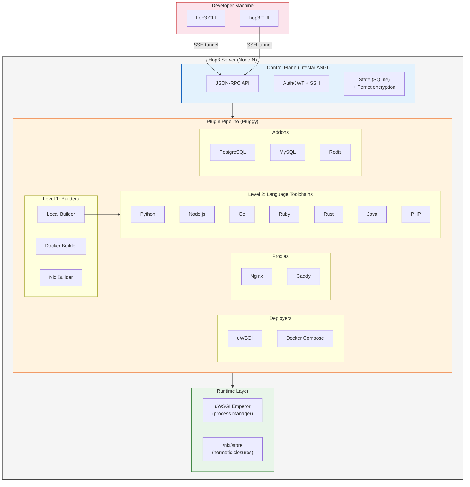
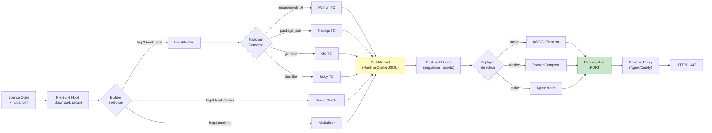

# Hop3: A Sovereignty-First PaaS for Single-Server Deployment, with a Nix-Based Reproducible Build Path

**Author:** Stéphane Fermigier, Abilian R&D
**Contact:** [sf@abilian.com](mailto:sf@abilian.com)
**Project:** Nix Integration for Hop3 (Hop3-Nixified), NGI0 Commons Fund
**Licence:** the software described here is Apache-2.0; see §10.

## Abstract

Application orchestration has converged on container clusters coordinated by a distributed consensus store [4], [20]. That machinery solves a real problem (scheduling work across a fleet of individually unreliable nodes) and a large class of deployments does not have that problem. A single server running a handful of long-lived applications is the normal case for small and medium organisations, for the network edge, and wherever digital sovereignty rules out an external control plane. For that case the cluster paradigm charges more than resident memory: a control plane to keep quorate, a container supply chain to trust, and an expertise requirement out of proportion to the workload.

We present **Hop3**, an open-source Platform-as-a-Service that treats the single node as its starting point rather than as a degenerate cluster. Single-node is the starting point; the architecture admits multi-node deployment (§11) but the claims made here are for the single-node case. Hop3 offers a Heroku-style developer experience (git-push deployment, automatic language toolchains, managed backing services) without requiring Docker or Kubernetes. It is built around a decoupled control plane (JSON-RPC over SSH, a Litestar ASGI core, local SQLite or PostgreSQL state, Fernet-encrypted secrets) and a plugin-driven pipeline factored into build strategies and ten language toolchains. An integration with the Nix package manager [10] supplies a hermetic build path: eleven parametrisable templates generate `hop3.nix` expressions from a declarative `hop3.toml` spec, each sealing its ecosystem's package manager behind a dependency set vendored from a committed lockfile and building offline in the Nix sandbox.

Two results carry the evaluation. **Every template-generated recipe in the corpus rebuilds bit-for-bit identically**, a census rather than a sample, and the strongest empirical claim here. And **both Nix build paths deploy 1.4–1.6× faster than Docker** and within 15% of a native toolchain build, across two independent runs of a four-strategy matrix; this contradicts the usual expectation that hermeticity is paid for in deploy time. The control plane holds 185 MB where a lean K3s carrying the same workload on identical hardware holds 1441 MB; closure sizes, cross-application deduplication (21–36%) and update deltas are measured against the equivalent upstream Docker images.

The application corpus is an instrument rather than a result: 58 upstream projects packaged across four build strategies exist to exercise the platform's edges, and what they established is a methodological finding. A curated subset is verified by **signing in through each application's own authentication**, rather than by an HTTP response, a bar the platform enforces on every deployment. Adopting it exposed twenty-three platform defects invisible to a deployment returning 200. Applied afterwards to a variant family that a deploy-oriented instrument had just scored 15 ok and 0 fail, the same bar **failed all sixteen** of its applications: five were serving with no usable credential at all, including a calendar server authenticating nobody and an identity provider with a published default password. The gap between "deploys" and "works" is total on that corpus, and it had been invisible to every instrument in use.

## 1. Introduction

The dominant paradigm for application deployment has shifted toward container orchestration systems, with Kubernetes emerging as the de facto standard [4]. Its central mechanisms (a consensus-based control plane, a container runtime, a service mesh) exist to schedule work across a fleet of individually unreliable machines. Where that problem is absent, the mechanisms remain and their costs do too: resident memory [5], [20], a container supply chain that must be trusted and kept current, and an operational expertise requirement that a two-person organisation running four applications is unlikely to meet. The mismatch is one of problem shape before it is one of resource consumption, though the latter is what can be measured, and §6.4 measures it [5]. Meanwhile, the proliferation of IoT devices and the demand for data locality have driven interest in edge and fog computing [1], [2], where workloads run on resource-constrained nodes at the network periphery.

Hop3 addresses the gap between heavyweight cloud-native orchestrators and manual provisioning scripts. It provides a self-contained PaaS that deploys and manages web applications on a single server, implementing the Twelve-Factor App methodology [6] without requiring Docker or Kubernetes. The system is designed with the following priorities:

- **Simplicity:** A single-node deployment model that removes distributed-systems complexity from the common case. Single-node is the starting point and the scope of every guarantee made here; §7.2 sets out what a multi-node variant would additionally require.
- **Sovereignty:** Self-hosted infrastructure where the operator retains full control over data and configuration [16], [17].
- **Reproducibility:** Hermetic builds via Nix integration, reducing environment drift across deployments [8], [10].

**Contributions.**

1. A control-plane architecture that operates without distributed consensus (etcd/Raft), with a single-process ASGI core that serves the full JSON-RPC CLI surface for a multi-application deployment.
2. A plugin-driven deployment pipeline factored along two independent axes: *builder* (Local, Docker, Nix) and *language toolchain* (Python, Node, Go, Ruby, Rust, Java, PHP, Clojure, Elixir, .NET). This bounds integration complexity as new languages or build strategies are added.
3. A template-based scheme for generating Nix expressions from a declarative `hop3.toml` specification, covering eleven common packaging patterns, each sealing its ecosystem's package manager behind a vendored dependency set, and a three-tier taxonomy classifying the resulting artefacts by provenance.
4. An application corpus of 58 upstream projects packaged across the four build strategies (154 variants) and deployed end-to-end on a remote VPS, with per-variant diagnostic logs collected automatically on failure. Packaged and verified counts are reported separately throughout (§6.1); the corpus is an instrument for exercising the platform's edges, and its size is a consequence of that rather than a result in itself.
5. A conceptual positioning of Nix-based deployment as a *fourth path* alongside containers, microVMs and unikernels (dependency-closure isolation without OS-level virtualisation), extending the post-container taxonomy of Vaño et al. [21] (§2.5, Table 2).

## 2. Background and Related Work

### 2.1 Edge and Fog Computing

Edge computing pushes workloads to the network periphery for low-latency processing [1], [2]. Fog computing extends this to a continuum of micro-datacenters and local servers bridging edge devices to the cloud [3]. Satyanarayanan [1] identifies the key challenges: limited bandwidth to the cloud, high variability in network conditions, and the need for autonomous operation. Moreschini et al. [19] formalize the "cloud continuum" spanning centralized datacenters through fog nodes to extreme edge devices. Puliafito et al. [22] survey fog architectures for IoT, noting that most assume container-based deployment models ill-suited for constrained hardware.

### 2.2 Heavyweight and Lightweight Orchestration

Kubernetes provides high availability through distributed consensus (Raft/etcd) but imposes substantial baseline resource consumption. Morabito et al. [5] demonstrate that the overhead of API servers, kubelets, and service meshes often exceeds the available resources of edge gateways. Lightweight distributions (K3s, MicroK8s, k0s) reduce this overhead but retain fundamental container-runtime dependencies. Koziolek and Eskandani [20] benchmark these distributions, finding that even K3s requires 500+ MB RAM for the control plane alone. Vaño et al. [21] review cloud-native orchestration at the edge, concluding that container-centric approaches introduce avoidable complexity for single-node deployments.

### 2.3 PaaS Heritage

The PaaS model, pioneered by Heroku and formalised in the Twelve-Factor App methodology [6], provides a developer-centric deployment interface: push source code, and the platform handles building, running and scaling. Cloud Foundry and OpenShift extended this to enterprise contexts [7]. **Dokku** adapts the model to a single server by combining shell plugin scripts with Docker: a git push triggers a buildpack or `Dockerfile` build, the result runs as a container, and backing services are provided by plugins. It holds no persistent control-plane process, keeping state in files and container labels, which makes its resident footprint close to that of the Docker daemon it drives. **Piku** takes the opposite decision on containers, running applications as ordinary processes under uWSGI behind nginx, with no container runtime at all; it is distributed as a single script and was written for hardware as small as a Raspberry Pi. Hop3 originates from Piku and retains code from it, so the process-level deployment model described in this report is inherited work; Hop3 adds the plugin decomposition of §4.3, the Nix build path of §5, and the addon and diagnostics layers. Neither system has a peer-reviewed description, and both codebases serve as their own reference. Two more recent entrants occupy the same single-server niche: **CapRover** wraps a web GUI around Docker Swarm. This introduces distributed-systems dependencies even for single-node use. **Coolify** offers a polished Vercel-style self-hosted experience, Docker-based, with no reproducible-build story. Hop3 occupies the same design space and differs from these systems in four places: (i) the build pipeline is factored into builder × language-toolchain rather than exposing buildpacks directly; (ii) Nix integration gives an alternative build strategy with stronger hermeticity than the native buildpack/toolchain path; (iii) a single uniform plugin architecture spans builders, toolchains, addons and proxies; and (iv) per-variant deployment diagnostics are collected automatically on failure. Table 1 summarises the comparison.

| Property | Dokku | Piku | CapRover | Coolify | **Hop3** |
|----------|-------|------|----------|---------|----------|
| Docker required | Yes | No | Yes | Yes | Optional |
| Language toolchains | Via buildpacks | 3 | Via Docker | Via Docker | 10 native + Docker + Nix |
| Reproducible builds *provided by the platform* | No | No | No | No | **Yes (Nix)** |
| Plugin architecture | Yes | No | Yes | Limited | **Yes (Pluggy)** |
| SBOM generation | No | No | No | No | **Yes (Python; pluggable)** |
| External dependencies | Docker Hub | None | Docker Hub, Swarm | Docker Hub | **None (with Nix)** |
| Web UI | Via plugins | No | Yes | Yes | Web planned; TUI (production) |
| Multi-server | No | No | Yes (Swarm) | Yes | Not yet; single-node first (§7.2) |

*Table 1: Hop3 against the direct single-server-PaaS competitors. "Optional" Docker means Docker is one of three build strategies, never a prerequisite. The reproducible-builds row concerns what each platform offers, leaving aside what an operator can achieve alongside it: nixpkgs can emit OCI images, so an operator may build reproducibly and deploy the result on any of these platforms (§5.1). On this row, Hop3's build path is part of the platform and its output is deployed without a container runtime. SBOM generation is currently a Python-ecosystem proof-of-concept behind a pluggable interface.*

### 2.4 Reproducible Builds and Deployment

Reproducible builds ensure that given identical source code, the build process produces bit-for-bit identical outputs [8]. Lamb and Zacchiroli [8] argue this is essential for software supply chain integrity. Fourné et al. [9] study adoption barriers, finding that tooling complexity is the primary obstacle.

The Nix package manager [10] provides a purely functional deployment model where each package is identified by a cryptographic hash over its declared build inputs. Dolstra [10] shows that this model gives a solid foundation for three operational properties: all dependencies are declared (no hidden references to the host system), upgrades and rollbacks compose cleanly (new store paths are added atomically and old ones kept), and multiple versions coexist without path conflicts. These are properties of the model and of the Nix store design; they are not by themselves equivalent to *deterministic builds*, which require an additional property of each individual derivation [8]. NixOS [11] extends the model to system configuration; Disnix [12] extends it to distributed multi-machine deployment; GNU Guix [13] offers a parallel implementation based on the same principles.

### 2.5 Container Alternatives and the Design Space of Post-Container Deployment

The assumption that containers are the only viable deployment abstraction is increasingly challenged from multiple directions. Vaño et al. [21], in their review of cloud-native orchestration at the edge, identify three post-container trends: WebAssembly/WASI [15], microVMs (Kata, Firecracker), and unikernels such as Unikraft [14]. Their Table 1 organises the field around Kubernetes-derived orchestrators (KubeEdge, OpenYurt, SuperEdge, K3s, …) and treats these three alternatives as emerging substitutes for the container baseline.

We argue that this taxonomy is incomplete. A fourth path is available: *dependency-level reproducibility without OS-level virtualisation*. It predates all three: it is the Nix deployment model [10], treated as a deployment abstraction rather than a developer-environment tool. Under this path, applications run as ordinary Unix processes, and isolation is provided by the *closure of their declared dependencies* rather than by a runtime sandbox. Table 2 below positions all five families (the container baseline and four alternatives) against each other.

| Approach | Isolation mechanism | App changes required | Kernel-level cost |
|----------|---------------------|----------------------|-------------------|
| Containers (runc, crun, …) | Namespaces + cgroups | None | Shared kernel |
| microVMs (Kata, Firecracker) | Lightweight hypervisor | None | One kernel per VM |
| Unikernels (Unikraft, Nabla) | Library-OS compiled with the app | Re-compile against unikernel libOS | No host kernel; bare hypervisor |
| WebAssembly/WASI | Bytecode sandbox | Compile to Wasm | Shared kernel + Wasm runtime |
| **Nix-based deployment (this paper)** | Content-addressed dependency closure | None | Shared kernel, no sandbox |

Nix provides hermeticity of *build inputs* without imposing any runtime isolation cost, a property no alternative in the Vaño taxonomy provides. It lacks the runtime isolation of containers or unikernels. For the single-server PaaS case, where reproducibility, bandwidth-efficient updates and clean rollback matter and multi-tenant isolation does not, this trade-off is favourable. The rest of this paper develops that argument.

### 2.6 Digital Sovereignty

European policy initiatives increasingly emphasise digital sovereignty: the ability of organisations and nations to control their own digital infrastructure [16], [17]. Floridi [16] argues for hybrid control regimes that balance global interoperability with local autonomy; Pohle and Thiel [17] survey how "digital sovereignty" has been mobilised in EU policy discourse. The concrete implication for infrastructure software is a demand for self-hostable stacks that do not assume a hyperscaler control plane; Hop3 is one answer within that space. We return to sovereignty in §7.4, where we characterise it as a set of technical invariants a platform architecture can enforce or weaken, rather than as a hosting location.

### 2.7 Infrastructure as Code

Rahman et al. [18] map the landscape of Infrastructure-as-Code (IaC) research, identifying declarative configuration as the dominant paradigm. Hop3's `hop3.toml` format sits in that tradition: the operator declares the application's language, entry point, addons and port, and the platform derives the rest.

## 3. Problem Definition

### 3.1 System Model

The setting is a single server with finite compute, memory and network capacity, running several applications side by side. An application is given by its source code and a declarative configuration (a `hop3.toml` file specifying runtime, dependencies, and backing services). Deploying it means turning that pair into a running instance on the server, and the requirements below constrain what that step must guarantee.

### 3.2 Requirements

Deployment is required to satisfy the following.

**R1. Determinism (desired, build-path-dependent).** Deploying the same source and configuration twice should produce *functionally equivalent* environments: services that answer equally to equal input. Under the Nix build path this is strengthened, because the closure of declared build inputs is content-addressed and a build invoked with the same derivation inputs therefore sees the same inputs every time. Bit-for-bit identity of the *outputs* additionally requires the derivation itself to be deterministic (no embedded timestamps, no parallel-order dependence, etc.); that is an orthogonal property of each derivation, addressed by the reproducible-builds community [8]. Under the Docker or native build paths, R1 is satisfiable only as a policy discipline (pinned base images, frozen package indexes) and is not guaranteed by the system.

**R2. Bounded overhead.** The control plane's resource consumption must stay bounded independently of how many applications it manages, and small relative to the server's capacity.

**R3. Autonomy.** The server must be able to rebuild, restart or roll back a deployed application without connectivity to external infrastructure.

**R4. Security.** Secrets required by a deployed application are encrypted at rest with authenticated encryption (Fernet AEAD), under a key generated on the node, held on the node, and never transmitted.

### 3.3 Comparison with Existing Approaches

The following table positions Hop3 against three existing approaches against requirements R1–R4. The "bounded overhead" column gives control-plane memory: a cited order of magnitude for Kubernetes, and first-party measurements on identical hardware for K3s, Docker Compose and Hop3 (§6.4). The other cells characterise the system as designed; measurement of them remains outstanding.

| Property | Kubernetes | K3s | Docker Compose | Hop3 |
|----------|-----------|-----|----------------|------|
| R1 (Determinism) | Not by design (images are mutable) | Not by design | Not by design | Under the Nix build path (hermetic inputs); not under Docker or native |
| R2 (Control-plane memory, order of magnitude) | GBs (consensus store + API server) | Hundreds of MB–GB: [20] reports 500+ MB; we measure ~1.2 GB (cgroup) / ~900 MB (system RAM) for lean K3s on identical hardware (§6.4) | Tens of MB: we measure ~27 MB (dockerd, §6.4) | ~185 MB (cgroup) / ~205 MB (PSS), measured (§6.4) |
| R3 (Autonomy) | No (requires quorum of etcd nodes) | Partial (single-node mode possible) | Yes | Yes |
| R4 (Encrypted secrets at rest) | Yes (sealed secrets) | Yes | No | Yes (Fernet AEAD) |
| Multi-language native builds | No | No | No | Yes (ten toolchains) |

## 4. The Hop3 Architecture

Hop3 is structured as a modular, plugin-driven system with four distinct layers.

### 4.1 Architecture Overview

Figure 1 shows the layered structure of a Hop3 deployment: a developer machine communicates over an SSH tunnel with a single server node; the node runs a Litestar ASGI control plane, a Pluggy-based plugin pipeline, and a runtime layer combining uWSGI Emperor for process supervision with a Nix store for hermetic closures.



*Figure 1: Hop3 system architecture. The CLI and TUI establish SSH tunnels to the server's Litestar ASGI control plane; the plugin pipeline resolves build and deployment strategy dynamically per application; the runtime layer couples uWSGI process supervision with a Nix store for hermetic closures.*

Figure 2 shows the deployment flow from a `git push` through builder selection, toolchain execution, artefact materialisation, deployer selection and proxy configuration:



*Figure 2: Deployment flow. The builder and toolchain are selected from `hop3.toml`; both Docker and Nix strategies bypass the toolchain step. All strategies converge on a `BuildArtifact` (carrying a `RuntimeConfig` JSON) consumed by the deployer. The reverse proxy is configured last and terminates TLS.*

### 4.2 Control Plane

The control plane is implemented as a single-process ASGI application (Litestar framework), providing:

- **JSON-RPC API** for command dispatch from the CLI and TUI clients.
- **Authentication** via JWT tokens over SSH tunnels, with magic-link browser login as an alternative.
- **State management** using SQLAlchemy with SQLite (single-server) or PostgreSQL (scalable), with Fernet AEAD encryption for secrets at rest.

Because Hop3 targets single-server deployment, it eliminates the need for distributed consensus (etcd/Raft), leader election, and cross-node state synchronization. This architectural choice directly satisfies R2 (bounded overhead) and R3 (autonomy).

### 4.3 Plugin Pipeline

The deployment pipeline uses the Pluggy hook specification framework to dynamically compose build, deploy, and proxy strategies:

**Two-level build architecture:**

- *Level 1 (Builders)* orchestrate **how** to build: LocalBuilder (native toolchains), DockerBuilder (containerized builds), NixBuilder (hermetic Nix builds).
- *Level 2 (Language Toolchains)* execute **what** to build: Python, Node.js, Go, Ruby, Rust, Java, PHP, Clojure, Elixir, .NET.

This separation allows the same application source to be built natively (direct compilation on the server), in a Docker container (isolation), or via Nix (reproducibility), depending on the operator's requirements.

**Build Artifact contract:** Every build produces a `BuildArtifact` containing a `RuntimeConfig` with workers, environment variables, and PATH configuration. This artifact is persisted as JSON and consumed by the deployer, creating a clean separation between build and run phases.

**Deployers** manage the application runtime: uWSGI (process management with automatic restart), Docker Compose (containerized apps), or static file serving (nginx).

**Proxies** configure reverse proxy routing: Nginx, Caddy, or Traefik, with automated TLS certificate management.

**Addons** provision backing services: PostgreSQL, MySQL, and Redis, with connection credentials injected as environment variables.

### 4.4 Configuration Model

Applications are configured via `hop3.toml`, a declarative format that extends the Twelve-Factor App [6] convention:

```toml
[build]
builder = "nix"          # or "local", "docker"

[run]
start = "gunicorn app:app --bind $BIND_ADDRESS:$PORT"
before-run = "python manage.py migrate"

[env]
DEBUG = "false"

[env.computed]
DATABASE_URL = "postgresql://${PGUSER}:${PGPASSWORD}@${PGHOST}:${PGPORT}/${PGDATABASE}"

[[addons]]
type = "postgres"
```

The `[env.computed]` section supports variable interpolation, resolving the common problem of mapping platform-injected variables (e.g., `PGHOST`) to application-expected names (e.g., `DATABASE_URL`).

## 5. Nix Integration for Deterministic Deployment

### 5.1 Motivation

Native toolchain builds (R1 partial) depend on the server's installed packages, which may drift over time. A `Dockerfile` provides isolation without reproducibility: the same file can produce different images on different days, because base images are mutable and package repositories roll forward. Nix provides hermetic builds where every dependency is cryptographically pinned [10].

Nix and containers are not alternatives. nixpkgs can emit OCI images directly (`dockerTools.buildImage`, `buildLayeredImage`, and third-party tools such as `nix2container`), so a reproducibly-built image is entirely achievable, and any platform that deploys images can deploy one. Reproducible builds are therefore available to Hop3's peers, in the sense that an operator can build that way and hand the result over.

Hop3 treats the closure as the deployment unit rather than as an intermediate on the way to an image. The store is materialised on the host and the application runs as an ordinary process, so no container runtime is required at run time and no registry is required at deploy time. Two consequences are measurable and are reported in §6.4: the store is shared across every application on the host, which yields cross-application deduplication (21–36% on the measured set), and an update transfers the store paths that changed, leaving image layers out of the exchange. Layered Nix-built images recover part of the first effect at layer granularity when layers are identical; we did not measure that variant, and do not claim a margin over it.

### 5.2 Architecture

Each Nix-built application provides a `hop3.nix` file, a Nix expression that evaluates to a package containing the application and all its dependencies. The NixBuilder plugin:

1. Evaluates `nix-build hop3.nix -A package` to produce a Nix store path.
2. Reads `$out/hop3/runtime.json` from the built package for worker commands, environment variables, and PATH entries.
3. Produces a `BuildArtifact` consumed by the standard deployer pipeline.

### 5.3 Reproducibility: What We Inherit and What We Add

Hop3 inherits its reproducibility properties from Nix. The underlying model (content-addressed storage of derivations identified by a cryptographic hash over their declared inputs) is established by Dolstra's purely functional deployment model [10] and the surrounding literature (NixOS [11], Disnix [12], Guix [13]). Input-hash equality captures *hermeticity* (the build sees the same inputs). *Deterministic build behaviour* (the build produces the same outputs from the same inputs) is an additional property that derivations may or may not satisfy [8], and is the subject of the wider reproducible-builds effort.

Hop3 adds three things against this background:

1. **A pipeline that produces Nix derivations from a higher-level declarative spec** (`hop3.toml`). The eleven templates in §5.4 take a small structured input (a package name, an exec target, environment overrides, addon dependencies) and emit a `hop3.nix` expression. The templating step is a pure function; identical `hop3.toml` inputs produce identical Nix expressions, and any non-determinism downstream belongs to Nix itself, and the wrapper introduces none.

2. **A runtime contract** (`$out/hop3/runtime.json`) that decouples what a Nix-built artefact *is* from how Hop3 *runs* it. The contract specifies the worker commands, environment variables, and PATH entries; the Nix build produces the JSON, and the Hop3 deployer consumes it. This separation lets the deployer evolve independently of any individual application's Nix expression.

3. **A uniform vendoring pattern that makes every template hermetic**, generalising `buildGoModule`'s `vendorHash` across six ecosystems. A fixed-output derivation runs only the package manager's fetch step against a committed lockfile. That step is the sole point of network access; it is content-addressed, so the dependency set is fixed by a hash. After it, the application builds in the sealed sandbox with the network off (`pip --no-index`, `composer` offline autoload, `pnpm --frozen-lockfile --ignore-scripts`, `bundlerEnv` from a bundix `gemset.nix`, `gradle.fetchDeps`). Package managers that resolve dependencies at build time are the standard obstacle to hermetic Nix packaging; the pattern removes it without per-ecosystem tooling.

4. **A reproducibility taxonomy for the templates.** Because sandbox purity is uniform, the tiers classify *provenance* rather than hermeticity: Tier 1 wraps a package nixpkgs already builds from source, Tier 2 builds the application from source in Hop3 against a hash-pinned dependency set, Tier 3 fetches an upstream release artefact by digest. Tiers 1 and 2 are auditable to source and Tier 3 is not, while all three rebuild bit-for-bit. The tier is declared on the template and inherited by every application selecting it, so an auditor reads a per-application label off a checkout rather than trusting a hand-maintained table. Tier 1 is preferred where available, since it also inherits nixpkgs' architecture coverage and security updates.

**Update bandwidth.** When a deployed application moves from one version to the next, only the store paths that changed between them need be transferred; pinned dependencies are unchanged and stay in the target's store. §6.4 quantifies this for the Tier-1 subset: a source-only bump re-sends the application's own path (tens of MB, well below the full closure). Whether that beats a Docker layer-level update is application-class-dependent. It does for large shared runtimes, but not for statically-linked single-binary applications whose upstream image is already minimal, where the two are comparable. Cross-application deduplication is the unconditional Nix disk win we measure; per-update bandwidth varies with the application class (§6.4).

**Scope of the claims.** The templating step receives no formal characterisation, and none is relied upon.

### 5.4 Current Status

Both Nix integration phases are implemented. Phase 1 supports applications that ship an explicit `hop3.nix` expression; 23 applications in the evaluation corpus follow this path. Phase 2 auto-generates `hop3.nix` from a declarative `hop3.toml` spec via one of eleven templates; 20 further applications in the evaluation corpus follow this path, and the template-generated corpus has since grown to 31 recipes (30 at the time of the reproducibility audit, §6.2). The two paths coexist: an operator starts from a template and may "eject" to a hand-crafted expression for finer control.

| Template | Tier | Build |
|---|---|---|
| `nixpkgs-wrapper` | 1 | wraps an existing nixpkgs package |
| `php-app` | 2 | `composer.lock` → vendored FOD, offline autoload |
| `python-venv` | 2 | hash-pinned `requirements.txt` → vendored wheel set, `--no-index` |
| `go-source` | 2 | `buildGoModule` with a `vendorHash` |
| `node-pnpm-install` | 2 | `pnpm fetch` FOD, `--frozen-lockfile --ignore-scripts` |
| `ruby-bundler` | 2 | `bundlerEnv` from a bundix `gemset.nix` |
| `java-gradle` | 2 | Gradle against a committed `deps.json` |
| `java-war`, `node-prebuilt` | 3 | upstream artefact fetched by digest |
| `prebuilt-binary`, `prebuilt-archive` | 3 | upstream artefact fetched by digest |

Recipes pin nixpkgs to a single commit (nixos-24.11), with one exception: an application that entered nixpkgs later can override the pin for itself, which `etherpad` does (a nixos-25.05 revision), because the package does not exist in the default. So the corpus is evaluated against *two* pins rather than one, and "the pinned nixpkgs" should be read accordingly. The mechanism is per-application and validated at parse time. A malformed revision is refused rather than interpolated into the expression. Any recipe may use it.

The distribution over the template-generated recipes is 6 Tier-1, 23 Tier-2, 2 Tier-3. It moved substantially during the project: applications initially packaged as Tier-3 wrappers were migrated to source builds as the vendoring pattern reached each ecosystem, leaving only the two whose upstream ships no buildable source for the packaged version; nixpkgs itself packages these from the upstream artefact. Each migration was a one-line template change in `hop3.toml` rather than a rewrite, which is the property the declarative spec exists to provide. The two generic prebuilt templates are retained with no current consumer: they remain the fast path for packaging an application without lockfile work, and the only path for proprietary software distributed as a binary, for which no source build is possible in principle.

Remaining work for subsequent releases includes Nix-based addon provisioning (PostgreSQL, Redis as Nix-managed services rather than OS packages) and a systematic treatment of multi-service applications under a single Nix closure (per ADR 038).

### 5.5 Closure Lifetime

Treating the closure as the deployment unit (§5.1) carries a liability that the image-based alternative does not, and it is a consequence of the same property that makes the approach attractive. An image is held alive by the container runtime that references it; reclaiming it while a container runs is not a state the runtime permits. A Nix closure is ordinary host state referenced by absolute path from a process that Nix does not supervise, and nothing in the Nix model keeps it alive. A garbage collection (invoked by an operator, a distribution's periodic timer, or a disk-pressure hook) is free to reclaim files that a running application is executing. The failure is delayed, and it does not resemble its cause: the next time the process is launched, it dies `No such file or directory` on a path that was present when the application was deployed. In a supervised setting this surfaces as a start-up timeout naming nothing.

Hop3 addresses this at three levels.

**Prevention.** The installer pins automatic collection off (`min-free = 0`, and the distribution's `nix-gc.timer` disabled where present). This removes the unattended case but not the operator who runs `nix-collect-garbage` by hand, which is a reasonable thing to do on a host short of disk.

**Retention.** The builder registers the built closure as an indirect Nix garbage-collection root in the application's directory, and (before a rebuild begins) registers the immediately-prior closure as a second root. The second root is what a rebuild-while-running requires: at the moment the new closure is realised, the still-running worker is executing paths belonging to the old one, which is now referenced by nothing. Rooting it after the rebuild, or carrying the root over by renaming the symlink, both leave a window in which the running application's files are collectable; the symlink rename in particular produces a dangling link rather than a root, because Nix tracks the root under its original name. Both roots live in the application directory, so destroying the application frees them and lets Nix reclaim the closure normally.

**Detection.** Before any launch of a worker (deploy, start, or restart) the platform resolves the store paths referenced by the application's worker commands, queries their requisites, and aborts if any are absent, naming the missing path and the command that would rebuild it. This converts a delayed and uninformative failure into an immediate and actionable one. It is a backstop rather than a guarantee: it reports that retention has already failed.

Retention and detection were verified separately, and they stand at different levels of evidence: a distinction that governs how much the mechanism is worth, since only one of them prevents anything. **Detection is verified by an injected fault** on a provisioned target: deleting a path from a deployed application's live closure and then restarting the application produces the named abort. **Retention is verified by construction but not by fault injection**: the prior closure is observably registered as a root across a rebuild-while-running, and no run has yet demonstrated that a collection then leaves both closures intact, because the container used for the other measurements cannot complete a collection (Nix scans `/proc` for runtime roots and aborts on a read the sandbox refuses). Establishing it requires a target whose Nix can collect, and is outstanding.

The verification itself produced the more transferable result. The detector was implemented on the deployment path, reviewed, released, and covered by unit tests that exercised its decision logic thoroughly. It had never once executed, for two independent reasons found only by running it against a deliberately broken closure. It resolved its helper binary through a search path the deployment process does not carry, so it reported itself skipped on every deployment; and a restart of a running application does not traverse the deployment path at all, so even once repaired it did not cover the sequence it was written for, in which a collection is followed by a relaunch. Neither defect is visible to a test of the mechanism, because both concern whether the mechanism is reached. A guard is two claims: that it decides correctly, and that it runs. Testing the first is routine while testing the second requires constructing the fault.

## 6. Evaluation

Three results come out of this section. **Every template-generated Nix recipe in the corpus rebuilds bit-for-bit identically**: a census of the full set rather than a sample (§6.2). **Both Nix build paths deploy faster than Docker**, by 1.4–1.6×, and within 15% of a native toolchain build, replicated across two independent runs (§6.3). And **verifying an application by signing in rather than by fetching a page changes the answer**, on one corpus from uniformly passing to uniformly failing (§6.1); this is a finding about instruments, and the reason the other two are stated as carefully as they are.

Hop3 is evaluated along two axes: **application coverage** (the breadth of real software the platform deploys and operates correctly, §6.1) and the **architectural requirements** R1–R4 (§6.2). §6.3 compares the three build strategies; §6.4 states the quantitative benchmark protocol and the measurements available at the time of writing. §7.4 states where each claim's replication stops; that is said once, there, rather than attached to every figure.

### 6.1 Application Coverage

Hop3 maintains a corpus of application variants covering four deployment strategies applied to a common set of open-source applications, so that cross-strategy comparisons remain meaningful. The counts below (April-2026 snapshot) reflect variants deployed end-to-end on a remote VPS (Ubuntu 24.04, 4 vCPU, 16 GB RAM) via the automated test harness.

| Strategy | Packaged | Notes |
|----------|-------|-------|
| Native uWSGI (language toolchains) | 40 | Python, Node, Go, Ruby, Rust, Java, PHP |
| Docker Compose (upstream Dockerfile) | 52 | Apps whose upstream publishes a Dockerfile |
| Hand-crafted Nix (`hop3.nix` written by operator) | 31 | Explicit dependency control |
| Template-generated Nix (from `hop3.toml`) | 31 | Eleven templates (see §5.4); auto-derived from a lockfile-equivalent manifest |
| **Total variants** | **154** | Drawn from 58 distinct upstream applications |

The catalog set adds one project that is packaged nowhere under `apps/` (Uptime Kuma), so the union of corpus and catalog is 59 upstream projects. The table counts the corpus.

*Table 1: the packaged corpus at the reporting cut-off.* Packaging an application is not the same as verifying it, and the two are counted separately throughout. The figures above count what the repository contains; the figures below count what a run confirmed. Where this report quotes a verified number it names the run that produced it: the four-variant matrix over the benchmark set (80 cells, §6.3), and complete runs of each Nix family over the catalog set, verified at the sign-in bar rather than by content assertion.

The corpus exercises seven of the ten implemented language toolchains (Python, Node, Go, Ruby, Rust, Java, PHP); the Clojure, Elixir and .NET toolchains are implemented but not represented in this application set.

**Two sets of twenty, converging.** At the time of writing this report draws on two curated twenty-application sets. The **catalog set** is the collection published in Hop3's signed application catalog and advertised as production-ready, chosen for operator utility and packaging feasibility. The **benchmark set** (§6.3, §6.4) was chosen for *language balance* (PHP 5 / Go 5 / Python 4 / Node 3 / JVM 3), so that cross-strategy timings are not dominated by one ecosystem. Twelve applications belong to both, and the two are being merged into a single corpus; the split is a stage in that work rather than a design. Each figure below names the set it rests on: the functional verification concerns the catalog set, the deploy-cost and closure measurements the benchmark set. Twenty is the number this project undertook to deliver rather than a property of the design, and the catalog is a living collection; its membership has already changed once (Gatus was replaced by Uptime Kuma) and is expected to grow well past twenty.

**Functional verification of the catalog set.** A deployment that returns HTTP 200 is a weak bar: a landing page, a placeholder, or an installation wizard all return 200. The catalog set is therefore verified through a stronger bar, and the bar is enforced by the platform rather than by a separate campaign. Each catalog application ships a **check script** that signs in through the application's own authentication surface using the credential Hop3 generated for it (ADR 056), asserts that an authenticated page is then reachable, and asserts that a *deliberately wrong* password is **refused**. Publishing an application to the catalog requires such a script, and the script runs at the end of every deployment of that application, including deployments initiated from the web interface. A separate driver (`check-catalog.py`, §10) exercises the whole operator-facing loop on a freshly-rebuilt server: enumerate the signed catalog, install each application from it, run its check, destroy it, and exit non-zero on any failure.

The negative assertion is not decoration. An earlier version of it looked for a session cookie after a bad-password submission; several applications set a session cookie on the *login page itself*, so the assertion passed for a credential the application had rejected. It was replaced with the same authenticated-reachability test the positive assertion uses, so the two are each other's control. A check that cannot fail is worth less than no check, because it is reported as evidence.

**Result.** Every application in the catalog has been observed installing from the signed catalog and accepting a real login: BookStack, Bugsink, Dolibarr, Easy!Appointments, Forgejo, Gitea, Invoice Ninja, Isso, Kanboard, Keycloak, LimeSurvey, Matomo, Mattermost, Miniflux, Nextcloud, Paheko, Radicale, Uptime Kuma, Vikunja and WordPress. This includes **Matomo** and **Dolibarr**, which an earlier snapshot of this report deferred as browser-wizard-only. A full run of the driver against a server rebuilt from a blank operating system completes in about 25 minutes, with per-application times from 14 s to 300 s.

The figure we can evidence is weaker than the sentence above, and it is exactly the distinction this section argues for. **The best complete recorded run is 19 of 20.** The twentieth failed on catalog content that predated its own fix and passed once republished; every application has been seen green, but no single recorded run has been all-green, and this report does not round that up. The gap is bookkeeping. A verification claim resting on "we saw each of them pass at some point" is a weaker object than one resting on a run that can be pointed at, and the whole argument of this section is that the difference between those two matters. The all-green run is outstanding at the time of writing.

**What raising the bar exposed.** Every application in the catalog set deployed successfully and served HTTP 200 *before* this verification existed. Bringing each of the twenty to a real login required twenty-three fixes, and their distribution is the finding: the defects were almost entirely in the **platform**, not in the application recipes. Applications were served over plain HTTP as well as TLS, so the `Secure` cookies that most of them set were never returned by the browser and every such login looped silently; PHP's built-in server was run with a single worker, so any application issuing a sub-request to itself during installation deadlocked against its own only worker (ten of the twenty run on that server); an installation whose deployment failed could not be retried, because the application record was committed before the deployment was attempted and every subsequent attempt was refused as a duplicate; a declared build command was honoured by five of the twelve language toolchains and silently dropped by the rest; and a clean reinstall reclaimed the platform's records of its backing-service databases without reclaiming the databases, so the next installation adopted a populated one. None of these is visible to a deployment that returns 200, and none was specific to an application.

**The same bar, applied to the Nix families.** The catalog set is packaged in three build strategies, and until recently only the native one had been verified this way. Applying the sign-in bar to the other two produced complete recorded runs of **18 of 19** template-generated variants and **16 of 16** hand-crafted ones, the latter being the only all-green family artefact the project holds.

The first of those runs is the more useful result. Three days before it, a deploy-oriented matrix scored the hand-crafted corpus 15 ok and 0 fail. The sign-in bar, on the same recipes, **failed all sixteen**. Five were serving with no usable credential at all: a calendar server whose authentication type defaulted to `none` and was never set, so every calendar and address book was public; a comment moderator whose configuration omitted its administrator section, so the moderation dashboard was served disabled; two applications (one of them an identity provider) shipping a literal `changeme`, so the deployed instance had an administrator whose password is in the repository while the operator held one that did not work; and a survey tool whose installer ran with a hard-coded password and discarded its own exit status. No status assertion and no content assertion can distinguish any of those from a working deployment, and every instrument the project then had reported them working.

The reading this does *not* support is that the recipes were poor: the same corpus reached 16 of 16 within a day of being measured. The 0/16 measures the distance between "deploys" and "works", on a corpus where every instrument had agreed for months. §7.4 treats this as the construct-validity threat it is; the numbers above are that threat measured rather than asserted.

A sixth defect in the same corpus was found by neither instrument. Both Nix packagings of two code forges deployed with open registration, because the setting that disables it lived in a shell script only the native recipe carries. An application with open registration signs in perfectly and refuses a wrong password: it passes the bar. The bar is a floor.

Two of these defects compounded in a way that exposes a general hazard of fixing configuration that was being ignored. The declared build command had been read and discarded by most language toolchains; making them honour it was correct, and immediately broke three applications, because the honoured command then ran against the system interpreter rather than the virtual environment the platform had just created for the application. The first defect had concealed the second for as long as it lasted: while the command was never executed, the environment it would have executed in did not matter, and the recipes that relied on it appeared to work. Repairing a configuration key that was silently inert is therefore not a safe change, and should be treated as introducing a new code path rather than as completing an old one. The defect was caught by a deployment run, not by the conformance test that had proved the key was now honoured in every toolchain. This is the same lesson as the four bit-identically-rebuilding applications that failed to start (§6.2), one level further out: a *successful deployment* is evidence about the deployment, not about the application.

**Verifying an application whose password you no longer hold.** A check that authenticates as the administrator stops working the moment an operator changes the administrator's password, which is both expected and desirable. Reporting such an application as unverified would be accurate but useless, and storing the operator's new password is not acceptable. Hop3's answer is an optional **probe account**: a non-privileged account created through the application's own user-management interface, whose credential the platform owns and rotates, used by the check in preference to the administrator's. It is declined per application where the deployment's threat model does not tolerate a platform-held account. Eleven of the twenty catalog applications declare one; the remainder fall back to the administrator credential, and every check reports which account it used. All eleven declarations have now run against live instances, so the mechanism is exercised rather than merely designed, over weeks rather than over a service history.

The application set covers the categories relevant to small-to-medium businesses, agencies and non-profits: content management (WordPress, Ghost, Wiki.js, HedgeDoc), collaboration (Etherpad, CryptPad, Nextcloud), analytics (Matomo), project management (Kanboard, Focalboard, Vikunja), code forges (Gitea), CRM (Dolibarr, Invoice Ninja), and federated messaging (Matrix Synapse).

Two applications are explicitly deferred with documented upstream-blocker analysis: **Monica** (Laravel Mix / webpack 5 incompatibility, fixed in Monica v5 beta) and **SonarQube** (bundled Elasticsearch requires kernel-level `vm.max_map_count` tuning, outside the PaaS scope). Documented exclusions of this kind are a deliberate choice: the alternative, silently partially-working apps, would erode the reliability claim.

### 6.2 Requirements Evidence from the Test Harness

The test harness provides direct evidence for each of R1–R4:

- **R1 (Determinism, Nix path):** **every template-generated recipe rebuilds bit-for-bit identically**: 30 of the 30 recipes in the corpus at the time of the audit, measured rather than asserted. It is a census of the full set rather than a sample: the claim covers the whole set, which is what makes it the strongest empirical result here. (The generated corpus has since grown to 31 recipes; the thirty-first postdates the audit and is not counted in it.) Each recipe is built and then rebuilt with `nix build --rebuild`, which compares the second output against the first; the check runs on a freshly-provisioned x86_64 host with nixpkgs pinned at `50ab793` (nixos-24.11). The first audit of the same corpus returned 25 of 30, and every closed gap was fixed in the template rather than in the application, so recipes added afterwards inherit the property: build-verification timestamps and prune markers stripped from the pnpm store, `dontFixup` to stop stdenv writing an interpreter store-path into vendored scripts, `RECORD` rewriting in the Python wheel set, strict validation in the composer FOD. The pinning is a property of the 0.7 line and postdates the April-2026 snapshot from which the §6.4 timings are drawn.

  The result covers all three tiers, which the earlier taxonomy did not permit: once every template vendors its dependency set into a fixed-output derivation and builds offline, a Tier-2 source build is as deterministic as a Tier-1 nixpkgs wrapper, and a Tier-3 wrapper is deterministic because a digest-pinned download trivially yields the same bytes. Determinism therefore no longer distinguishes the tiers, and reporting it as though it did would overstate what Tier 1 buys. The property is claimed for x86_64 only: a vendored dependency set is resolved per platform, so the committed lockfiles fix one architecture, and a second requires vendoring a second set.

  **What the guarantee is relative to.** Reproducibility here is a property of a build performed against one nixpkgs revision, and that revision has to move for security updates, which raises the obvious question of what a move costs. Evaluating the corpus against a nixos-25.05 revision, **all but one recipe rebuild identically and one fails to build**. [EDITORIAL: resolve before submission; unlike every other measurement in §6, this pin-bump evaluation has no run artifact under `notes/benchmarks/`, and the corresponding plan item is still open. Either re-run it and record the per-application disposition, or cut this paragraph and the two that follow it. Publishing it as measured while the measurement cannot be produced would breach the same rule §6.4 states.] The single failure is instructive about where the guarantee ends. Its vendored dependency set hashed identically under both revisions, and its package manager was the same version in both, yet the installed dependency tree differed, and the newer standard environment carried a check (`noBrokenSymlinks`) that declined to ship a tree containing three dangling links. The sandbox fixes a build's inputs but cannot control how the tools consuming those inputs behave. Identical inputs are therefore necessary for a reproducible build without being sufficient, which is the reason determinism is established by rebuilding and comparing rather than by reasoning over input hashes.

  **The maintenance this implies.** A single revision is pinned for the whole corpus, so the pin cannot move until every recipe builds against it: one blocked application holds back the security updates of the other thirty. The blockage is also not cheap to clear. Diagnosing this instance required a full corpus rebuild on a Linux host, a comparison of two store paths, and evaluating both revisions to establish that the package manager was identical; clearing it requires someone fluent in both Nix's fixup machinery and pnpm's virtual-store layout, and at the time of writing it remains open.

  Three factors set the recurring size of that bill. nixpkgs cuts two stable releases a year and security work can force a move between them, so the cycle repeats on roughly that schedule. Twenty-three of the thirty-one recipes are Tier-2, which places their lockfiles and vendor hashes in our hands rather than a distribution's. And a single bump is a poor estimator of the rate, because failures correlate by ecosystem: this one arose from a standard-environment check meeting a Node dependency tree, and a change touching a fetcher or a language hook would meet every recipe using it at once.

  The pressure this creates is visible in the corpus already. The per-application pin override exists for applications needing a package the default revision predates, and one application uses it, so the corpus is evaluated against two revisions rather than one. Applied under bump pressure the same mechanism becomes a way to defer the work, at the cost of maintaining several nixpkgs revisions instead of one. This is the structural trade the Nix path makes: integration work that a distribution performs once for all its users is transferred to whoever owns the pin. The property holds, and so does its cost.

  A bit-identical rebuild is evidence about the build, never about the running application. Four applications in this corpus rebuilt deterministically while failing to start: an uncompiled native addon, a locale tree absent from a static root in two separate applications, and a process manager scoped to a test-only dependency group. None of these is visible to a hash comparison. The advertised gate is accordingly the conjunction of the rebuild check and a clean deploy verified over HTTP. §6.1 reports that even that conjunction is not sufficient, since all twenty catalog applications passed it while a majority carried a defect that prevented anyone from logging in.
- **R2 (Bounded overhead):** the control plane runs as a small fixed set of Litestar ASGI processes (a master and its workers); per-application resident memory is dominated by the application process, to which Hop3 adds little. Measured on the dev deployment with one application, the control plane holds ~205 MB PSS across two processes (~110 MB for the largest single process); §6.4 reports this and the protocol that extends it to a curve against application count.
- **R3 (Autonomy):** the deployment target operates without connectivity to external control planes; build artifacts are materialised on disk (`BuildArtifact` JSON) so that `restart` and `rollback` operations require no network.
- **R4 (Encrypted secrets):** addon credentials are encrypted at rest with Fernet AEAD and a node-local key (`HOP3_SECRET_KEY`); the key is never transmitted over RPC.

### 6.3 Deployment Strategy Comparison

| Strategy | Build Determinism | Container Required | Native Performance | Disk Overhead |
|----------|------------------|-------------------|-------------------|---------------|
| Native toolchain | No: pinned; unsealed (host network and system libraries) | No | Yes | Low |
| Docker | No: pinned base and app version; unsealed (`RUN` steps have network; images embed timestamps) | Yes | No (cgroup overhead) | Base-image-dependent (small for scratch/Alpine) |
| Nix | Yes, measured at all three tiers (every recipe rebuilds bit-identically, x86_64) | No | Yes | Larger per-app; deduplicated across apps |

The §6.4 measurements refine the disk column: for statically-linked applications a minimal Docker image can be *smaller* than the equivalent Nix closure per application, while the Nix store deduplicates shared paths across co-hosted applications.

**Deploy cost across strategies (measured, replicated).** We ran the full four-variant matrix over the 20-application benchmark set (§6.1), 80 cells in all, on a single server blank-slated by an operating-system rebuild immediately beforehand, with the corpus read from a pre-registered `protocol.yaml` committed before the run. Each application was deployed and verified through its HTTP surface before teardown. This is the first like-for-like deploy-cost comparison across the three build strategies. Timings are wall-clock from `deploy` to a verified response; only successful cells contribute to the statistics.

The matrix was run twice, a week apart, each time on a freshly rebuilt host, and two variants were additionally re-run on their own in between. Each *cell* remains a single sample within a run, so no per-cell confidence interval is available; what the repetition establishes is that the per-variant medians and the ordering between them survive an independent run on a clean machine.

| Variant | Median, run A | Median, run B | Median, extra run | Deployed / failed / no recipe (A → B) |
|---------|-------:|-------:|-------:|---|
| native  | 98 s  | 106 s | 100 s | 17/2/1 → 16/3/1 |
| nix     | 110 s | 101 s | —     | 16/1/3 → 15/0/5 |
| nix-gen | 116 s | 122 s | 116 s | 19/1/0 → **20/0/0** |
| docker  | 163 s | 166 s | —     | 20/0/0 → 20/0/0 |

*Table 4: Deploy time and coverage by build strategy, 20 benchmark-set applications × 4 variants, n=1 per cell per run. Run A 2026-07-21, run B 2026-07-28, both on a blank-slated dedicated host; the extra column is a same-week single-variant re-run (2026-07-24). Full distributions for run B: native mean 113 s (88–204), nix 115 s (87–192), nix-gen 168 s (93–452), docker 198 s (93–528).*

The result runs against the common expectation that Nix dominates deploy cost. Both Nix paths sit within 15% of the native toolchain and are **1.4–1.6× faster than Docker** at the median, in both runs. In run B the hand-written Nix path was in fact the fastest of the four (101 s against 106 s native), which we do not read as Nix beating a native build; the two are within the spread of the native medians across runs (98–106 s). It does bound how large any Nix penalty can be: on this corpus it is not distinguishable from zero.

Docker's disadvantage is stable and structural. Its mean is far worse than its median (198 s against 166 s) with a long tail (528 s for Vikunja, 398 s for Directus), because an image is constructed from a base image on every deploy, whereas a Nix deploy materialises store paths that a warm store already holds. Docker is nonetheless the only strategy with complete coverage in both runs; the Nix paths account for every missing recipe, which is the cost of that path: a hand-written closure does not exist for every application, and in run B five were absent rather than three.

The one direction of travel visible between the runs is coverage rather than speed: `nix-gen` went from 19/20 to **20/20** after the packaging defect described below was fixed, while `native` lost a cell. Median deploy times moved by 4–8% in both directions, which is the scale of run-to-run variation a reader should assume for every timing in this report.

**Failure taxonomy.** Four of the 80 cells failed in run A, and their causes separate into platform defects and harness artefacts rather than collapsing into a single reliability figure. `native/bugsink` was rejected by the platform's own pinning gate (*"has unpinned requirements"*): a recipe defect, and the gate behaving correctly. `nix/bugsink` and `nix-gen/gitea` were both recorded as start-timeouts (270 s and 299 s), but the retained diagnostic bundles show these are not the same kind of event. `nix-gen/gitea` never ran slowly; it crash-looped, aborting at boot while registering a cron task because its locale files were absent, and the supervisor was throttling restarts; no timeout would have admitted it. The Go build placed only the compiled frontend under the application's static root, while gitea resolves both its frontend and its `options/` tree (locales, licence and label templates) there. That is a packaging defect; it was fixed, and run B's 20/20 `nix-gen` coverage is the confirmation. `nix/bugsink` never bound its port and emitted no application-side traceback, so its bundle does not determine a cause. Re-deploying the *identical* store path to the same host afterwards succeeded in eighteen seconds and served correctly, so the failure is not deterministic. It built a forty-five package virtualenv including compiled Rust and mypyc extensions on a host already thirty deployments into the run; the conditions of the run are the likely cause, and no defect in the application or its recipe explains the observation equally well. A single passing re-run does not prove the absence of a fault, so the cell is counted as failed and reported as unexplained. It also establishes that per-cell results are not fully independent of the order in which they run, which is the same caveat that attaches to the timings. `native/wordpress` returned HTTP 200 and was, on inspection of the captured response, correctly installed and serving its default post; the harness truncated the body at a 16 KB fetch limit *before* matching, and WordPress 6.4's block theme inlines more than that into `<head>` alone, so the asserted marker never reached the matcher. That is a defect in the measurement apparatus: both the deployment and the assertion were correct. The limit has since been raised, and a `contains` miss against a body that hit the limit now reports that it may be a false negative rather than asserting absence.

Counting only deployment defects, 79 of 80 cells behaved correctly in run A; the raw figure is 72/80. Run B returned 71/80 with three `native` failures and six absent recipes. We report both the raw and the adjudicated counts, because which of these a reader treats as a failure is a judgement they should be able to make for themselves.

### 6.4 Quantitative Benchmark Protocol and Preliminary Measurements

The quantitative evaluation is conducted over the 20-application benchmark set (§6.1). The protocol below (fixed hardware, kernel, pinned nixpkgs commit, and comparison set) is stated in full so that the measurements are reproducible by third parties. The figures reported in this section are **preliminary**, and the sense in which they are preliminary differs by measurement, so each subsection states its own status. The deploy-cost matrix of §6.3 has been run twice on independently rebuilt hosts and is replicated at the level of per-variant medians, though not at the level of individual cells. The closure and update-delta figures are deterministic functions of a pinned recipe and revision and were confirmed unchanged on re-measurement. The memory and build-install figures remain single-sample, and some were taken on the project's development host rather than a freshly-provisioned instance. The protocol, the raw measurement data and the measurement harness are archived with the artifact (§10). The suite measures:

- **Build-and-install-from-scratch time**: wall-clock from a freshly-provisioned blank server to a functionally-ready application, per application and per build strategy, decomposed into provision / build / deploy / first-healthy phases.
- **Second-instance install time and disk delta**: the marginal cost of standing up a second instance of the same application, which under the Nix path reuses the already-materialised closure.
- **Disk footprint**: per-application and deduplicated across the benchmark set (`nix path-info -rS` / `du /nix/store` versus `docker image inspect` / `docker system df`).
- **Nix closure versus Docker image size, and update delta**: the compressed transfer required to move an application from one version to the next (the closure set-difference versus the changed Docker layers), for both a source-only and a dependency change.
- **Reproducibility**: a byte-identical rebuild check (`nix build --rebuild`, comparing `narHash`) across every template-generated recipe, reported per tier and per template.
- **Control-plane footprint versus application count**: resident memory at 0, 1, 5, 10 and 20 applications, reported as a fitted per-application slope, measured against K3s [20] and Docker Compose under an identical workload.

Baselines (Dokku, Docker Compose, K3s) are measured on independently-provisioned hosts under the same workloads, so the comparison is like-for-like.

A preliminary run gives the following measured figures. Closure sizes and per-process memory are from the dev deployment (8 vCPU, 16 GB, Linux 6.8), and the build-install timings and baseline comparison on freshly-provisioned cpx41 boxes of the same class (8 vCPU, 16 GB, x86_64); nixpkgs is pinned to nixos-24.11, with one exception noted in §5.4.

**Control-plane footprint.** With one application deployed, the control plane holds **205 MB PSS** (258 MB RSS) across its two ASGI processes. This is higher than an earlier single-process estimate of ~100 MB, and is precisely why a measured curve against application count, rather than a single figure, is required to support the boundedness claim (R2).

**Closure versus image size.** For six benchmark-set applications spanning Go and Java, the uncompressed Nix runtime closure and the matching upstream Docker image are:

| Application | Nix closure | Store paths | Docker image | Nix update delta† |
|-------------|-------------|-------------|--------------|-------------------|
| Miniflux 2.2.8 | 54.8 MB | 8 | 12.3 MB | 19.4 MB |
| Vikunja 0.24.6 | 109.6 MB | 8 | 36.4 MB | 74.2 MB |
| Mattermost 9.11.16 | 245.8 MB | 9 | 424.9 MB | 79.8 MB |
| Gitea 1.22.6 | 483.8 MB | 94 | 71.4 MB | 97.8 MB |
| Forgejo 11.0.1 | 505.3 MB | 93 | 75.1 MB | 112.8 MB |
| Keycloak 26.1.4 | 1149.8 MB | 157 | 239.2 MB | 164.1 MB |

*Table 3: Nix runtime closure versus upstream Docker image (uncompressed), nixpkgs nixos-24.11. † the bytes re-sent on a source-only version bump: the application's own store path; pinned dependencies are unchanged and are not re-transferred.*

There is no universal size winner. The Nix closure is *larger* than a minimal (scratch/Alpine) upstream image (dramatically so for the static-Go apps and for Keycloak, which ships the full JDK as store paths), but *smaller* than a fat upstream image: Mattermost's closure is 246 MB against a 425 MB image. Per-application size tracks how minimal the upstream image is; the packaging model has little bearing on it. The Nix disk advantages that hold regardless are **cross-application deduplication** and reproducibility. Deduplication depends on runtime homogeneity: the union closure saves **36% across the four Go applications** (which share glibc, git and bash) but **21% across all six** (Java and Go share little), still a real saving that grows with the number of co-hosted applications sharing a runtime. The **update delta** (the application's own store path, re-sent on a source-only bump) is 19–164 MB, below the full closure; but for applications whose upstream image is already minimal it is comparable to, or larger than, re-pulling that image, so the bandwidth advantage of the Nix delta (§5.3) is real only where the runtime graph is large and shared. A reproducibility check confirms the R1 story for this subset: rebuilding each of the six from source (`nix build --rebuild`) yields a byte-identical `narHash`.

**On re-taking these figures.** The table was measured again on 2026-07-28, and all eighteen cells returned identical values. That confirms the recipes and the measurement pipeline have not drifted. It is, however, *not* evidence against the sampling criticism of §7.4, and should not be read as one. A closure size, a store-path count and an update delta are deterministic functions of a pinned recipe and a pinned nixpkgs revision: repeating the measurement is expected to return the same number, and would indicate a defect if it did not. Repetition buys nothing here. It is the *timings* (§6.3, and the build-and-install figures below) and the *memory* figures that carry run-to-run variance, and those are where the missing repeats matter.

**Build-and-install time.** On a freshly-provisioned x86_64 VPS (Hetzner cpx41, 8 vCPU, 16 GB), a blank server reaches a running, HTTP-verified application in **528 s (≈ 9 min)** end to end, unattended. This is a reference point rather than a performance claim: we are aware of no published equivalent for the comparable systems of §2.3, so there is nothing to be faster or slower than, and the figure's value is that a third party can re-take it on the same instance class and compare. It bounds the cost of the property that matters operationally: the path from a blank operating system to a verified application is a single unattended command, so a node is reconstructible rather than precious (S1, §7.5). This covers operating-system dependencies, all language toolchains, the Hop3 control plane, and the first application (Radicale), fully automated. With the platform and toolchains already installed, deploying a further application takes **131–177 s** and is largely independent of the build strategy: native Go (Gitea 131 s, Miniflux 160 s), native Python (Radicale 173 s), Nix-generated (Forgejo 139 s) and Docker (Gitea 146 s, Isso 177 s) all fall in the same band. The build itself is not the bottleneck for these applications; the fixed pipeline cost (dependency reconciliation, health verification and teardown) dominates, so the choice of builder barely moves the total. (Each per-application figure is a full deploy-verify-teardown cycle and therefore bounds the deploy cost from above.) The control-plane resident set with no application deployed holds steady at ~196 MB PSS, consistent with the ~205 MB measured with one application (§6.2).

**Control-plane footprint versus the baselines.** We measured control-plane memory as the systemd-service cgroup `memory.current`, one metric applied to every stack. Its absolutes are soft: it charges page cache, and it charges only pages first faulted in by the cgroup, so it can fall either side of the resident set. Docker Compose (`dockerd`) uses **27 MB** with no container and **65 MB** with one; a lean K3s (Traefik, servicelb and metrics-server disabled, v1.36.2) uses **1183 MB** idle and **1441 MB** with one pod; Hop3 (`hop3-server` + `hop3-rootd`) uses **185 MB** with one application deployed. Compared like for like (same metric, same workload), Hop3's control plane is **7.8× lighter than K3s** with one workload deployed (185 MB against 1441 MB), and 6.4× lighter than an idle K3s; both exceed the 500+ MB reported by Koziolek & Eskandani [20]. K3s additionally consumes ~916 MB of whole-system RAM as reported by `free`, a figure that includes the kernel and base OS; we compute no ratio from it, since no matching whole-system measurement of a Hop3 box was taken. The Docker Compose and K3s figures were taken on freshly-provisioned cpx41 boxes; the Hop3 figure was taken on the project's development host of the same class (8 vCPU, 16 GB).

**How soft "soft" turns out to be, and what we now report instead.** The caveat above was originally stated as a direction: a long-lived host accumulates page cache, so the Hop3 figure was called pessimistic. Re-measuring establishes that the direction was right and the magnitude was badly underestimated, which changes what the metric can be used for. On the development host after a day of building and deploying, the same cgroup read **1139 MB**; decomposing it (`memory.stat`) attributes **914 MB to page cache** and only 159 MB to the processes themselves. On a server rebuilt from a blank operating system minutes earlier, the same cgroup read **142 MB**, of which the page-cache component was zero. One metric, one software version, an eightfold spread determined entirely by what the machine had been doing beforehand.

Proportional set size is stable across the same conditions (166 MB on the cold box, 186 MB on the warm one, 205 MB in the earlier run with one application), because it does not charge shared page cache to the process. **We therefore report PSS as the control-plane figure and treat `memory.current` as a bounded cross-stack comparator rather than a quantity.** The consequence for the comparison above is that it is sound only if the K3s and Docker Compose figures were taken under comparable cache conditions; they were taken on freshly-provisioned boxes, which is the favourable case, but we did not record their cache decomposition at the time and cannot demonstrate it after the fact. The ratio is reported here with that stated, and re-taking all three stacks with `memory.stat` recorded is the way to settle it. A reviewer should treat the ordering (a consensus-based control plane costs roughly an order of magnitude more than a single-server one) as the durable claim, and the precise multiplier as provisional.

Hop3 is heavier than a bare `dockerd` (185 MB against 65 MB, a 2.8× gap), as expected: Docker Compose offers a container runtime and none of the API surface, state store, build pipeline or reverse-proxy management that Hop3 carries. The comparison confirms R2's premise: a consensus-based control plane is the overhead a single-server PaaS avoids.

The remaining cells (the second-instance warm-cache timing, the version-to-version update deltas measured across two releases, the memory-versus-application-count curve, and a Dokku baseline) are the subject of the accompanying measurement release. (The corpus-wide reproducibility check reported under R1 in §6.2 closes what was previously the largest of these gaps.) The harness (`hop3-bench`) and the raw measurements are part of the public artifact (§10).

## 7. Discussion

### 7.1 Trade-offs

**Single-node scope.** Hop3 optimises for single-node autonomy and ships no multi-node orchestration. High availability must therefore be handled at the network layer (DNS failover, load balancers). For the target scenario (a single VPS, self-hosted, in a small or medium organisation), this is the right starting point, and for workloads requiring sub-minute failover across nodes Hop3 is not today a suitable substrate. The scope is a sequencing decision rather than an architectural ceiling: the control plane holds no assumption that its node is the only one, and §7.2 enumerates what a multi-node variant would additionally require. Every guarantee in this report is nonetheless made for the single-node case, and none should be read as anticipating the multi-node one.

**Python runtime.** The control plane is implemented in Python (with Litestar/ASGI), which trades raw performance for development velocity and ecosystem breadth. The control plane is not in the application's critical path. It orchestrates deployment and management; requests never pass through it.

**Nix learning curve.** Writing `hop3.nix` files requires familiarity with the Nix expression language, which has a well-documented learning curve [9]. Phase 2 of the Nix integration (auto-generating Nix expressions from lockfiles) was designed to mitigate this.

**Maturity of the Nix runtime.** The Nix *build* path and the Nix *runtime* path reached different levels of maturity. The build path is the subject of this report's strongest measurement (§6.2). The runtime path (a generated runtime description driving the process supervisor, with the closure-lifetime machinery of §5.5) is delivered as a beta: the contract works, applications of real complexity run under it, it is protected by an automated gate, and its detection of a reclaimed closure is verified by fault injection on a target rather than asserted. Two things separate it from a 1.0. Retention is verified by construction and not yet by an injected fault (§5.5), which leaves the mechanism that *prevents* the failure resting on inspection while the mechanism that *reports* it rests on evidence. And the corpus has no completeness pass with a per-application runtime disposition: the applications measured in §6 all run, and the recipes outside that set have no recorded verdict either way. Both are follow-on work (§11.8). Nothing in §5 or §6 depends on the difference, because every measurement reported here concerns builds.

**The generator's reach is narrower than the platform's.** Almost every template packages software *fetched from elsewhere*: a release tarball, a registry package, a nixpkgs attribute, an upstream binary. The evaluation corpus consists of such software, and it shaped the template set. An operator deploying their own application, the git-push case the platform otherwise centres on, is a different shape: the source is already present. Two templates support it today (`go-source`, `ruby-bundler`, the latter by construction); for the rest, a first-party application can reach the Nix path only through a hand-written expression, which is the barrier the generator exists to remove. The gap is a consequence of validating against third-party software: the corpus never exercised the case, so the templates never grew it. The limitation belongs to the present system, and the change is mechanical (build the recipe directory instead of a fetched archive) and does not affect the reproducibility argument, since the dependency-pinning machinery is unchanged either way.

**Evaluation gap.** The measurements are preliminary and unevenly so, and §7.4 states exactly where each claim's replication stops. Completing the suite means per-cell repeats with confidence intervals, a randomised variant order, the memory-versus-application-count curve, second-instance measurements, and baselines against the single-server PaaS systems §2.3 names as Hop3's peers rather than against container orchestration alone.

### 7.2 Relationship to Edge-Native Deployment

Hop3 is a single-server PaaS by design, and makes no claim on the edge-native category. We do not claim membership in the edge-native research conversation surveyed by Vaño et al. [21]. That field has a coherent set of problems (heterogeneous device fleets, intermittent connectivity, K8s-derived control planes adapted to constrained hardware) that Hop3 does not directly address. We note three architectural properties relevant to that conversation, each as a precondition rather than as a demonstrated result:

- The control plane is small enough to run on constrained hardware; a precise footprint under representative workloads is part of the planned benchmark (§6.4).
- The single-server model operates without external dependencies at steady state; a node can redeploy or roll back without uplink connectivity.
- Under the Nix build path, an application update transfers only the changed store paths, leaving the rest in place; §6.4 measures this delta at tens of MB for the Tier-1 subset, though for minimal single-binary images its advantage over a Docker layer-level update is modest, and the clearer disk benefit is cross-application deduplication.

A multi-node edge variant of Hop3 would require: (i) a gossip-based or eventually-consistent state-synchronisation protocol between nodes; (ii) workload-placement policies that account for node heterogeneity and intermittent connectivity; (iii) conflict-resolution semantics for concurrent configuration changes on disconnected nodes. None of these are implemented, and none is contributed here.

### 7.3 Comparison with Alternative Approaches

Unikernels [14] and WebAssembly [15] offer runtime-level isolation with lower resource overhead than containers, at the cost of requiring application-level changes (static linking in a non-Linux environment; compilation to WASI bytecode). Hop3's approach (unmodified processes with *dependency-level* isolation via a read-only Nix store) is weaker than either in terms of what it isolates (process isolation, but not kernel- or namespace-level isolation beyond what the host provides), and stronger in terms of compatibility with existing application code. The comparison is one of design trade-offs, with no strict ordering implied: container/unikernel/WASI approaches isolate the runtime; Hop3 isolates the dependency graph.

The nearest alternative design to Hop3's is not a container platform at all but the same closure model shipped differently: build with Nix, emit an OCI image, and deploy that image on an existing platform. This keeps reproducibility and requires no new deployment machinery, which is an advantage, and it accepts the container runtime, the registry round-trip and per-image storage that Hop3's process-level deployment avoids. The trade is between reusing an established distribution channel and keeping one shared store on the host. §5.1 states which side of it Hop3 takes and why, and §6.4 measures the two effects that follow.

Vaño et al.'s review [21] organises the edge-orchestration field around two axes: lightweight K8s distributions (K3s, MicroK8s) versus K8s-adapted-for-edge frameworks (KubeEdge, OpenYurt, SuperEdge, Open Horizon, Baetyl). Both axes presuppose Kubernetes as the substrate. Hop3 sits *off* this axis altogether: it provides a PaaS-level interface without Kubernetes and without containers as a hard requirement. We do not claim this is a strict improvement over the Kubernetes-derived path. For multi-node, high-availability, multi-tenant deployments it would not be. We claim it is a better fit for a large class of real workloads (single-server SMB and sovereignty-focused deployments) that the K8s-derived path serves with substantial overhead. Section 6.1 documents a 154-variant packaged corpus, of which the 62 Nix variants require no container runtime at all; the catalog subset of those has since been verified at the sign-in bar rather than by content assertion, 16 of 16 hand-crafted and 18 of 19 template-generated.

### 7.4 Threats to Validity

**Sampling.** Replication is partial and uneven, and the paper's claims should be read at the level it reaches in each case. The deploy matrix has been run twice on independently rebuilt hosts, plus two single-variant re-runs, so the per-variant medians have two or three observations each and the ordering between strategies is replicated. **Individual cells remain single samples**, so no per-cell confidence interval exists and no claim is made about any one application's deploy time. The memory figures and the build-and-install timing are single samples outright. Medians across twenty applications are reported because the corpus is wide, and width does not substitute for repetition.

**Ordering.** Within each run, the four variants of each application ran sequentially on one host, always in the order native → docker → nix → nix-gen. Later variants therefore inherit whatever earlier ones left in the page cache, the Nix store and the Docker layer cache, which plausibly flatters the Nix rows relative to native. The second run reproduced the ordering but used the same variant sequence, so it does not isolate the effect: replication and de-confounding are different things, and only the first has been done. Randomising the variant order within a run is what would settle it, and has not been done.

**Provisioning asymmetry.** The control-plane memory comparison places Hop3 on the project's long-lived development host and K3s and Docker Compose on freshly-provisioned instances of the same class. A long-lived host accumulates page cache, so the asymmetry runs against Hop3 and the reported ratio is a lower bound. It remains an asymmetry, and one that a re-measurement on a fresh host would remove.

**Choice of baselines.** K3s and Docker Compose are measured. §2.3 identifies Dokku, Piku, CapRover and Coolify as the systems closest to Hop3 in purpose, and none of them is measured. The comparison therefore establishes the distance from container orchestration rather than the distance from Hop3's actual peers, which is the more demanding question.

**Construct validity: "deployed" is not "works", and it is measurable.** This report's central methodological claim is that a deployment returning HTTP 200 is a weak bar. That has been asserted throughout; it is also now measured. In one week the same sixteen hand-crafted Nix recipes were scored by two instruments three days apart: a deploy-oriented matrix returned **15 ok, 0 fail**, and the sign-in bar returned **0 of 16** (§6.1). Five of those applications were serving with no usable credential at all, and all sixteen reached 16 of 16 within a day of the second measurement.

The datum has a limit. It compares one corpus at one moment, and the corpus in question had never been measured at the stronger bar before, so it is a *maximum* for the gap rather than a typical one. The gap can be total: a variant family can be uniformly green on the weaker instrument and uniformly unusable. It also has a ceiling in the other direction: a sixth defect in the same corpus, both Nix packagings of two forges deploying with open registration, passes the sign-in bar cleanly.

**Scope of the reproducibility claim.** Determinism is measured across the whole template-generated corpus, with no sampling, which makes it the strongest empirical claim in this report. It is nonetheless relative to one nixpkgs revision, one architecture (x86_64), and the continued availability of upstream sources, and §6.2 quantifies what moving the first of those costs. It is also a claim about builds: four applications in this corpus rebuilt bit-for-bit while failing to start.

**Construct validity of "deployed".** A deployment is counted as successful when the application answers over HTTP and the response contains an application-specific marker. That is stronger than a status code and weaker than exercising the application's features. For the catalog set the bar is raised to an authenticated interaction (§6.1); for the wider corpus it is not. §6.1 also shows the gap between those two bars is not small: every catalog application cleared the weaker bar while a majority carried a defect that made logging in impossible. Any count in this report resting on the weaker bar should be read with that in mind, and the 154-variant corpus figure of §6.1 rests on it.

**Two twenty-application sets.** The catalog set (§6.1) and the benchmark set (§6.3, §6.4) share twelve members, so a result established on one does not automatically transfer to the other, and each figure names its set. The two are being merged into a single corpus, so this is a property of the snapshot rather than of the design; every count here should be read as of its stated date.

**Maturity of the verification mechanism.** The check scripts and the deploy-time gate are new at the time of writing. Every declared probe account has now run against a live instance (the variant generator grafts an application's probe declaration into its Nix variants, and both Nix families were exercised end to end), so the mechanism is demonstrated rather than merely designed, on recent runs rather than over a long service history. The driver that exercises the full catalog loop is a fourth test entry point alongside the three enumerated in §10, not yet integrated with them, so "the tests pass" currently requires knowing which of four commands to run.

### 7.5 Sovereignty as Technical Invariants

"Digital sovereignty" (§2.6) is often used loosely to mean self-hosting. We propose a more precise characterisation: a deployment platform provides sovereignty to the degree that it enforces the following technical invariants.

**S1 (Infrastructure independence).** The platform can build, deploy, and operate applications without connectivity to any external service. Under Hop3's Nix builder, once the store is populated, all operations are local. No container registry, cloud API, or package repository need be reachable. The native and Docker builders weaken this invariant through dependence on OS package managers and image registries.

**S2 (Auditability).** Every component of the running environment can be traced to its source. A Nix closure is a complete, hash-addressed dependency graph from application source through compilers and libraries to the runtime. Combined with per-application SBOM generation (currently a Python-ecosystem proof-of-concept behind a pluggable interface), this lets an operator verify what is running and where it came from. Docker images flatten the build history into opaque layers that cannot be traced to source without external tooling.

**S3 (Reproducibility).** An independent party can rebuild the same deployment from the same inputs and verify the output. Under the Nix builder with a pinned nixpkgs this holds at every tier and is measured (§6.2). The tiers still distinguish whether the reproduced bytes can be *audited*: a Tier-3 wrapper reproduces an upstream binary faithfully without allowing anyone to check what it contains, so reproducibility and auditability must be claimed separately. This frees the operator from dependence on the original builder's environment and allows the deployment to be reconstituted on different hardware or after a compromise.

**S4 (No telemetry or phone-home).** The platform transmits no usage data, crash reports, or licence-validation requests. Hop3 satisfies this by architectural design: the control plane initiates no outbound connections at steady state.

**S5 (Cryptographic self-containment).** Secrets are generated and stored locally (R4); no external key-management service or identity provider is required for core operations. TLS certificates may be provisioned via Let's Encrypt (requiring outbound connectivity) or via locally-managed certificates.

We propose S1–S5 as evaluative criteria for the sovereignty claims of any deployment platform, moving the assessment beyond hosting location. A platform deployed on a European VPS but pulling mutable images from Docker Hub, reporting to a US-based telemetry service, and depending on a non-EU certificate authority has *hosting sovereignty* but not *operational sovereignty*. Hop3 under the Nix builder satisfies S1–S5; under the native or Docker builders, S1–S3 are partially weakened. The plugin architecture lets an operator choose a position on this spectrum: native builds for rapid development, Docker for compatibility with existing CI pipelines, and Nix for full operational sovereignty.

### 7.6 Where the Effort Actually Went

A report that describes a finished system tends to imply the effort was distributed the way its sections are. It was not. Two records let the distribution be examined rather than recalled, and they were kept for different reasons: 58 numbered **decision records**, written before or alongside the work they govern, and a set of **lessons-learned notes**, written afterwards when something had cost more than it should have. The first records what was decided; the second records what surprised us. They do not agree, and the disagreement is the interesting part.

| Area | Decision records | Design text | Implementation commits |
|------|-----------------:|------------:|-----------------------:|
| Security and privilege separation | 12 | ~a quarter | 54 (privileged helper) |
| Plugin architecture and build pipeline | 10 | ~an eighth | 257 (plugins) |
| CLI and command surface | 7 | ~an eighth | 464 (client + handlers) |
| Process, documentation, unclassified | 7 | ~a ninth | 251 (docs) |
| Testing infrastructure | 4 | ~a tenth | — |
| Configuration model | 5 | ~a tenth | — |
| Nix integration | 6 | ~a twelfth | 47 (builder plugin) |
| Resilience, data and backing services | 4 | ~a thirteenth | — |
| Distribution and tooling | 3 | small | — |

*Table 6: design effort by area. The shares are deliberately coarse. Word counts are a weak proxy (decision records differ in verbosity, several carry long rejected-alternatives sections recording thinking rather than work, and a terse record can govern more implementation than a discursive one), so only the broad masses are meaningful and no ordering within a band should be read into. Commit counts are an independent and equally imperfect proxy, given for the paths that principally serve each area. Where the two disagree, the disagreement is informative: security is dense in design text and light in commits against the privileged helper, because that work moved trust boundaries rather than adding code.*

Three observations survive the coarseness, and each contradicts an expectation held at the start.

**The two records rank the same work oppositely.** Nix is a modest line in the decision record and the *largest single file* in the lessons-learned notes. The command surface is the reverse: the largest area by design text and commits, and one of the smallest lesson files. The pattern is consistent and it names two different kinds of cost. Nix was cheap to decide and expensive to learn: its model was settled early and correctly, and the expense landed in per-ecosystem particulars that no amount of design would have anticipated: which package manager writes a timestamp into its lockfile, which build hook rewrites an interpreter path into a vendored script, which fixed-output derivation hashes stably. The command surface was the opposite. Its implementation was never the hard part; deciding what it should do was, and that had to be decided three times.

**Integrating a correct idea is cheap; the expense lands elsewhere.** The Nix figure above is a consequence of the property §5.3 describes rather than a sign the work went badly. Nix's model provides the guarantees, and what remained was finding one vendoring pattern per ecosystem and expressing it as a template; after which it generalises mechanically, a new application on an existing template inheriting reproducibility without further design. The corollary is the useful part: effort concentrated where no external model was available to inherit.

**The command surface was the largest and most-revised area.** Seven decision records, some 22,000 lines across the client and the server-side handlers, and 464 commits. It also carried the most rework: ADR 025 improved the user experience, ADR 036 replaced that with a full ergonomics model, ADR 052 replaced parts of that again to give every command-line tool one flag lexicon, ADR 042 reworked the context model on top, and ADR 047 (which would settle how the resolved application and environment travel with each invocation) is still a draft. ADR 036 was revised seventeen times and ADR 042 fifteen.

The reason, in retrospect, is that a command surface has no natural specification. A build pipeline can be judged against whether the artefact runs; a reproducibility claim can be judged by rebuilding. A command-line interface is judged by whether the right thing happens when someone types the obvious thing, and the obvious thing depends on what they did five minutes earlier, which directory they are in, and which of several plausible mental models they hold. Each iteration began with a defensible design and ended when real use showed it had guessed wrong about that. We do not regard the result as finished, in either its experience or its implementation: the resolution chain deciding which application a bare command targets is powerful and hard to reason about, several concepts remain reachable under more than one spelling, and two of the governing records are drafts. §11.5 treats this as future work rather than as a completed contribution.

**Security grew to about a quarter of the design record, largely unplanned.** The funded plan named firewalls and an audit. What the work produced was twelve decision records including the largest in the project (ADR 041, which redesigned privilege so that the control plane never holds root), plus a firewall design superseded once (040 → 045), secret storage consolidated after two sources were found to disagree, generated application credentials, and a per-application uid separation proposal still open. Most of it was reactive: each round of review moved a trust boundary, and moving a boundary in a platform that installs software as root is not a local change. This is the clearest instance of the pattern §12 states as the transferable result.

Two further observations are quieter but shaped the schedule as much as any of these. Test infrastructure became a product in its own right: `hop3-testing` is 19,681 lines, the second-largest package after the server itself, and test code across the repository is comparable in size to the source it covers. And a whole class of effort leaves almost no trace in the decision record at all (process supervision, database-connectivity particulars across native and containerised deployment, cross-distribution parity, asynchronous-to-thread boundaries) because it consists of discovery rather than decision. Half the lessons-learned corpus is about that class. A reader reconstructing this project from its ADRs alone would substantially underestimate it.

## 8. Supporting Tooling and Side Artefacts

Work on Hop3 repeatedly ran into gaps in the surrounding tooling, and several of the resulting tools became artefacts in their own right. Each was needed by the work or has proved useful to it, and several of the claims in this report are checkable only because a tool was written to check them. They are reported here because a platform's supporting instruments are part of what it is, and because most of them are useful outside it. Those published on PyPI are cited at their package index entry [25]; the remainder are in the project's public repositories.

**Security.** `LeWAF` is a web application firewall written in Python: a SecLang parser, the OWASP Core Rule Set, integrations for the common Python web frameworks, and a standalone reverse-proxy mode. It occupies two positions at once, which is the reason it is described here rather than only in §4. It is an independent library, published under Apache-2.0 and usable as middleware by any Python web application; and it is the engine behind Hop3's own layer-7 firewall (ADR 050). Choosing it over the more widely-cited Go and C engines was deliberate: it drops into Hop3's existing Python process model with no additional build or runtime story, and it is a codebase this project controls, so a rule-engine gap is a bug we can fix rather than a dependency we must wait on. That second reason is the sovereignty argument of §7.5 applied to our own supply chain, and we found it persuasive enough to write an engine.

**Verification and test quality.** `forall`, a model checker for Python, is used to establish a property that ordinary tests can only sample. Hop3 validates application names in two places, the server and the privileged helper (§4.2), and a divergence between them is a security-relevant defect. The parity of the two validators is expressed as a proof obligation that runs as a property test under `pytest` and as an exhaustive check under `forall check`, so the two gates are shown to accept the same language at every input length. `tepyd`, the "test pyramid doctor", assesses the shape of a test suite against declared tier budgets and is configured per package in this repository. `llm-sec-audit` and the associated `letscode` plugins [29] apply language models to security review, and were used during the audit rounds described in §7.4.

**Documentation and reporting.** `validoc` makes documentation executable: tutorial prose and its command blocks are extracted and run as tests, so a tutorial that stops working fails a test run instead of silently misleading a reader. It allows §6.1 to treat the tutorials as part of the verified corpus. `md2typst` generates the typeset form of this report from its Markdown source. `codaviz` explores a codebase and renders its structure; a generated report for Hop3 is archived with the repository.

**Evaluation infrastructure.** `hop3-bench` (in the `hop3-tooling` package, ADR 057) is the measurement harness behind every figure in §6.4: it takes each probe against a live target, writes raw results to a tracked path, and regenerates the manuscript's tables from that raw run, so no number in this report is hand-transcribed. `cloudalone` provides a single-box substitute for a cloud provider's API, written when the availability of cloud instances became a practical constraint on running the measurement protocol of §6.4.

**Design-space exploration.** `punix` is an experiment in software deployment along the lines of Nix, Guix and SlapOS, built on an explicit theoretical foundation, and was trialled during this project as an alternative to the Nix path described in §5. Its existence reflects a view this report also takes: the guarantees in that section follow from the underlying deployment model rather than from any one implementation of it, and a different implementation of the same model would inherit them. `nanopython` is a reimplementation of MicroPython in Zig. `situ` is a user-interface framework for web applications.

`LeWAF`, `validoc`, `md2typst`, `tepyd` and `forall` are published on PyPI [25], and `LeWAF` additionally at `github.com/abilian/lewaf`. All but the first are declared development dependencies of this repository, so the checks described above are reproducible from a checkout; `LeWAF` is an optional runtime dependency behind the `waf` extra. `hop3-bench` and `cloudalone` are in-tree, the former in the `hop3-tooling` package.

`punix`, `nanopython` and `situ` are research experiments rather than dependencies: none is used by Hop3, and they are named here because the funded work produced them, rather than because the platform rests on them. Their release status is not asserted.

## 9. Project Deliverables

This report doubles as the final report for *Nix Integration for Hop3* (NGI0 Commons Fund, project #2024-04-365). The funded plan named twenty milestones across five tasks; the table below accounts for every one of them, so a reader reconciling this report against the project plan can do so in a single pass. The annex numbers M5.1 through M5.6 but defines no M5.5, and the table preserves that numbering rather than silently closing the gap.

Sections 1–9 describe the work that carries a research argument. Several milestones are engineering deliverables with no such argument, and would otherwise go unmentioned in a paper of this shape; §9.1 covers those, briefly and in their own right.

| Task | Milestone | Delivered | Described in | Primary evidence |
|------|-----------|-----------|--------------|------------------|
| **T1** Nix build plugins | M1.1 Nix "native" builder: apps that already carry a Nix expression | Yes | §5.2, §5.4 | `apps/real-apps-nix` (hand-written `hop3.nix` per application); ADR 006–008 |
| | M1.2 Nix alternatives to every existing builder (Python, Node, Ruby, Go, Rust, Java) for a 12-factor workflow | Yes | §5.2–§5.4, §6.2 | Eleven templates; `apps/real-apps-nix-gen` (31 recipes); ADR 008 |
| **T2** Nix runtime | M2.1 Specifications and proof of concept | Yes | §5.1–§5.2 | The runtime contract: `runtime.json` in the built package drives worker commands, environment and PATH (ADR 009, ADR 035) |
| | M2.2 Beta implementation | Yes | §5.2, §7.1 | Contract implemented and gated; deploy-time closure-integrity check; garbage-collection hardening (ADR 053) |
| | M2.3 Final release ("1.0") | **No, out of scope** | §7.1 | The project delivers the M2.2 beta. 1.0 wants a corpus-wide completeness pass and a persistent-store regression job; both named as follow-on work |
| **T3** Security & resilience | M3.1 Backing services (storage, email, databases) | Yes | §4.3, §9.1 | Postgres/MySQL/Redis/S3 addons; email as a swappable-backend addon (ADR 054) |
| | M3.2 Upgrades, including data migrations | Yes | §9.1 | `hop3 app upgrade` with automatic rollback; verified server upgrade |
| | M3.3 Backups, with resilience and migration tests | Yes | §9.1 | Cross-instance backup/restore; ADR 024; e2e migration suite |
| | M3.4 Testing framework and infrastructure, incl. canary tests | Yes | §6.1, §10 | Four instruments (§10); content-checked and authenticated verification; ADR 043 |
| | M3.5 Firewalls: network-level and WAF (OWASP Core Rule Set) | Yes | §8, §9.1 | Network firewall via the privileged helper (ADR 040/041/045); LeWAF L7 WAF (ADR 050) |
| | M3.6 CLI (basic) | Yes | §4.2, §4.4 | JSON-RPC CLI over SSH; one flag lexicon across tools (ADR 036, ADR 052) |
| | M3.7 Web UI (basic) | Yes | §9.1 | Dashboard: application lifecycle, addons, backups, environment, catalog install |
| | M3.8 Outcomes of the security audit and accessibility scan | **Partly** | §7.4, §9.1 | Internal audit rounds processed and remediated; external review and the accessibility scan are named as outstanding |
| **T4** Packaged applications | M4.1–M4.4: 20 applications in four batches, each with experience reports | Yes | §6.1, §9.1 | 154 variants from 58 upstream projects; a twenty-application catalog verified through authenticated login; 20 experience reports plus an aggregate |
| **T5** Dissemination | M5.1 Website and blog, with regular updates | Yes | §9.1 | Project site; 25 posts |
| | M5.2 Documentation for developers, administrators and end users | Yes | §9.1, §8 | 215 pages, incl. 46 tutorial pages over 12 stacks, executed as tests by `validoc` |
| | M5.3 Technical report and/or research paper | Yes | *this report* | This document, plus two earlier interim technical reports |
| | M5.4 Conference presentation or workshop | Yes | §9.1 | OSXP 2025; OW2con 2025; OW2con 2026 |
| | M5.6 Videos / screencasts | **Partly** | §9.1 | 68 asciinema recordings produced; publication outstanding |

*Table 5: the funded project's milestones and where each is evidenced.* Seventeen of the twenty are delivered, two partly, and one (M2.3) is explicitly out of scope with its reasoning in §7.1. Where a milestone is not fully met this report says so in the row rather than in a footnote, and §7.4 carries the corresponding limitations.

### 9.1 Deliverables Without a Research Argument

The milestones below are engineering outcomes. They are essential to the platform and to the evaluation, and each is documented at length in the repository's decision records; they are summarised here so that the account is complete.

**Backing services and email (M3.1).** Applications declare backing services in their configuration and the platform provisions, wires and encrypts credentials for them (§4.3, R4). Email is treated as a backing service with a swappable backend rather than as a question of whether to run a mail server: the operator selects a backend once at the server level (a provider relay, a development sink that captures and never sends, or direct delivery in which the node is its own mail transfer agent), an application opts in by attaching an email addon, and the application-facing contract is a loopback SMTP endpoint that does not change when the backend does. The provider credential therefore never enters an application's environment. Direct delivery ships as a preview: it fails loudly where it cannot run, and its deliverability caveats are documented rather than papered over.

**Upgrades and backups (M3.2, M3.3).** An application upgrade snapshots, redeploys, runs migrations, verifies health, and restores the snapshot automatically if any of those steps fails. Backups are cross-instance: a backup taken on one node restores onto another and redeploys there, which is the operation that makes a Hop3 node replaceable rather than precious, and it is verified end to end including the negative paths (collision, corrupted manifest). A server upgrade confirms the control plane came back before reporting success, which is the same fail-loud discipline §6.1 describes for application verification.

**Firewalls (M3.5).** Two layers, deliberately separate. At the network layer, packet-filter rules and the fixed-port registry are applied through a privileged helper daemon that exposes typed operations over a local socket and authenticates its callers by kernel-supplied credentials, replacing an earlier arrangement in which the control plane held broad privilege escalation. At the application layer, LeWAF (§8) fronts an application with the OWASP Core Rule Set, scores its own audit stream, and bans autonomously.

**Web interface (M3.7).** The dashboard covers the application lifecycle (list, status, logs, deploy, destroy), addons, backups, environment variables, and installation from the signed catalog. It authenticates with the same credential model as the command line. The catalog-installation path through this interface is the one §6.1's verification campaign exercised by hand, which is why several of the defects it found were interface-level rather than deployment-level.

**Security audit and accessibility (M3.8).** Internal audit rounds were conducted and their findings remediated, including a pre-authentication administrative-takeover path and a production debug-mode leak; §7.4 and §7.5 carry the resulting threat framing. Two components of this milestone are outstanding and are reported as such: a review by an external firm, and an accessibility scan of the web interface.

**Packaged applications and experience reports (M4.1–M4.4).** The applications are §6.1's subject. The *reports* are the second half of the milestone and are a distinct artefact: one per application, recording what packaging it required, what it exposed about the platform, and what remained unresolved, plus an aggregate that draws the cross-cutting patterns together. They are written to be useful to someone packaging the twenty-first application, and they are the reason the failure taxonomies in this report can be specific.

**Dissemination (M5.1, M5.2, M5.4, M5.6).** The project site currently carries 25 posts. The documentation runs to 215 pages for developers, administrators and end users, including 46 tutorial pages across twelve language and framework stacks; the tutorials are executed against a live server as tests (§8), so a tutorial that stops working fails a test run. The work was presented at OSXP 2025 and at OW2con in 2025 and 2026. 68 terminal screencasts were recorded; publishing them is outstanding.

## 10. Artifact and Data Availability

Hop3 is free software under the Apache-2.0 licence. The source, the plugin pipeline, and the full application corpus (`apps/real-apps-native`, `apps/real-apps-docker`, `apps/real-apps-nix`, `apps/real-apps-nix-gen`) are public at https://github.com/abilian/hop3. The measurement harness used in §6.4 ships in the same repository (`hop3-bench`, in the `hop3-tooling` package), and the benchmark protocol together with the raw measurement data are under `notes/benchmarks/`, so every figure in §6.4 traces to the run that produced it and can be re-taken with a single command. The application-coverage figures in §6.1 are reproducible from a pinned commit/tag. The evaluated snapshot will be archived to a citable DOI (Zenodo) for the camera-ready version.

**Verification instruments, and their fragmentation.** Reproducing the claims of §6 currently means running four separate entry points. The suite is not yet unified. `pytest` covers the in-process layers (unit and integration) and a Docker-backed end-to-end layer. `hop3-test` provisions a target, deploys the application corpus to it and verifies each over HTTP; it is the instrument behind the coverage figures. `validoc` executes the documentation (§8). `check-catalog.py`, in the catalog repository, drives the operator-facing catalog loop described in §6.1 (enumerate, install, authenticate, destroy) and was written during the verification campaign because none of the other three exercised the path an operator actually takes from the published catalog to a working application. It is deliberately small and deliberately outside the platform: it uses only the public command-line interface, so it tests what a user has, rather than what the test harness can reach internally. That independence is the reason it found what it found, and it is also the reason it duplicates target management and result reporting that `hop3-test` already implements. Folding it into the harness while preserving its outside-in stance is outstanding work.

## 11. Future Work

The system described here is the single-node case brought to a working state. This section sets out where it goes next. The ordering is not arbitrary: one architectural change (turning the privileged helper into a node agent) makes most of the rest possible, and several items that look independent are consequences of it. Two entries are of a different kind: §11.5 concerns a part of the system that is finished in the sense of working and unfinished in the sense of being right, and §11.8 concerns the evaluation rather than the artefact. Where a direction already has a design record, that record is cited; several are still drafts, and are identified as such rather than presented as plans.

### 11.1 From a privileged helper to a node agent

Hop3 already contains most of the mechanism a distributed deployment needs, in a component built for an unrelated reason. The privileged helper (`hop3-rootd`, ADR 041) exists so that the control plane can run unprivileged: it exposes a small set of *typed* operations over a local socket, authenticates its caller by kernel-supplied process credentials, and refuses anything outside its vocabulary. The control plane does not execute privileged work; it asks a separate component to, across a narrow, explicit interface.

That interface is the one a remote agent needs. Replacing its local socket with an authenticated remote transport turns the helper into a **node agent** and leaves the control plane as an **orchestrator** which no longer runs on every machine it manages. Nothing in the operation vocabulary changes; what changes is who is on the other end of it. The design work is therefore mostly about identity, transport and reconciliation rather than about the executor.

The intended model is not the imperative one. ADR 017 (Draft) grounds it in **Promise Theory** [26]: a node is an autonomous agent that makes voluntary promises about its own state, and coordination emerges from compatible promises rather than from a controller pushing commands to passive machines. The properties this buys are the ones a single-server platform already values: an agent converges toward its promised state idempotently and on its own schedule, and a partitioned agent keeps its promises locally, which is requirement R3 restated for a fleet. The declarative application spec is already the natural promise body: it states what the node undertakes to be running, and the agent's cycle is to evaluate, compare and repair. This model is not new and it is not untested at scale; CFEngine [27] demonstrated it across very large estates.

ADR 017 stages the work so that each phase is useful alone:

1. **Single-node self-healing**: a reconciliation loop with health probes and restart policies, which is worth having whether or not a second node ever exists (ADR 029, Draft).
2. **Agent extraction**: the node's responsibilities named as an object with a status report and an explicit promise type, making the boundary real without changing behaviour.
3. **Coordinator-based multi-node**: a scheduler that filters, scores and picks, against a registry of promises. A central authority, and pragmatic.
4. **Decentralised federation**: the coordinator replaced by conflict-free replicated state [28] disseminated by gossip, with placement emerging from local capability evaluation. Agents advertise what they have and accept what they can carry.

The concrete prerequisites are identifiable and mostly unwritten: a remote transport with node enrolment; node identity (SPIFFE/SVID where an issuing infrastructure exists, mutual TLS or a tunnelled equivalent otherwise); cross-node reconciliation; extending the fixed-port registry (ADR 045) from single-host arbitration to cross-node; and a **classification of which changes can be applied to a running node directly and which require a rebuild**. The last of these is small in code and large in consequence (err permissively and the declared state and the actual state drift, which is precisely the failure the platform exists to prevent), and it needs its own design record before implementation.

One property of the Nix path becomes considerably more valuable here than it is on one machine. A closure delta is the minimal transfer unit, common dependencies cross the network once and are then shared, and content-addressing makes a partial transfer safe because a store path is either complete or absent. For a fleet on constrained or intermittent links that is a materially different update story from shipping images, and §6.4 already measures the delta on a single host.

### 11.2 The agent's runtime

If the privileged helper becomes the component that runs on every node, its implementation choices stop being an internal matter. It is small, long-lived, privileged, and on the critical path of every deployment; this makes it the one place in the system where CPython's footprint, startup cost and dependency surface are least justified, and where a smaller trusted computing base pays the most.

Several directions are open, and they differ in what they optimise. A systems language (Rust, Zig) minimises the runtime and the attack surface, at the cost of a second language in the codebase and of losing the shared vocabulary with the rest of the platform. A reduced Python runtime keeps that vocabulary while shedding most of the interpreter: a MicroPython-inspired implementation, or an ahead-of-time compiler for a restricted subset. On constrained hardware (§11.4) the difference between these options and CPython is not a micro-optimisation.

There is a specific reason this rewrite is more tractable for this component than it would be elsewhere. The helper's input-validation contracts are already expressed as proof obligations checked independently of the implementation, exhaustively by a model checker as well as by property tests (§8). They exist because the same identifiers are validated in two places and a divergence between them would be a security defect. A reimplementation in another language must accept and reject exactly the same language, and that is a property which can be *checked* rather than reviewed. Having stated the contract separately from the code is what turns a privileged-component rewrite from an act of faith into a verifiable exercise.

### 11.3 Replacing the process runner

Applications are supervised by uWSGI in Emperor mode. It works, and it is the wrong long-term shape: a large multi-protocol application server used for a fraction of its capability, carrying configuration surface and a maintenance trajectory the platform does not control. ADR 023 (Draft) proposes replacing the runtime stack around it.

The requirements a replacement must satisfy are already implicit in what is deployed today: per-application supervision with an explicit restart policy, socket activation, resource caps that are actually enforced, reconfiguration without dropping in-flight connections, and a first-class story for applications that are not WSGI (which is now most of the corpus). The candidate space is well populated: process supervisors of the s6 or runit lineage, systemd user units, or a purpose-built supervisor driven directly from the runtime description.

The substitution is tractable because of a decision already taken. The deployer consumes a declarative runtime description produced by the build (§4.3, §5.3): worker commands, environment, paths. The supervisor sits behind that contract rather than being woven through the build pipeline, so replacing it is a matter of writing a new consumer of an existing artefact. That the build/run split makes the process runner substitutable was not its original motivation, and is a useful check that the separation was drawn in the right place.

### 11.4 Edge and IoT targets

§7.2 declines any claim on the edge-native category, and that remains the correct position for the system as evaluated. The agent model of §11.1 is what would change it, and the platform arrives at that conversation with several of the preconditions already met rather than aspirational: a control plane measured at a fraction of a lightweight Kubernetes distribution (§6.4), steady-state operation with no external dependency (R3), and bandwidth-efficient updates (§5.3, §6.4).

The gaps are specific. Heterogeneous fleets need placement policies that account for node capability and intermittent reachability. Coordination needs a transport suited to constrained devices and lossy links; the candidate space (a broker-less message queue, a cloud-native bus, or an IoT-native protocol) is an open question rather than a decided one. And small hardware needs architecture coverage the reproducibility claim explicitly does not have today: §6.2 scopes it to x86_64 because a vendored dependency set is resolved per platform, and an ARM-class target means vendoring a second set. That is mechanical work rather than research, and it is a prerequisite.

IoT proper (devices smaller than a single-board computer) is a further step and is not claimed as a direction so much as a question the agent model makes it possible to ask.

### 11.5 Finishing the command surface

§7.6 reports that the command-line interface consumed more design iteration than any other part of the system and is nonetheless the part we are least satisfied with. Three specific things are unfinished, and each has a decision record that stops short of settling it.

**The resolution chain.** A bare command has to decide which application it targets, and it does so from an ordered chain: an explicit flag, an environment variable, a file in the working directory, a project configuration, a pinned context. The chain is powerful and it is difficult to reason about: a diagnostic flag exists precisely because users could not predict its outcome, which is an admission rather than a feature. ADR 047 (Draft) would make the resolved application and environment travel with every invocation so that the server sees a decided context rather than re-deriving one; it is the smallest change that would let the chain be simplified without breaking scripts.

**One concept, one spelling.** Backward compatibility has left several concepts reachable under more than one name. Each alias was individually reasonable and their sum is a surface larger than the model beneath it, which the documentation check of §8 quantified: a majority of the deprecated spellings it found were in our own guides, not in user scripts. Retiring them is straightforward and unglamorous.

**A specification to test against.** The deeper problem is the one §7.6 identifies: unlike the build path, the command surface has no property that can be checked by machine, so each iteration was validated by use and revised when use disagreed. What would change that is a stated model of resolution and precedence: an object a test can be written against, rather than a set of behaviours discovered one report at a time. We regard this, and not the individual defects above, as the substantive open item.

### 11.6 Composability with a control plane Hop3 does not own

The architecture assumes throughout that Hop3 owns its host: it provisions the databases, holds the secrets, writes the reverse-proxy configuration. That assumption governs exactly four plugin boundaries, and each is one the existing decomposition (§4.3) ought to be able to express:

- **External resource binding**: consuming connection details for a backing service that something else provisioned, instead of provisioning it locally. Anyone running Hop3 beside an existing database wants this.
- **A pluggable secret backend**: an external store as the source of truth, preserving the generate-once semantics of the local one (ADR 048).
- **External proxy mode**: registering a route with a proxy Hop3 neither writes nor reloads.
- **A DNS plugin interface**: currently absent altogether, and a new capability rather than a generalisation of an existing one.

These matter because they are the test of whether the plugin factorisation of §4.3 was drawn correctly. A decomposition that only admits the implementations it shipped with is a taxonomy rather than an extension mechanism. Each of these boundaries has to become a hook without disturbing the others, and if any of them cannot, that is a finding about the architecture rather than about the feature.

### 11.7 Generator outputs and multi-component applications

The template system emits a Nix expression and a runtime description. Two extensions follow from the same machinery.

**A second output target.** The same templates could emit a system-closure module for a declarative Linux distribution rather than a platform-specific runtime artefact; the harder part is that the vendoring pattern, lockfile handling and hash pinning of §5.3 must survive the translation in each ecosystem, which is where such translations usually fail. Two further emitters fall out of it: a configuration schema derived from the module's option set, carrying stable option identity across upstream version bumps, and a declarative backup and restore specification.

**Multi-component applications.** The current model assumes one process tree per application, and the corpus contains applications that exceed it (§7.1). ADR 038 specifies a component schema: a web tier, its workers and its queues as a single declarative unit, with start ordering, per-component health checks and per-component resource limits. This is the item with the widest blast radius inside the system, touching the configuration model, the deployer, the health-check layer and the resource layer at once. The corpus is also the wrong shape to validate it: it was assembled from applications that fit the single-tree assumption, so testing the component model means packaging applications chosen because they do not.

### 11.8 Completing the evaluation

§7.4 states what the measurements do not yet support, and closing those gaps is future work in its own right: per-cell repeats with confidence intervals under a randomised variant order; the memory-versus-application-count curve rather than its current two-point stand-in; second-instance warm-store timings; and baselines against the single-server PaaS systems §2.3 identifies as Hop3's actual peers, which is the more demanding comparison and the one not yet made. The reproducibility claim additionally wants an architecture beyond x86_64, and a recorded per-application disposition for a nixpkgs revision bump. The runtime path wants two further things (§7.1): a per-application runtime disposition over the recipes outside the benchmark set, and an injected-fault demonstration of closure retention (§5.5) on a target whose Nix can complete a collection, which the container used for the other measurements cannot.

## 12. Conclusion

Hop3 shows that PaaS-level developer experience (git-push deployment, automatic builds, managed backing services) can be achieved on a single server without container orchestration. The architecture meets the requirements set out in §3 (determinism via Nix, bounded control-plane overhead, autonomous operation, encrypted secrets); the 154-variant corpus, of which a curated catalog is verified through its authenticated interface on every deployment, demonstrates that the design composes on real software (§6.1–§6.2), and a measurement campaign (§6.3–§6.4) quantifies deploy cost across the four build strategies over two independent runs, the control-plane footprint against K3s and Docker Compose baselines, closure sizes and update deltas against equivalent Docker images, and build-and-install time from a blank server.

One result generalises past this platform. Each time the verification bar was raised (from a build that succeeds, to a process that starts, to a page that returns 200, to a page that returns the application's *own* content, to a user who can actually sign in), a fresh class of defect appeared that every weaker bar had passed. The last of these steps was taken over twenty applications that were already deployed, already serving 200, and already advertised, and it turned up twenty-three defects, nearly all of them in the platform rather than in the applications (§6.1). We take the practical implication to be that a deployment platform should treat its verification bar as part of the system under test, and should site the highest bar it can afford inside the deployment path rather than in a campaign that runs beside it.

The Nix integration provides reproducible deployment, inheriting the content-addressed model of purely functional software deployment [10] and measuring what that yields in practice (§6.2). The two-level build architecture (builder × toolchain) keeps the operational complexity bounded as new languages, runtimes and deployment strategies are added: the ten language toolchains compose with the LocalBuilder, while Docker and Nix are toolchain-independent build strategies; integration cost therefore grows additively (ten toolchains **plus** three build strategies) rather than as their product. That is the combinatorial explosion the two-level factorisation avoids.

The route past the single node, set out in §11, runs through a component that already exists for an unrelated reason: the privileged helper built so that the control plane need not run as root exposes exactly the narrow, typed, credential-authenticated interface a remote agent requires. That the extension path was already present in a component designed for something else is the clearest evidence we have that the architectural boundaries of §4 were drawn in useful places.

## 13. Acknowledgements

Hop3 began as a fork of **Piku** [23], by Rui Carmo and its contributors, and retains code from it; the process-level deployment model described in §2.3 and §4 is inherited from that work, and we thank its authors. Hop3 also reuses code from **Nua** [24], an earlier deployment platform built by the same team as Hop3.

This project is partly funded through the [NGI0 Commons Fund](https://nlnet.nl/commonsfund), a fund established by [NLnet](https://nlnet.nl) with financial support from the European Commission's [Next Generation Internet](https://ngi.eu) programme, under the aegis of DG Communications Networks, Content and Technology. Project page: <https://nlnet.nl/project/Hop3-Nixified/>.

## References

[1] M. Satyanarayanan, "The Emergence of Edge Computing," *IEEE Computer*, vol. 50, no. 1, pp. 30–39, 2017. https://doi.org/10.1109/MC.2017.9

[2] W. Shi, J. Cao, Q. Zhang, Y. Li, and L. Xu, "Edge Computing: Vision and Challenges," *IEEE Internet of Things Journal*, vol. 3, no. 5, pp. 637–646, Oct. 2016. https://doi.org/10.1109/JIOT.2016.2579198

[3] F. Bonomi, R. Milito, J. Zhu, and S. Addepalli, "Fog Computing and Its Role in the Internet of Things," in *Proc. MCC Workshop on Mobile Cloud Computing*, Helsinki, Finland, Aug. 2012, pp. 13–16. https://doi.org/10.1145/2342509.2342513

[4] C. Pahl, A. Brogi, J. Soldani, and P. Jamshidi, "Cloud Container Technologies: A State-of-the-Art Review," *IEEE Transactions on Cloud Computing*, vol. 7, no. 3, pp. 677–692, 2019. https://doi.org/10.1109/TCC.2017.2702586

[5] R. Morabito, V. Cozzolino, A. Y. Ding, N. Beijar, and J. Ott, "Consolidate IoT Edge Computing with Lightweight Virtualization," *IEEE Network*, vol. 32, no. 1, pp. 102–111, 2018. https://doi.org/10.1109/MNET.2018.1700175

[6] A. Wiggins, *The Twelve-Factor App*, Heroku, 2012. https://12factor.net/

[7] C. Pahl, "Containerization and the PaaS Cloud," *IEEE Cloud Computing*, vol. 2, no. 3, pp. 24–31, 2015. https://doi.org/10.1109/MCC.2015.51

[8] C. Lamb and S. Zacchiroli, "Reproducible Builds: Increasing the Integrity of Software Supply Chains," *IEEE Software*, vol. 39, no. 2, pp. 62–70, 2022. https://doi.org/10.1109/MS.2021.3073045

[9] M. Fourné, D. Wermke, W. Enck, S. Fahl, and Y. Acar, "It's like flossing your teeth: On the importance and challenges of reproducible builds for software supply chain security," in *Proc. IEEE S&P*, 2023. https://doi.org/10.1109/SP46215.2023.10179320

[10] E. Dolstra, "The Purely Functional Software Deployment Model," Ph.D. thesis, Utrecht University, 2006. https://edolstra.github.io/pubs/phd-thesis.pdf

[11] E. Dolstra, A. Löh, and N. Pierron, "NixOS: A Purely Functional Linux Distribution," *Journal of Functional Programming*, vol. 20, no. 5–6, pp. 577–615, 2010. https://doi.org/10.1017/S0956796810000195

[12] S. van der Burg and E. Dolstra, "Disnix: A Toolset for Distributed Deployment," *Science of Computer Programming*, vol. 79, pp. 52–69, 2014. https://doi.org/10.1016/j.scico.2012.03.006

[13] L. Courtès, "Functional Package Management with Guix," in *Proc. European Lisp Symposium*, Madrid, Spain, 2013. https://arxiv.org/abs/1305.4584

[14] S. Kuenzer et al., "Unikraft: Fast, Specialized Unikernels the Easy Way," in *Proc. EuroSys '21*, Apr. 2021. https://doi.org/10.1145/3447786.3456248

[15] V. Kjorveziroski and S. Filiposka, "WebAssembly as an Enabler for Next Generation Serverless Computing," *Journal of Grid Computing*, vol. 21, article 34, 2023. https://doi.org/10.1007/s10723-023-09669-8

[16] L. Floridi, "The Fight for Digital Sovereignty: What It Is, and Why It Matters, Especially for the EU," *Philosophy & Technology*, vol. 33, no. 3, pp. 369–378, 2020. https://doi.org/10.1007/s13347-020-00423-6

[17] J. Pohle and T. Thiel, "Digital Sovereignty," *Internet Policy Review*, vol. 9, no. 4, 2020. https://doi.org/10.14763/2020.4.1532

[18] A. Rahman, R. Mahdavi-Hezaveh, and L. Williams, "A Systematic Mapping Study of Infrastructure as Code Research," *Information and Software Technology*, vol. 108, pp. 65–77, 2019. https://doi.org/10.1016/j.infsof.2018.12.004

[19] S. Moreschini et al., "Cloud Continuum: The Definition," *IEEE Access*, vol. 10, pp. 131876–131886, 2022. https://doi.org/10.1109/ACCESS.2022.3229185

[20] H. Koziolek and N. Eskandani, "Lightweight Kubernetes Distributions: A Performance Comparison of MicroK8s, k3s, k0s, and Microshift," in *Proc. ICPE '23*, Coimbra, Portugal, Apr. 2023. https://doi.org/10.1145/3578244.3583737

[21] R. Vaño, I. Lacalle, P. Sowinski, R. S-Julian, and C. E. Palau, "Cloud-Native Workload Orchestration at the Edge: A Deployment Review and Future Directions," *Sensors*, vol. 23, no. 4, 2023. https://doi.org/10.3390/s23042215

[22] C. Puliafito, E. Mingozzi, F. Longo, A. Puliafito, and O. Rana, "Fog Computing for the Internet of Things: A Survey," *ACM Transactions on Internet Technology*, vol. 19, no. 2, pp. 1–41, 2019. https://doi.org/10.1145/3301443

[23] R. Carmo and contributors, *Piku: The tiniest PaaS you've ever seen*, 2016–. https://github.com/piku/piku

[24] Abilian SAS, *Nua: self-hosted application deployment platform*, 2022–2024. https://github.com/abilian/nua

[25] Abilian SAS, supporting tooling published on the Python Package Index: `lewaf`, `validoc`, `md2typst`, `tepyd`, `forall`. https://pypi.org/user/fermigier/

[26] J. A. Bergstra and M. Burgess, *Promise Theory: Principles and Applications*, 2nd ed. Ålesund, Norway: χtAxis Press, 2019.

[27] M. Burgess, "A Site Configuration Engine," *Computing Systems*, vol. 8, no. 3, pp. 309–337, 1995.

[28] M. Shapiro, N. Preguiça, C. Baquero, and M. Zawirski, "Conflict-Free Replicated Data Types," in *Proc. SSS 2011*, Lecture Notes in Computer Science, vol. 6976, pp. 386–400. https://doi.org/10.1007/978-3-642-24550-3_29

[29] Abilian SAS, Letscode Plugins, 2026-. https://git.sr.ht/~sfermigier/letscode-plugins
