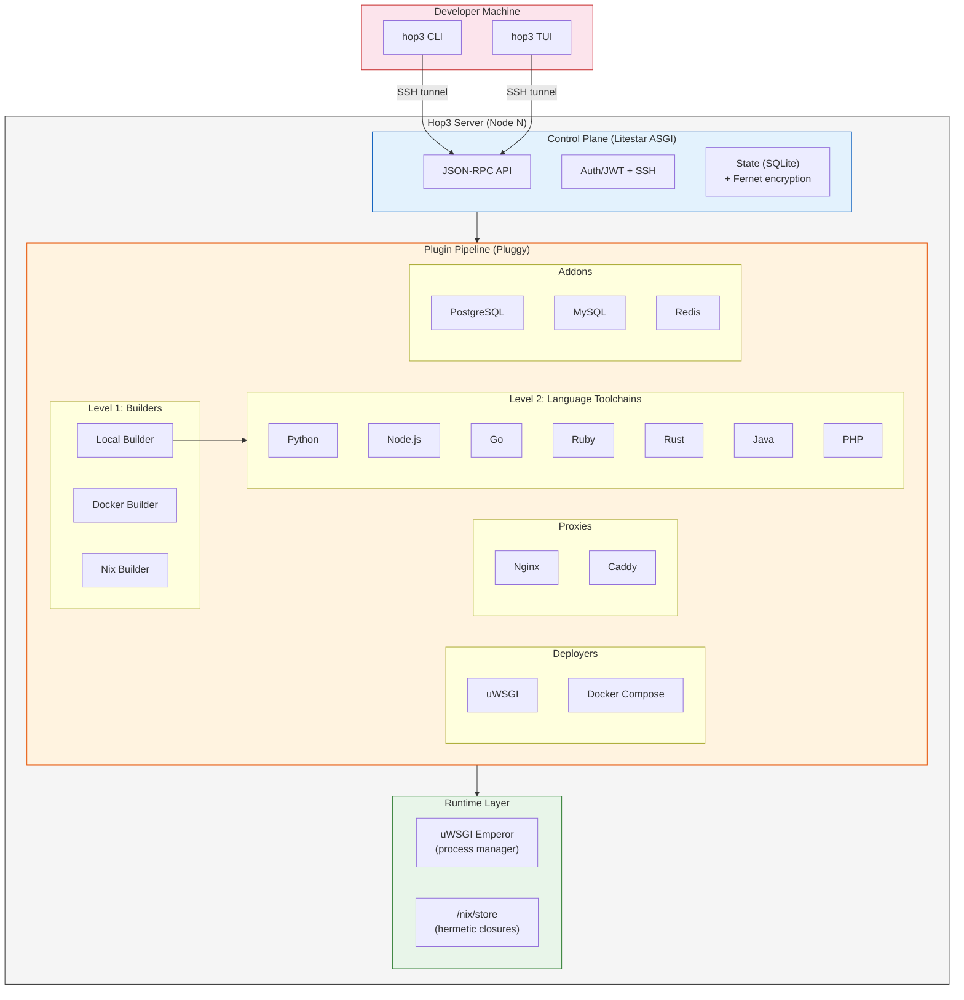
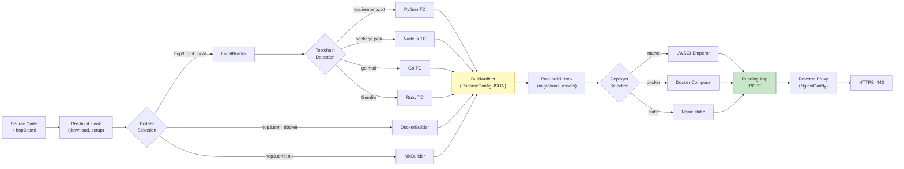

# Hop3: A Sovereignty-First PaaS for Single-Server Deployment, with a Nix-Based Reproducible Build Path

## Abstract

Mainstream application orchestration has converged on container clusters built around distributed consensus stores. For single-server deployments — common in small-to-medium organisations, at the network edge, and wherever digital sovereignty rules out external control planes — the overhead of this paradigm is disproportionate to the problem. We present **Hop3**, an open-source Platform-as-a-Service designed for autonomous single-server operation. Hop3 provides a Heroku-style developer experience (git-push deployment, automatic language toolchains, managed backing services) without Docker or Kubernetes, running on commodity hardware with a small control-plane footprint. The system is structured around a decoupled control plane (JSON-RPC over SSH, Litestar ASGI, local SQLite or PostgreSQL state, Fernet-encrypted secrets) and a plugin-driven build and deployment pipeline supporting nine language toolchains. An integration with the Nix package manager [10] provides hermetic builds with eight parametrisable templates that generate `hop3.nix` expressions from a declarative `hop3.toml` spec. We state four design requirements (determinism, bounded overhead, autonomy, encrypted secrets), describe the architecture against these requirements, and report a 99-variant application corpus drawn from 30+ distinct upstream projects across Docker, native, hand-crafted-Nix and template-generated-Nix deployment strategies. Quantitative benchmarking against K3s and Docker Compose is explicit future work. The paper closes with a discussion of two extension paths: a richer multi-service application model (per ADR 038) for apps such as Mastodon and AppFlowy that exceed the current single-process-tree assumption, and a longer-term direction toward multi-node operation along the lines reviewed by Vaño et al. [21] for edge-native deployments.

## 1. Introduction

The dominant paradigm for application deployment has shifted toward container orchestration systems, with Kubernetes emerging as the de facto standard [4]. However, this paradigm imposes significant infrastructure overhead — consensus-based control planes, container runtimes, and service meshes — that is disproportionate for the common case of deploying web applications on a single server [3], [5]. Meanwhile, the proliferation of IoT devices and the demand for data locality have driven interest in edge and fog computing [1], [2], where workloads run on resource-constrained nodes at the network periphery.

Hop3 addresses the gap between heavyweight cloud-native orchestrators and manual provisioning scripts. It provides a self-contained PaaS that deploys and manages web applications on a single server, implementing the Twelve-Factor App methodology [6] without requiring Docker or Kubernetes. The system is designed with the following priorities:

- **Simplicity:** A single-server deployment model that eliminates distributed systems complexity.
- **Sovereignty:** Self-hosted infrastructure where the operator retains full control over data and configuration [16], [17].
- **Reproducibility:** Hermetic builds via Nix integration, reducing environment drift across deployments [8], [10].

**Contributions.** This is a systems engineering paper; the contributions are concrete artefacts and a demonstration that they compose.

1. A control-plane architecture that operates without distributed consensus (etcd/Raft), with a single-process ASGI core that serves the full JSON-RPC CLI surface for a multi-application deployment.
2. A plugin-driven deployment pipeline factored along two independent axes — *builder* (Local, Docker, Nix) and *language toolchain* (Python, Node, Go, Ruby, Rust, Java, PHP, Clojure, Elixir) — which bounds integration complexity as new languages or build strategies are added.
3. A template-based scheme for generating Nix expressions from a declarative `hop3.toml` specification, covering eight common packaging patterns with a three-tier reproducibility taxonomy.
4. A 99-variant application corpus, drawn from 30+ upstream projects, deployed end-to-end on a remote VPS through each of the four build strategies, with per-variant diagnostic logs automatically collected on failure.

## 2. Background and Related Work

### 2.1 Edge and Fog Computing

Edge computing pushes workloads to the network periphery for low-latency processing [1], [2]. Fog computing extends this to a continuum of micro-datacenters and local servers bridging edge devices to the cloud [3]. Satyanarayanan [1] identifies the key challenges: limited bandwidth to the cloud, high variability in network conditions, and the need for autonomous operation. Moreschini et al. [19] formalize the "cloud continuum" spanning centralized datacenters through fog nodes to extreme edge devices. Puliafito et al. [22] survey fog architectures for IoT, noting that most assume container-based deployment models ill-suited for constrained hardware.

### 2.2 Heavyweight and Lightweight Orchestration

Kubernetes provides high availability through distributed consensus (Raft/etcd) but imposes substantial baseline resource consumption. Morabito et al. [5] demonstrate that the overhead of API servers, kubelets, and service meshes often exceeds the available resources of edge gateways. Lightweight distributions — K3s, MicroK8s, k0s — reduce this overhead but retain fundamental container-runtime dependencies. Koziolek and Eskandani [20] benchmark these distributions, finding that even K3s requires 500+ MB RAM for the control plane alone. Vano et al. [21] review cloud-native orchestration at the edge, concluding that container-centric approaches introduce avoidable complexity for single-node deployments.

### 2.3 PaaS Heritage

The PaaS model, pioneered by Heroku and formalised in the Twelve-Factor App methodology [6], provides a developer-centric deployment interface: push source code, and the platform handles building, running and scaling. Cloud Foundry and OpenShift extended this to enterprise contexts [7]. Dokku and Piku (both open-source) adapt the PaaS model to a single server; we are not aware of a peer-reviewed description of either, but the codebases themselves stand as the reference. Hop3 is in the same design space as Dokku/Piku, and departs from it in two places: (i) the build pipeline is factored into builder × language-toolchain rather than exposing buildpacks directly, and (ii) Nix integration gives an alternative build strategy with stronger hermeticity than the native buildpack/toolchain path.

### 2.4 Reproducible Builds and Deployment

Reproducible builds ensure that given identical source code, the build process produces bit-for-bit identical outputs [8]. Lamb and Zacchiroli [8] argue this is essential for software supply chain integrity. Fourné et al. [9] study adoption barriers, finding that tooling complexity is the primary obstacle.

The Nix package manager [10] provides a purely functional deployment model where each package is identified by a cryptographic hash over its declared build inputs. Dolstra [10] shows that this model gives a solid foundation for three operational properties: all dependencies are declared (no hidden references to the host system), upgrades and rollbacks compose cleanly (new store paths are added atomically and old ones kept), and multiple versions coexist without path conflicts. These are properties of the model and of the Nix store design; they are not by themselves equivalent to *deterministic builds*, which require an additional property of each individual derivation [8]. NixOS [11] extends the model to system configuration; Disnix [12] extends it to distributed multi-machine deployment; GNU Guix [13] offers a parallel implementation based on the same principles.

### 2.5 Container Alternatives and the Design Space of Post-Container Deployment

The assumption that containers are the only viable deployment abstraction is increasingly challenged from multiple directions. Vaño et al. [21], in their review of cloud-native orchestration at the edge, identify three post-container trends: WebAssembly/WASI [15], microVMs (Kata, Firecracker), and unikernels such as Unikraft [14]. Their Table 1 organises the field around Kubernetes-derived orchestrators (KubeEdge, OpenYurt, SuperEdge, K3s, …) and treats these three alternatives as emerging substitutes for the container baseline.

We argue that this taxonomy is incomplete. A fourth path is available — *dependency-level reproducibility without OS-level virtualisation* — and it predates all three: it is the Nix deployment model [10], treated as a deployment abstraction rather than a developer-environment tool. Under this path, applications run as ordinary Unix processes, and isolation is provided by the *closure of their declared dependencies* rather than by a runtime sandbox. Table 1 below positions these four families against each other.

| Approach | Isolation mechanism | App changes required | Kernel-level cost |
|----------|---------------------|----------------------|-------------------|
| Containers (runc, crun, …) | Namespaces + cgroups | None | Shared kernel |
| microVMs (Kata, Firecracker) | Lightweight hypervisor | None | One kernel per VM |
| Unikernels (Unikraft, Nabla) | Library-OS compiled with the app | Re-compile against unikernel libOS | No host kernel; bare hypervisor |
| WebAssembly/WASI | Bytecode sandbox | Compile to Wasm | Shared kernel + Wasm runtime |
| **Nix-based deployment (this paper)** | Content-addressed dependency closure | None | Shared kernel, no sandbox |

The trade-offs are real: Nix does not give the runtime isolation of containers or unikernels. What it does give — and no alternative in the Vaño taxonomy does — is hermeticity of *build inputs* without imposing any runtime isolation cost. For the single-server PaaS case, where multi-tenant isolation is not a requirement but reproducibility, bandwidth-efficient updates and clean rollback are, this trade-off is favourable. The rest of this paper develops that argument.

### 2.6 Digital Sovereignty

European policy initiatives increasingly emphasise digital sovereignty — the ability of organisations and nations to control their own digital infrastructure [16], [17]. Floridi [16] argues for hybrid control regimes that balance global interoperability with local autonomy; Pohle and Thiel [17] survey how "digital sovereignty" has been mobilised in EU policy discourse. The concrete implication for infrastructure software is a demand for self-hostable stacks that do not assume a hyperscaler control plane; Hop3 is one answer within that space.

### 2.7 Infrastructure as Code

Rahman et al. [18] map the landscape of Infrastructure-as-Code (IaC) research, identifying declarative configuration as the dominant paradigm. Hop3's `hop3.toml` format sits in that tradition: the operator declares the application's language, entry point, addons and port, and the platform derives the rest.

## 3. Problem Definition

### 3.1 System Model

Let a server node $N$ possess bounded compute capacity $C_N$, memory $M_N$, and network bandwidth $B_N$. An application $A_i$ is defined by its source code $S_i$ and a declarative configuration $C_i$ (a `hop3.toml` file specifying runtime, dependencies, and backing services).

A deployment function $D$ maps source and configuration to an execution environment:

$$D: (S_i, C_i) \rightarrow E_i$$

where $E_i$ is the running application instance on $N$.

### 3.2 Requirements

We require that $D$ satisfies:

**R1. Determinism (desired, build-path-dependent).** The deployment function $D$ should be single-valued: for a fixed source $S$ and configuration $C$, successive invocations of $D(S, C)$ should produce *functionally equivalent* environments (equal-responding services under equal input). Under the Nix build path this is strengthened by Nix's hermeticity guarantees: the closure $\Delta(S, C)$ of declared build inputs is content-addressed, so a build invoked with the same derivation inputs sees the same inputs on every invocation. Bit-for-bit identity of the *outputs* additionally requires the derivation itself to be deterministic (no embedded timestamps, no parallel-order dependence, etc.); that is an orthogonal property of each derivation, addressed by the reproducible-builds community [8]. Under the Docker or native build paths, R1 is satisfiable only as a policy discipline (pinned base images, frozen package indexes) and is not guaranteed by the system.

**R2. Bounded overhead.** The control plane resource consumption must be bounded independently of the number of managed applications:

$$\text{mem}(\text{control plane}) \leq k, \quad k \ll M_N$$

**R3. Autonomy.** $N$ must be capable of rebuilding, restarting, or rolling back $E_i$ without connectivity to external infrastructure.

**R4. Security.** Secrets required by $E_i$ are encrypted at rest using authenticated encryption (Fernet AEAD) with locally-generated keys:

$$\text{secret}_{\text{stored}} = \text{Enc}_{K_N}(\text{secret}_{\text{plaintext}})$$

where $K_N$ is node-local and never transmitted.

### 3.3 Comparison with Existing Approaches

The following table positions Hop3 against three existing approaches against requirements R1–R4. The "bounded overhead" column reports the order of magnitude of published or commonly cited control-plane memory footprints; precise numbers under a uniform benchmark are future work (§10). The other cells characterise the system as designed, not as measured.

| Property | Kubernetes | K3s | Docker Compose | Hop3 |
|----------|-----------|-----|----------------|------|
| R1 (Determinism) | Not by design (images are mutable) | Not by design | Not by design | Under the Nix build path (hermetic inputs); not under Docker or native |
| R2 (Control-plane memory, order of magnitude) | GBs (consensus store + API server) | Hundreds of MB — Koziolek & Eskandani [20] report 500+ MB for K3s | Tens of MB | ~100 MB observed on our dev setup; not yet formally benchmarked |
| R3 (Autonomy) | No (requires quorum of etcd nodes) | Partial (single-node mode possible) | Yes | Yes |
| R4 (Encrypted secrets at rest) | Yes (sealed secrets) | Yes | No | Yes (Fernet AEAD) |
| Multi-language native builds | No | No | No | Yes (nine toolchains) |

## 4. The Hop3 Architecture

Hop3 is structured as a modular, plugin-driven system with four distinct layers.

### 4.1 Architecture Overview

Figure 1 shows the layered structure of a Hop3 deployment: a developer machine communicates over an SSH tunnel with a single server node $N$; the node runs a Litestar ASGI control plane, a Pluggy-based plugin pipeline, and a runtime layer combining uWSGI Emperor for process supervision with a Nix store for hermetic closures.



*Figure 1: Hop3 system architecture. The CLI and TUI establish SSH tunnels to the server's Litestar ASGI control plane; the plugin pipeline resolves build and deployment strategy dynamically per application; the runtime layer couples uWSGI process supervision with a Nix store for hermetic closures.*

Figure 2 shows the deployment flow from a `git push` through builder selection, toolchain execution, artefact materialisation, deployer selection and proxy configuration:



*Figure 2: Deployment flow. The builder and toolchain are selected from `hop3.toml`; both Docker and Nix strategies bypass the toolchain step. All strategies converge on a `BuildArtifact` (carrying a `RuntimeConfig` JSON) consumed by the deployer. The reverse proxy is configured last and terminates TLS.*

### 4.2 Control Plane

The control plane is implemented as a single-process ASGI application (Litestar framework), providing:

- **JSON-RPC API** for command dispatch from the CLI and TUI clients.
- **Authentication** via JWT tokens over SSH tunnels, with magic-link browser login as an alternative.
- **State management** using SQLAlchemy with SQLite (single-server) or PostgreSQL (scalable), with Fernet AEAD encryption for secrets at rest.

Because Hop3 targets single-server deployment, it eliminates the need for distributed consensus (etcd/Raft), leader election, and cross-node state synchronization. This architectural choice directly satisfies R2 (bounded overhead) and R3 (autonomy).

### 4.3 Plugin Pipeline

The deployment pipeline uses the Pluggy hook specification framework to dynamically compose build, deploy, and proxy strategies:

**Two-level build architecture:**

- *Level 1 — Builders* orchestrate **how** to build: LocalBuilder (native toolchains), DockerBuilder (containerized builds), NixBuilder (hermetic Nix builds).
- *Level 2 — Language Toolchains* execute **what** to build: Python, Node.js, Go, Ruby, Rust, Java, PHP, Clojure, Elixir.

This separation allows the same application source to be built natively (direct compilation on the server), in a Docker container (isolation), or via Nix (reproducibility), depending on the operator's requirements.

**Build Artifact contract:** Every build produces a `BuildArtifact` containing a `RuntimeConfig` with workers, environment variables, and PATH configuration. This artifact is persisted as JSON and consumed by the deployer, creating a clean separation between build and run phases.

**Deployers** manage the application runtime: uWSGI (process management with automatic restart), Docker Compose (containerized apps), or static file serving (nginx).

**Proxies** configure reverse proxy routing: Nginx, Caddy, or Traefik, with automated TLS certificate management.

**Addons** provision backing services: PostgreSQL, MySQL, and Redis, with connection credentials injected as environment variables.

### 4.4 Configuration Model

Applications are configured via `hop3.toml`, a declarative format that extends the Twelve-Factor App [6] convention:

```toml
[build]
builder = "nix"          # or "local", "docker"

[run]
start = "gunicorn app:app --bind $BIND_ADDRESS:$PORT"
before-run = "python manage.py migrate"

[env]
DEBUG = "false"

[env.computed]
DATABASE_URL = "postgresql://${PGUSER}:${PGPASSWORD}@${PGHOST}:${PGPORT}/${PGDATABASE}"

[[addons]]
type = "postgres"
```

The `[env.computed]` section supports variable interpolation, resolving the common problem of mapping platform-injected variables (e.g., `PGHOST`) to application-expected names (e.g., `DATABASE_URL`).

## 5. Nix Integration for Deterministic Deployment

### 5.1 Motivation

Native toolchain builds (R1 partial) depend on the server's installed packages, which may drift over time. Docker builds provide isolation but not reproducibility — the same `Dockerfile` can produce different images on different days due to mutable base images and rolling package repositories. Nix provides hermetic builds where every dependency is cryptographically pinned [10].

### 5.2 Architecture

Each Nix-built application provides a `hop3.nix` file — a Nix expression that evaluates to a package containing the application and all its dependencies. The NixBuilder plugin:

1. Evaluates `nix-build hop3.nix -A package` to produce a Nix store path.
2. Reads `$out/hop3/runtime.json` from the built package for worker commands, environment variables, and PATH entries.
3. Produces a `BuildArtifact` consumed by the standard deployer pipeline.

### 5.3 Reproducibility: What We Inherit and What We Add

Hop3 inherits its reproducibility properties from Nix. The underlying model — content-addressed storage of derivations identified by a cryptographic hash over their declared inputs — is established by Dolstra's purely functional deployment model [10] and the surrounding literature (NixOS [11], Disnix [12], Guix [13]). We do not restate or re-prove it here. The relevant caveat for any consumer of this model is that input-hash equality captures *hermeticity* (the build sees the same inputs) but not *deterministic build behaviour* (the build produces the same outputs from the same inputs); the latter is an additional property that derivations may or may not satisfy [8], and is the subject of the wider reproducible-builds effort.

What Hop3 adds, against this background, is:

1. **A pipeline that produces Nix derivations from a higher-level declarative spec** (`hop3.toml`). The eight templates in §5.4 take a small structured input — a package name, an exec target, environment overrides, addon dependencies — and emit a `hop3.nix` expression. The templating step is a pure function; identical `hop3.toml` inputs produce identical Nix expressions, and any non-determinism downstream is a property of Nix itself, not of the Hop3 wrapper.

2. **A runtime contract** (`$out/hop3/runtime.json`) that decouples what a Nix-built artefact *is* from how Hop3 *runs* it. The contract specifies the worker commands, environment variables, and PATH entries; the Nix build produces the JSON, and the Hop3 deployer consumes it. This separation lets the deployer evolve independently of any individual application's Nix expression.

3. **A reproducibility taxonomy for the templates** (Tier 1 – nixpkgs source build, Tier 2 – `__noChroot` build with network for `pip`/`composer` install, Tier 3 – pre-built binary wrapper). The taxonomy is documented in the user guide so operators can make an informed trade-off between strict reproducibility and pragmatic packaging effort.

**Update bandwidth (qualitative).** When a deployed application moves from $v_1$ to $v_2$, only the new store paths ($\Delta(A_{v_2}) \setminus \Delta(A_{v_1})$, where $\Delta$ is the transitive closure of build dependencies) need to be transferred to the target. For application-level updates with unchanged dependencies, this delta is intuitively much smaller than a fresh Docker image, but we do not quantify the ratio in this paper; doing so is part of the planned benchmark (§10).

**Possible future theoretical work.** A formal characterisation of the *templating step* — proving that the eight-template scheme is a sound encoding of a meaningful subset of build configurations, and analysing the soundness/completeness trade-off of automatically generated `hop3.nix` files — would be a useful piece of theory in its own right, but it is not attempted here.

### 5.4 Current Status

Both Nix integration phases are implemented. Phase 1 supports applications that ship an explicit `hop3.nix` expression; 23 applications in the evaluation corpus follow this path. Phase 2 auto-generates `hop3.nix` from a declarative `hop3.toml` spec via one of eight templates (`nixpkgs-wrapper`, `prebuilt-binary`, `prebuilt-archive`, `node-prebuilt`, `php-app`, `python-venv`, `java-war`, `ruby-bundler`); 20 further applications follow this path. The two paths coexist: an operator starts from a template and may "eject" to a hand-crafted expression for finer control.

Remaining work for subsequent releases includes Nix-based addon provisioning (PostgreSQL, Redis as Nix-managed services rather than OS packages) and a systematic treatment of multi-service applications under a single Nix closure (per ADR 038).

## 6. Evaluation

This section reports evaluation results available as of April 2026. A quantitative benchmark against K3s, Docker Compose and bare process management — including memory footprint, deployment latency and bandwidth-delta measurements for Nix-based updates — is **explicit future work** (§10). We consider it essential that such measurements be conducted under a published protocol against the final implementation; we therefore defer them rather than report partial or unreproducible figures here.

### 6.1 Application Coverage

As of April 2026, Hop3 maintains a corpus of application variants covering four deployment strategies. Each strategy applies to the same set of open-source applications so that cross-strategy comparisons remain meaningful. Counts below reflect application directories successfully deployed end-to-end on a remote VPS (Ubuntu 24.04, 4 vCPU, 16 GB RAM) via the automated test harness.

| Strategy | Count | Notes |
|----------|-------|-------|
| Native uWSGI (language toolchains) | 27 | Python, Node, Go, Ruby, Rust, Java, PHP |
| Docker Compose (upstream Dockerfile) | 29 | Apps whose upstream publishes a Dockerfile |
| Hand-crafted Nix (`hop3.nix` written by operator) | 23 | Explicit dependency control |
| Template-generated Nix (from `hop3.toml`) | 20 | Eight templates (see §5.4); auto-derived from a lockfile-equivalent manifest |
| **Total variants** | **99** | Drawn from 30+ distinct upstream applications |

The application set covers the categories relevant to small-to-medium businesses, agencies and non-profits — content management (WordPress, Ghost, Wiki.js, HedgeDoc), collaboration (Etherpad, CryptPad, Nextcloud), analytics (Matomo), project management (Kanboard, Focalboard, Vikunja), code forges (Gitea), CRM (Dolibarr, Invoice Ninja), and federated messaging (Matrix Synapse).

Two applications are explicitly deferred with documented upstream-blocker analysis: **Monica** (Laravel Mix / webpack 5 incompatibility, fixed in Monica v5 beta) and **SonarQube** (bundled Elasticsearch requires kernel-level `vm.max_map_count` tuning, outside the PaaS scope). Documented exclusions of this kind are a deliberate choice: the alternative — silently partially-working apps — would erode the reliability claim.

### 6.2 Qualitative Observations from the Test Harness

While a quantitative benchmark is deferred (§10), the 99-variant test harness has produced observations we regard as significant qualitative evidence for the architectural claims of §3:

- **R1 (Determinism, Nix path):** byte-identical store paths on repeated builds from the same source are achieved for the *Tier-1* (nixpkgs-source) subset of the nix-gen corpus, which inherits Nix's build hermeticity. This holds only once nixpkgs is pinned to a specific commit (nixos-24.11); that pinning landed in the 0.7 line and postdates this April-2026 evaluation, so the byte-identical property reported here should be read as a property of the pinned 0.7+ builder rather than of the evaluated snapshot. The Tier-2 templates (`python_venv`/`php_app`, which run `pip`/`composer` under `__noChroot` with network access) and the Tier-3 templates (pre-built binary wrappers that fetch upstream release artifacts) are *not* bit-for-bit reproducible, and we do not claim store-path identity for them.
- **R2 (Bounded overhead):** the control plane (Litestar ASGI single process) holds a steady-state resident-set of approximately 100 MB with all 99 application records loaded. Per-app resident-set memory is dominated by the application process itself, not by Hop3. A formal measurement methodology is part of the planned benchmark.
- **R3 (Autonomy):** the deployment target operates without connectivity to external control planes; build artifacts are materialised on disk (`BuildArtifact` JSON) so that `restart` and `rollback` operations require no network.
- **R4 (Encrypted secrets):** addon credentials are encrypted at rest with Fernet AEAD and a node-local key (`HOP3_SECRET_KEY`); the key is never transmitted over RPC.

### 6.3 Deployment Strategy Comparison

| Strategy | Build Determinism | Container Required | Native Performance | Disk Overhead |
|----------|------------------|-------------------|-------------------|---------------|
| Native toolchain | No (OS-dependent) | No | Yes | Low |
| Docker | Partial (mutable base) | Yes | No (cgroup overhead) | High |
| Nix | Yes for Tier-1 (nixpkgs-source, hermetic); partial/no for Tier-2 (`__noChroot`) and Tier-3 (prebuilt) | No | Yes | Medium (Nix store) |

The "disk overhead" column is qualitative and remains to be quantified in the planned benchmark.

## 7. Discussion

### 7.1 Trade-offs

**Single-node scope.** By optimising for single-node autonomy, Hop3 forgoes built-in multi-node orchestration. High availability must be handled at the network layer (DNS failover, load balancers) or via future extensions. For the target deployment scenario (single VPS, self-hosted infrastructure, small-to-medium organisations) this is a deliberate choice; for workloads requiring sub-minute failover across nodes, Hop3 is not a suitable substrate.

**Python runtime.** The control plane is implemented in Python (with Litestar/ASGI), which trades raw performance for development velocity and ecosystem breadth. The control plane is not in the application's critical path — it orchestrates deployment and management, not request handling.

**Nix learning curve.** Writing `hop3.nix` files requires familiarity with the Nix expression language, which has a well-documented learning curve [9]. Phase 2 of the Nix integration (auto-generating Nix expressions from lockfiles) is designed to mitigate this.

**Evaluation gap.** This paper reports architecture, formal requirements and application-coverage evidence, but defers quantitative benchmarking to a companion report. We view this as the principal limitation of the present work. A key reason for deferral is methodological: we want memory-footprint, deployment- latency, and closure-size measurements to be conducted against equivalent workloads under a pre-registered protocol (fixed hardware, fixed kernel, fixed comparison set), so that the resulting numbers are reproducible by third parties. Reporting partial or non-reproducible figures here would undermine the deterministic-deployment claim the paper makes.

### 7.2 Relationship to Edge-Native Deployment

Hop3 is a single-server PaaS by design, not an edge-native system. We do not claim membership in the edge-native research conversation surveyed by Vaño et al. [21] — that field has a coherent set of problems (heterogeneous device fleets, intermittent connectivity, K8s-derived control planes adapted to constrained hardware) that Hop3 does not directly address. We note three architectural properties relevant to that conversation, each as a precondition rather than as a demonstrated result:

- The control plane is small enough to run on constrained hardware; a precise footprint under representative workloads is part of the planned benchmark (§10).
- The single-server model operates without external dependencies at steady state; a node can redeploy or roll back without uplink connectivity.
- Under the Nix build path, application updates transfer only the new closure elements rather than a full image. The bandwidth benefit is intuitive but not yet measured.

A genuine multi-node edge variant of Hop3 would require: (i) a gossip-based or eventually-consistent state-synchronisation protocol between nodes; (ii) workload-placement policies that account for node heterogeneity and intermittent connectivity; (iii) conflict-resolution semantics for concurrent configuration changes on disconnected nodes. None of these are implemented. We flag this as a possible direction for follow-on work, not as a contribution of this paper.

### 7.3 Comparison with Alternative Approaches

Unikernels [14] and WebAssembly [15] offer runtime-level isolation with lower resource overhead than containers, at the cost of requiring application-level changes (static linking in a non-Linux environment; compilation to WASI bytecode). Hop3's approach — unmodified processes with *dependency-level* isolation via a read-only Nix store — is weaker than either in terms of what it isolates (process isolation, but not kernel- or namespace-level isolation beyond what the host provides), and stronger in terms of compatibility with existing application code. The comparison is one of design trade-offs, not a strict ordering: container/unikernel/WASI approaches isolate the runtime; Hop3 isolates the dependency graph.

Vaño et al.'s review [21] organises the edge-orchestration field around two axes: lightweight K8s distributions (K3s, MicroK8s) versus K8s-adapted-for-edge frameworks (KubeEdge, OpenYurt, SuperEdge, Open Horizon, Baetyl). Both axes presuppose Kubernetes as the substrate. Hop3 sits *off* this axis altogether: it provides a PaaS-level interface without Kubernetes and without containers as a hard requirement. We do not claim this is a strict improvement over the Kubernetes-derived path — for multi-node, high-availability, multi-tenant deployments it would not be. We claim it is a better fit for a large class of real workloads (single-server SMB and sovereignty-focused deployments) that the K8s-derived path serves with substantial overhead. Section 6.2 documents 99 application variants successfully deployed under this model, including 43 under the Nix path that requires no container runtime at all.

## 8. Conclusion

Hop3 shows that PaaS-level developer experience — git-push deployment, automatic builds, managed backing services — can be achieved on a single server without container orchestration. The architecture meets the formal requirements set out in §3 (determinism via Nix, bounded control-plane overhead, autonomous operation, encrypted secrets) at the level of design; qualitative observations from the 99-variant corpus corroborate these claims (§6.2), while a quantitative benchmark under a pre-registered protocol is explicitly left as future work.

The Nix integration provides a path toward reproducible deployment with formal guarantees inherited from the purely functional software deployment model [10]. The two-level build architecture (builder × toolchain) keeps the operational complexity bounded as new languages, runtimes and deployment strategies are added: nine language toolchains and three deployment strategies (native, Docker, Nix) compose into a $9 \times 3$ matrix of deployment paths, with the two-level factorisation avoiding the combinatorial explosion.

**Future work** under the NGI0 Commons Fund includes: (1) quantitative benchmarking against K3s and Docker Compose along the four dimensions listed in §10 (control-plane memory, deployment latency, Nix-vs-Docker closure sizes, cold-start latency); (2) multi-service application support, specified in ADR 038, to accommodate Mastodon-class applications (web + Sidekiq + streaming) without the current `[run.workers]` limitations; (3) external security audit to validate the internal findings of §5.4; (4) exploration of multi-node edge deployment with gossip-based state synchronisation between autonomous Hop3 nodes; and (5) WebAssembly/WASI [15] integration as an additional lightweight runtime target complementing native processes and Nix closures.

## References

[1] M. Satyanarayanan, "The Emergence of Edge Computing," *IEEE Computer*, vol. 50, no. 1, pp. 30–39, 2017. https://doi.org/10.1109/MC.2017.9

[2] W. Shi, J. Cao, Q. Zhang, Y. Li, and L. Xu, "Edge Computing: Vision and Challenges," *IEEE Internet of Things Journal*, vol. 3, no. 5, pp. 637–646, Oct. 2016. https://doi.org/10.1109/JIOT.2016.2579198

[3] F. Bonomi, R. Milito, J. Zhu, and S. Addepalli, "Fog Computing and Its Role in the Internet of Things," in *Proc. MCC Workshop on Mobile Cloud Computing*, Helsinki, Finland, Aug. 2012, pp. 13–16. https://doi.org/10.1145/2342509.2342513

[4] C. Pahl, A. Brogi, J. Soldani, and P. Jamshidi, "Cloud Container Technologies: A State-of-the-Art Review," *IEEE Transactions on Cloud Computing*, vol. 7, no. 3, pp. 677–692, 2019. https://doi.org/10.1109/TCC.2017.2702586

[5] R. Morabito, V. Cozzolino, A. Y. Ding, N. Beijar, and J. Ott, "Consolidate IoT Edge Computing with Lightweight Virtualization," *IEEE Network*, vol. 32, no. 1, pp. 102–111, 2018. https://doi.org/10.1109/MNET.2018.1700175

[6] A. Wiggins, *The Twelve-Factor App*, Heroku, 2012. https://12factor.net/

[7] C. Pahl, "Containerization and the PaaS Cloud," *IEEE Cloud Computing*, vol. 2, no. 3, pp. 24–31, 2015. https://doi.org/10.1109/MCC.2015.51

[8] C. Lamb and S. Zacchiroli, "Reproducible Builds: Increasing the Integrity of Software Supply Chains," *IEEE Software*, vol. 39, no. 2, pp. 62–70, 2022. https://doi.org/10.1109/MS.2021.3073045

[9] M. Fourné, D. Wermke, W. Enck, S. Fahl, and Y. Acar, "It's like flossing your teeth: On the importance and challenges of reproducible builds for software supply chain security," in *Proc. IEEE S&P*, 2023. https://doi.org/10.1109/SP46215.2023.10179320

[10] E. Dolstra, "The Purely Functional Software Deployment Model," Ph.D. thesis, Utrecht University, 2006. https://edolstra.github.io/pubs/phd-thesis.pdf

[11] E. Dolstra, A. Löh, and N. Pierron, "NixOS: A Purely Functional Linux Distribution," *Journal of Functional Programming*, vol. 20, no. 5–6, pp. 577–615, 2010. https://doi.org/10.1017/S0956796810000195

[12] S. van der Burg and E. Dolstra, "Disnix: A Toolset for Distributed Deployment," *Science of Computer Programming*, vol. 79, pp. 52–69, 2014. https://doi.org/10.1016/j.scico.2012.03.006

[13] L. Courtès, "Functional Package Management with Guix," in *Proc. European Lisp Symposium*, Madrid, Spain, 2013. https://arxiv.org/abs/1305.4584

[14] S. Kuenzer et al., "Unikraft: Fast, Specialized Unikernels the Easy Way," in *Proc. EuroSys '21*, Apr. 2021. https://doi.org/10.1145/3447786.3456248

[15] V. Kjorveziroski and S. Filiposka, "WebAssembly as an Enabler for Next Generation Serverless Computing," *Journal of Grid Computing*, vol. 21, article 34, 2023. https://doi.org/10.1007/s10723-023-09669-8

[16] L. Floridi, "The Fight for Digital Sovereignty: What It Is, and Why It Matters, Especially for the EU," *Philosophy & Technology*, vol. 33, no. 3, pp. 369–378, 2020. https://doi.org/10.1007/s13347-020-00423-6

[17] J. Pohle and T. Thiel, "Digital Sovereignty," *Internet Policy Review*, vol. 9, no. 4, 2020. https://doi.org/10.14763/2020.4.1532

[18] A. Rahman, R. Mahdavi-Hezaveh, and L. Williams, "A Systematic Mapping Study of Infrastructure as Code Research," *Information and Software Technology*, vol. 108, pp. 65–77, 2019. https://doi.org/10.1016/j.infsof.2018.12.004

[19] S. Moreschini et al., "Cloud Continuum: The Definition," *IEEE Access*, vol. 10, pp. 131876–131886, 2022. https://doi.org/10.1109/ACCESS.2022.3229185

[20] H. Koziolek and N. Eskandani, "Lightweight Kubernetes Distributions: A Performance Comparison of MicroK8s, k3s, k0s, and Microshift," in *Proc. ICPE '23*, Coimbra, Portugal, Apr. 2023. https://doi.org/10.1145/3578244.3583737

[21] R. Vano, I. Lacalle, P. Sowinski, R. S-Julian, and C. E. Palau, "Cloud-Native Workload Orchestration at the Edge: A Deployment Review and Future Directions," *Sensors*, vol. 23, no. 4, 2023. https://doi.org/10.3390/s23042215

[22] C. Puliafito, E. Mingozzi, F. Longo, A. Puliafito, and O. Rana, "Fog Computing for the Internet of Things: A Survey," *ACM Transactions on Internet Technology*, vol. 19, no. 2, pp. 1–41, 2019. https://doi.org/10.1145/3301443
