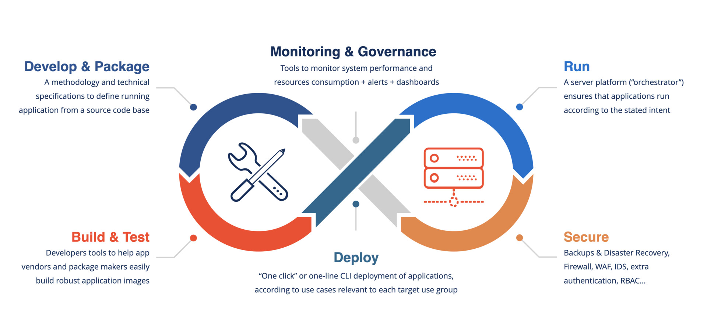
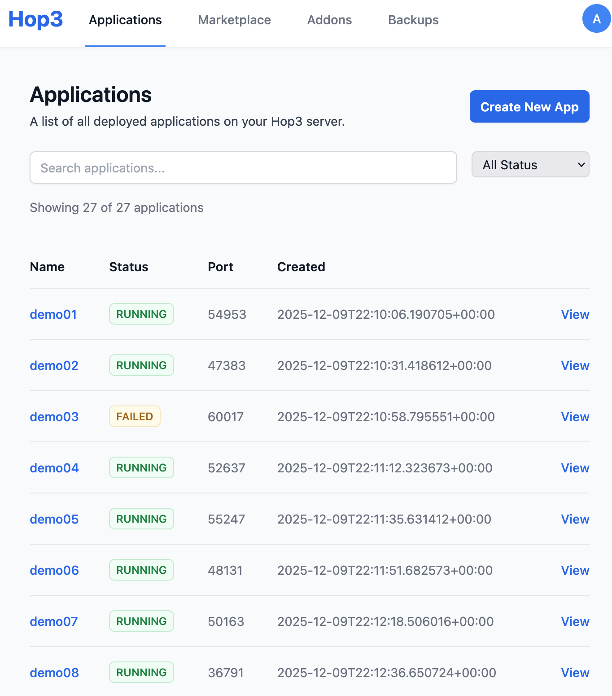
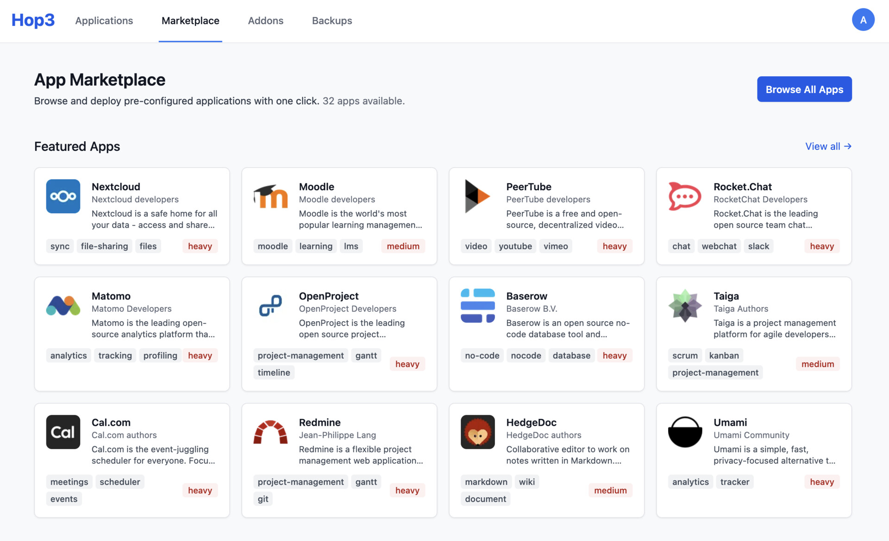
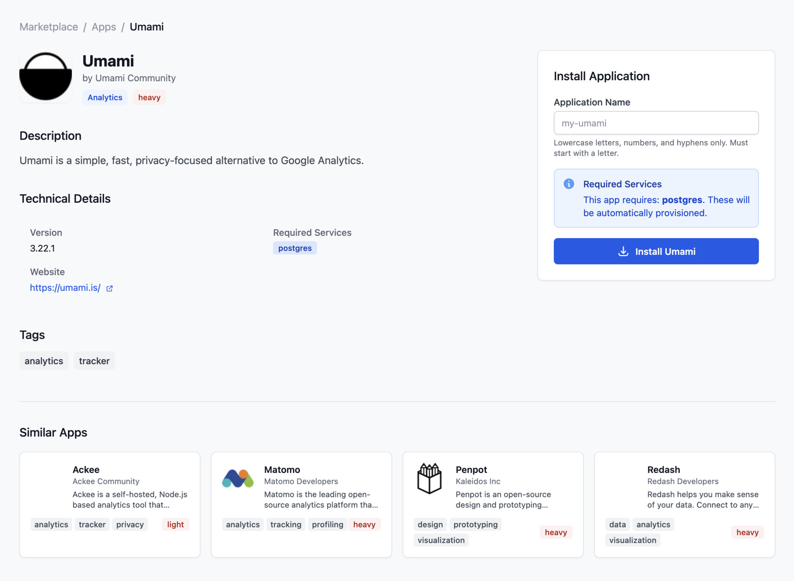
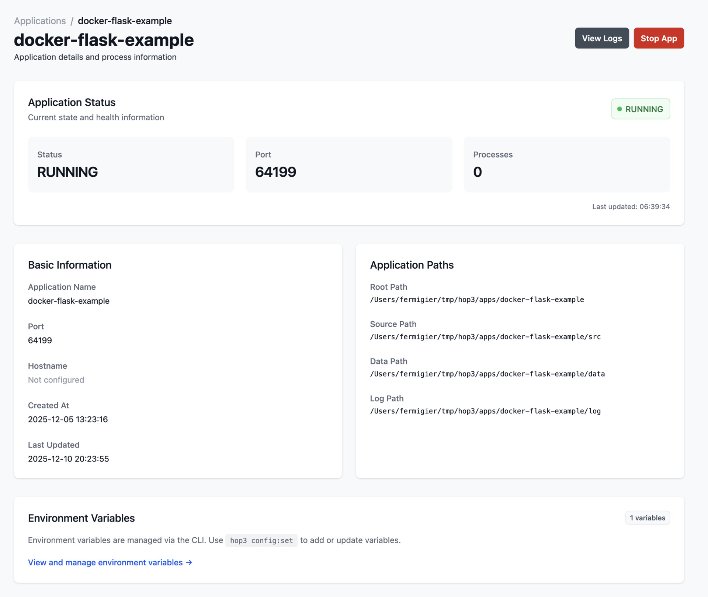
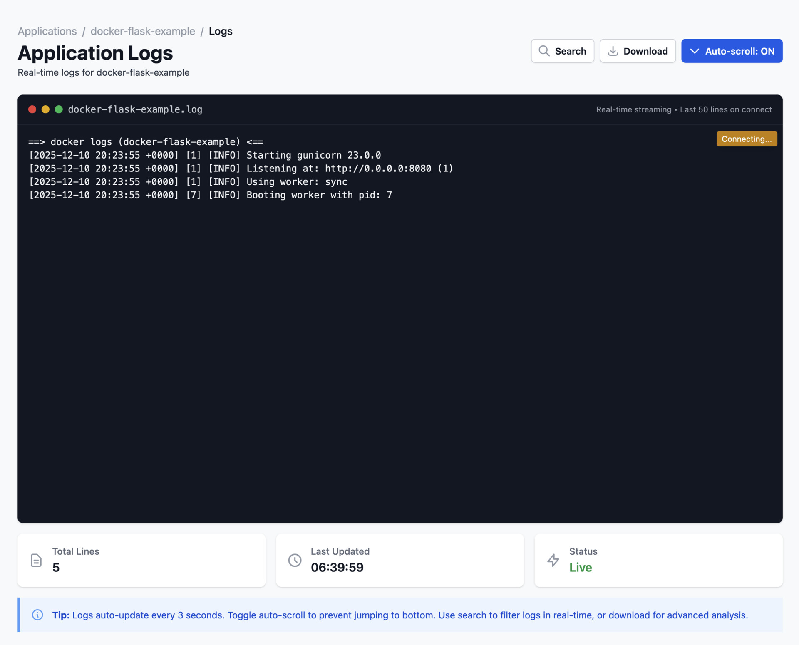
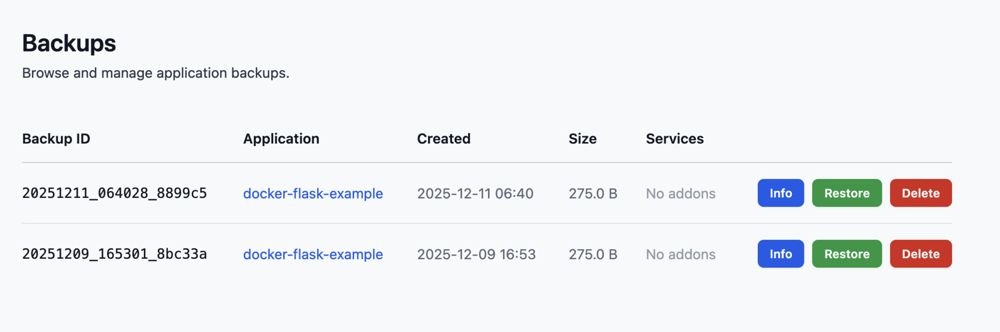
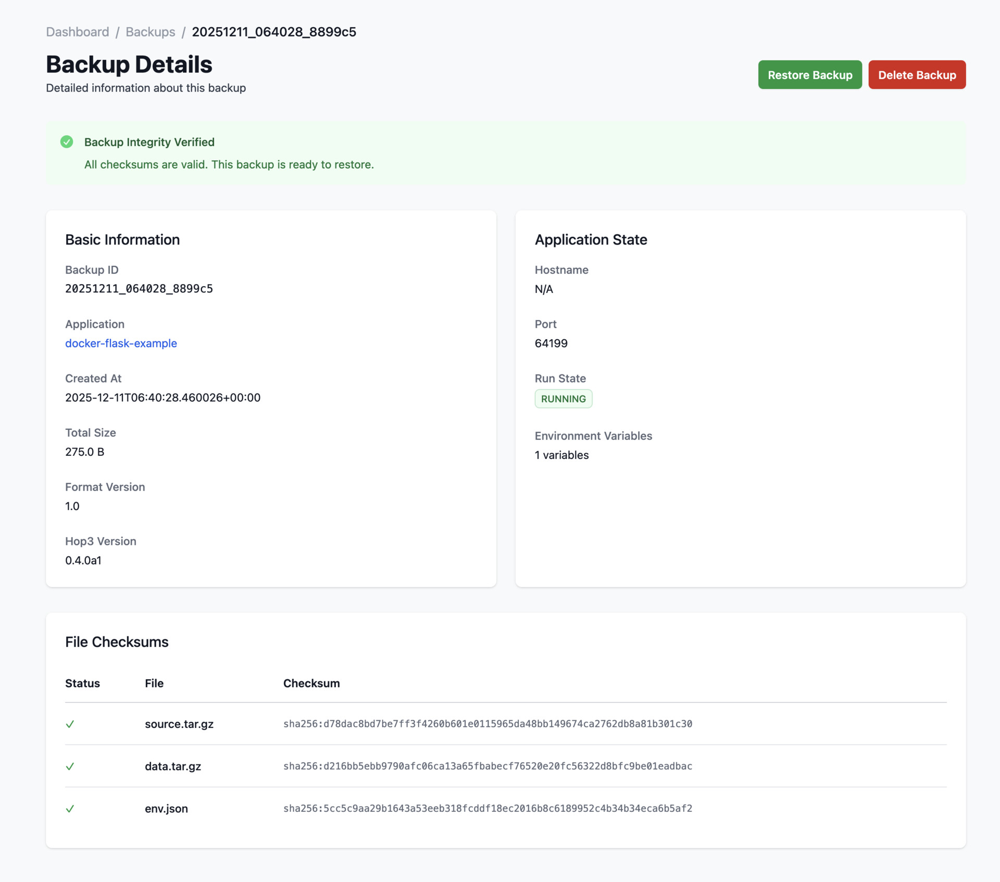
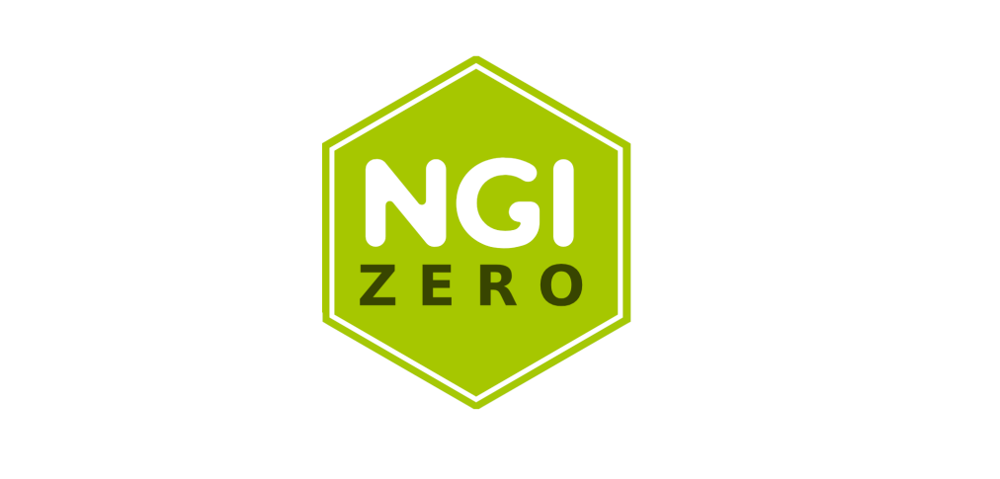
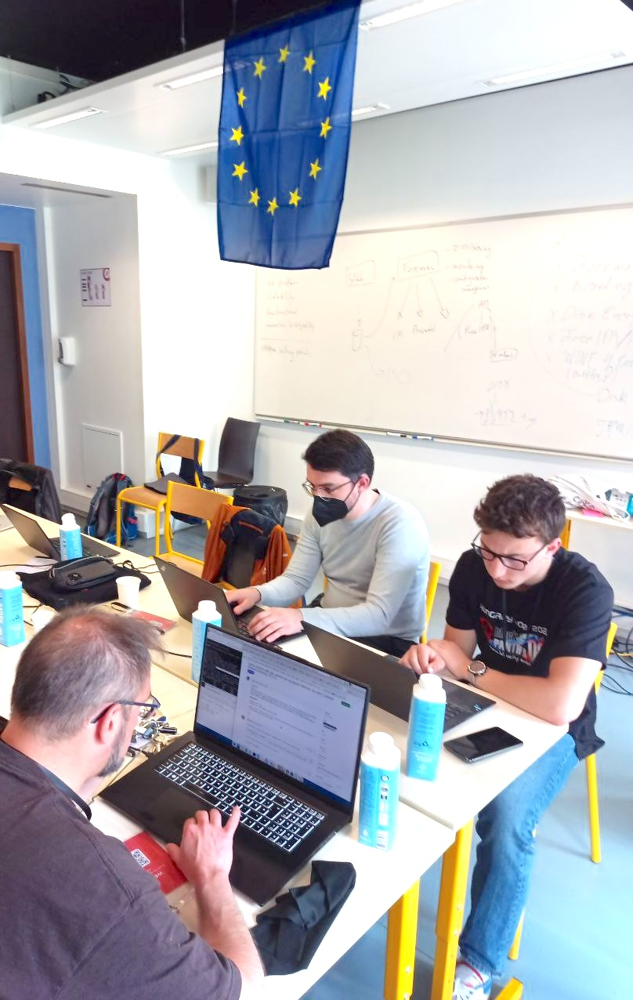

<!-- _class: lead invert -->
<!-- _header: "" -->
<!-- _footer: "" -->

<div style="text-align: center; margin-top: 5em;" class="smaller">
</div>

# **Hop3: From Self-Hosting Complexity to Production-Ready Sovereignty**

## An Open-Source PaaS for Digital Autonomy

### OSXP 2025, Paris
#### Stefane Fermigier (PhD), CEO, Abilian

<div style="text-align: center; margin-top: 5em;" class="smaller">
Slides sur: <b>speakerdeck.com/sfermigier</b>
</div>

---
<!-- _class: invert -->

# Part 1

## The Sovereignty Paradox

---


## The Promise of Self-Hosting

**Digital sovereignty** is the ability to control your own digital destiny:
- Your data stays yours
- Your infrastructure, your rules
- No vendor lock-in
- Full transparency and auditability

**Open source software** should be the foundation of this sovereignty.

Yet most organizations **give up** and hand their data to hyperscalers.

**Why?**

---


## The Reality: Operational Chaos

Self-hosting F/OSS applications means:

<div class="columns">
<div>

**Constant Complexity:**
- Infrastructure provisioning
- Configuration management
- Dependency hell
- Version compatibility
- Security patching

</div>
<div>

**Operational Burden:**
- Monitoring & alerting
- Backup & disaster recovery
- SSL certificate management
- User management
- Log aggregation

</div>
</div>

**The cruel irony:** To gain sovereignty, you need a dedicated DevOps team. Most SMEs, NGOs, and public institutions can't afford this.

<!-----

## The Self-Hosting Trap

**The vicious cycle:**

1. Install F/OSS application (easy!)
2. First security vulnerability → scramble to update
3. Database needs backup → manual scripts
4. SSL certificate expires → site goes down
5. New version breaks compatibility → rollback chaos
6. Team gives up → migrates to SaaS

**Result:** Digital sovereignty abandoned for operational convenience.

The "Linux Distribution" model works for infrastructure and desktops.
**It has never been successfully extended to web applications.**-->

---
## Our Thesis

**The solution isn't to work harder — it's to build smarter platforms.**

What if we could:
- Deploy any F/OSS (or not) app with a single click, CLI command or `git push`
- Automatic SSL, backups, monitoring
- One-click service provisioning (PostgreSQL, Redis...)
- Web UI for non-technical administrators
- Reproducible, deterministic environments

**This is Hop3.**

---
<!-- _class: invert -->

# Part 2

## Engineering a Sovereign PaaS

---
## Introducing Hop3


**Hop3** is an open-source Platform-as-a-Service that makes self-hosting practical.

**What we deliver:**
- **Complete lifecycle management:** build, deploy, maintain, secure, backup
- **Production-grade reliability** without DevOps expertise
- **Full control** over your infrastructure and data

**License:** Apache

**Target users:**
- SMEs deploying internal tools
- IT departments managing F/OSS portfolios
- Developers who want simple deployments

---


---
## Architecture Philosophy


**12-Factor App Foundation:**
- Declarative configuration (`hop3.toml` or `Procfile`)
- Strict separation of config from code
- Backing services as attached resources
- Stateless processes, disposable environments

**Beyond 12 Factors:**
- **Security by design:** Fernet-encrypted credentials, JWT auth
- **Sustainability:** Runs on modest hardware, energy-conscious
- **Extensibility:** Plugin architecture (Pluggy + Dishka DI)

---


## The Web Dashboard

**For administrators who prefer GUIs:**

- Real-time application status
- Live log streaming
- Service attachment visualization
- Backup management
- Environment variable editing

**No CLI required** for day-to-day operations.

Built with: Litestar, HTMX, Tailwind CSS

---
## CLI

<pre>
❯ hop help
USAGE
    $ hop <command> <args>
    $ hop help <command>    # Show help for a command
    $ hop help --all        # Show all commands including subcommands

COMMANDS
    admin            Administrative commands.
    app              Commands for managing app instances.
    apps             List all applications.
    auth             Authentication commands.
    backup           Run a backup for an app's source code and virtual environment.
    config           Manage an application config / env.
    deploy           Deploy an application from its configured repository.
    help             Display useful help messages.
    init             Initialize connection to a Hop3 server via SSH.
    login            Authenticate to a server.
    pg               Manage PostgreSQL databases.
    plugins          List installed plugins and their commands.
    ps               Show process count for an app.
    redis            Manage Redis instances.
    run              Run a command in the context of an app.
    sbom             Generate a Software Bill of Materials (SBOM) for an app.
    settings         Manage local CLI settings (server URL, token, SSL).
    system           Manage the hop3 system.    
</pre>

---
## Declarative Configuration

**`hop3.toml`** - Your application's complete specification:

```toml
[metadata]
id = "my-nextcloud"
version = "1.0.0"

[run]
start = "php-fpm"

[env]
NEXTCLOUD_ADMIN_USER = "admin"
NEXTCLOUD_TRUSTED_DOMAINS = "cloud.example.com"

[[provider]]
name = "postgres"
version = "15"

[[provider]]
name = "redis"
```

No Kubernetes YAML. No Docker Compose complexity. Just your app's needs.

---
## Backing Services: First-Class Citizens

**PostgreSQL, Redis, MySQL...** with full lifecycle management. Extensible via plugins.

<div class="columns">
<div>

**Operations:**
- Provision with one command
- Attach to any application
- Automatic credential injection
- Backup & restore integration

</div>
<div>

**Security:**
- Fernet AEAD encryption at rest
- Credentials never in plaintext
- Secure environment variable injection
- Per-service isolation

</div>
</div>

```bash
hop3 addons:create postgres mydb
hop3 addons:attach mydb --app my-nextcloud
# DATABASE_URL automatically injected
```

---
## Backup & Restore: Built-In

**Complete data protection**, not an afterthought:

```
backup/
├── metadata.json      # SHA256 checksums, timestamps
├── source.tar.gz      # Application code
├── data.tar.gz        # User data
├── env.json           # Configuration
└── services/
    └── postgres_mydb.sql   # Database dump
```

**Features:**
- Integrity verification (SHA256)
- Service-aware (PostgreSQL, MySQL, Redis...)
- Fail-fast (no partial backups)
- Point-in-time recovery

---
## Plugin Architecture

**Everything is extensible:**

<div class="columns">
<div>

**Build Strategies:**
- Native (Python, Node, Go, Rust...)
- Docker (Dockerfile)
- Nix (coming soon)

**Deployment Runtimes:**
- uWSGI Emperor
- Docker Compose
- Systemd (planned)

</div>
<div>

**Proxy Backends:**
- Nginx (default)
- Caddy
- Traefik

**Service Addons:**
- PostgreSQL, Redis, MySQL
- MongoDB, Cassandra... (planned)
- S3, email, etc.

</div>
</div>

**Built with Pluggy** (pytest's plugin system) + **Dishka** (dependency injection)

---
## Deterministic Environments

**The reproducibility problem:**
- "Works on my machine" syndrome
- Dependency drift over time
- Security vulnerabilities in forgotten packages

**Our approach today:**
- Explicit dependency declarations (`requirements.txt`, `package.json`...)
- Isolated build environments (virtualenv, node_modules)
- Version pinning by default
- SBOM generation (CycloneDX format)

**Coming with Nix:** Bit-perfect, reproducible deployments

---
<!-- _class: invert -->

# Part 3

## "Live" Demonstration

---
## Demo: Deploying a Flask Application

**Scenario:** Deploy a Python Flask app with PostgreSQL database.

**Steps:**
1. Create app files and deploy
2. Check status and configure environment
3. Create and attach PostgreSQL database
4. View logs and create backup
5. Generate SBOM for compliance

---
## Step 1: Create & Deploy

<pre>
$ cat app.py
from flask import Flask, jsonify
import os

app = Flask(__name__)

@app.route('/')
def hello():
    name = os.environ.get('APP_NAME', 'World')
    return f'&lt;h1&gt;Hello, {name}!&lt;/h1&gt;&lt;p&gt;Deployed with Hop3&lt;/p&gt;'

@app.route('/health')
def health():
    return jsonify(status='healthy')

$ hop deploy demo-app ./app-dir
> Starting deployment for app 'demo-app'
-> Using builder: 'local'
-> Build successful. Artifact: /home/hop3/apps/demo-app/venv (kind: virtualenv)
-> Using deployment strategy: 'uwsgi'
-> Deployment successful. App running at: http://127.0.0.1:53329
> Deployment for 'demo-app' finished successfully.
</pre>

---
## Step 2: Check Status

<pre>
$ hop app:status demo-app
┏━━━━━━━━━━━┳━━━━━━━━━━━━━━━━━━━━━━━━┓
┃ Property  ┃ Value                  ┃
┡━━━━━━━━━━━╇━━━━━━━━━━━━━━━━━━━━━━━━┩
│ Name      │ demo-app               │
│ Status    │ RUNNING                │
│ Instances │ 1                      │
│ Local URL │ http://127.0.0.1:53329 │
└───────────┴────────────────────────┘

$ hop app:ping demo-app
✓ App 'demo-app' is responding
┏━━━━━━━━━━━━━━━━┳━━━━━━━━━━━━━━━━━━━━━━━━━━┓
┃ Property       ┃ Value                    ┃
┡━━━━━━━━━━━━━━━━╇━━━━━━━━━━━━━━━━━━━━━━━━━━┩
│ Status         │ 200 OK                   │
│ Response Time  │ 5ms                      │
└────────────────┴──────────────────────────┘
</pre>

---
## Step 3: Configure Environment

<pre>
$ hop config:set demo-app APP_NAME=Hop3Demo ENVIRONMENT=production
Updated configuration for 'demo-app':
  • Set APP_NAME=Hop3Demo
  • Set ENVIRONMENT=production

$ hop config:show demo-app
┏━━━━━━━━━━━━━┳━━━━━━━━━━━━┓
┃ Key         ┃ Value      ┃
┡━━━━━━━━━━━━━╇━━━━━━━━━━━━┩
│ APP_NAME    │ Hop3Demo   │
│ ENVIRONMENT │ production │
└─────────────┴────────────┘

$ hop app:restart demo-app
App 'demo-app' restart triggered.
</pre>

---
## Step 4: Create PostgreSQL Database

<pre>
$ hop addons:create postgres demo-db
Addon 'demo-db' of type 'postgres' created successfully.

$ hop addons:attach demo-db --app demo-app
Addon 'demo-db' attached to app 'demo-app' successfully.

Environment variables:
  Added DATABASE_URL
  Added PGDATABASE
  Added PGUSER
  Added PGPASSWORD
  Added PGHOST
  Added PGPORT

$ hop addons:info demo-db
Addon: demo-db
Type: postgres
database: demo_db
host: 127.0.0.1
port: 5432
version: PostgreSQL 16.11
</pre>

---
## Step 5: View Logs

<pre>
$ hop app:logs demo-app
==> web.1 <==
*** Starting uWSGI 2.0.31 (64bit) on [Thu Dec 11 06:25:39 2025] ***
detected number of CPU cores: 2
PEP 405 virtualenv detected: /home/hop3/apps/demo-app/venv
Python version: 3.12.3
spawned uWSGI master process (pid: 491807)
[2025-12-11 06:25:39 +0000] [491810] [INFO] Starting gunicorn 23.0.0
[2025-12-11 06:25:39 +0000] [491810] [INFO] Listening at: http://0.0.0.0:53329
[2025-12-11 06:25:39 +0000] [491810] [INFO] Using worker: sync
[2025-12-11 06:25:39 +0000] [491811] [INFO] Booting worker with pid: 491811
</pre>

---
## Step 6: Create Backup

<pre>
$ hop backup:create demo-app
Creating backup for app 'demo-app'...

✓ Backup created successfully!

Backup ID: 20251211_062736_3beb5f
Total size: 270.0 B

Contents:
  - Source code
  - Data directory
  - Environment variables (1 variables)

$ hop backup:list demo-app
┏━━━━━━━━━━━━━━━━━━━━━━━━┳━━━━━━━━━┳━━━━━━━━━━━━━━━━━━━━━┳━━━━━━━━━━━┓
┃ BACKUP ID              ┃ SIZE    ┃ CREATED             ┃ STATUS    ┃
┡━━━━━━━━━━━━━━━━━━━━━━━━╇━━━━━━━━━╇━━━━━━━━━━━━━━━━━━━━━╇━━━━━━━━━━━┩
│ 20251211_062736_3beb5f │ 270.0 B │ 2025-12-11 06:27:36 │ COMPLETED │
└────────────────────────┴─────────┴─────────────────────┴───────────┘
</pre>

---
## Step 7: Generate SBOM

<pre>
$ hop sbom demo-app | head -25
{
  "components": [
    {
      "name": "Flask",
      "purl": "pkg:pypi/flask@3.1.2",
      "type": "library",
      "version": "3.1.2"
    },
    {
      "name": "gunicorn",
      "purl": "pkg:pypi/gunicorn@23.0.0",
      "type": "library",
      "version": "23.0.0"
    },
    {
      "name": "psycopg2-binary",
      "purl": "pkg:pypi/psycopg2-binary@2.9.11",
      "type": "library",
      "version": "2.9.11"
    },
    ...
  ],
  "bomFormat": "CycloneDX",
  "specVersion": "1.6"
}
</pre>

---
## Web UI: Marketplace



**Rich app ecosystem**

Browse and deploy pre-configured applications from the marketplace.

---
## Web UI: Marketplace (2)



**One-click app deployment**

View app information, requirements, and deploy with a single click.

---
## Web UI: Application Overview



**Full control**

Manage configuration, view logs, and control app lifecycle.

---
## Web UI: Application Details



**Real-time status**

Monitor your applications with logs and live status updates.

---
## Web UI: Backup Management



**Backup overview**

View all backups across your applications.

---
## Web UI: Backup Details



**Restore & manage**

Inspect backup contents and restore with one click.

---
<!-- _class: invert -->

# Part 4

## The Open Internet Stack in Action

---
## Hop3 in the European F/OSS Ecosystem

**Funded (in part) by European research programs:**

<div class="columns">
<div>

**NEPHELE** (Horizon Europe)
- Cloud-edge orchestration research
- Docker / Kubernetes / Karmada backend
- Placement & optimisation
- Validated Hop3's extensibility
- **Pure research (TRL 3-4)**

</div>
<div>

**NGI Zero Commons Fund** (NLnet)
- Security & resilience
- "Nix Integration for Hop3"
- POC applications packages
- Robust testing infrastructure
- **TRL 5-8: Experimental development**

</div>
</div>

<div class="logo-footer">




</div>

---
## NGI0: Towards Reproducible Sovereignty

**The NGI Zero Commons project** focuses on making Hop3 (almost) production-ready (TRL8):

<div class="columns">

<div>

**Security & Resilience (90% complete):**
- Encrypted credential storage (Fernet AEAD)
- Web Application Firewall (LeWAF)
- Database migrations (Alembic)
- Backup/restore system
- Comprehensive testing (435+ tests)
- Web UI dashboard with SSE logs

</div><div>

**What it enables:**
- Trustworthy deployments for public institutions
- Auditable infrastructure for compliance
- Sustainable self-hosting for SMEs, startups

</div></div>

---
## LeWAF: A Web Application Firewall for Hop3

**LeWAF** = Lightweight Web Application Firewall (a byproduct of the NGI0 project)

<div class="columns">
<div>

**What it is:**
- Pure Python WAF engine
- ModSecurity SecLang compatible
- **92% OWASP CRS** rule support
- Prevents: SQL injection, XSS, path traversal...

**Performance:**
- Sub-millisecond latency (~0.1ms)
- 12,000+ requests/second

</div>
<div>

**Hop3 Integration:**
- Pluggable WAF architecture
- Per-app configuration via `hop3.toml`
- Automatic deployment with apps
- Centralized security logging

**Configuration:**
```toml
[waf]
enabled = true
ruleset = "owasp-crs"
paranoia_level = 1
```

</div>
</div>

---
## NGI0: The Nix Vision

**Why Nix matters for sovereignty:**

- **Reproducibility:** Same inputs → identical outputs, forever
- **Auditability:** Complete dependency graph, no hidden packages
- **Security:** Immutable builds, instant rollback
- **Sustainability:** Builds work years later, not just today

**Roadmap:**
- Nix builder plugin for apps with existing expressions
- Nix-based Python/Node builders as alternatives to the "native" builders
- Goal: **Bit-perfect, reproducible deployments**

---
## The Open Internet Stack Vision

**NGI has funded hundreds of F/OSS building blocks.**
**Who deploys them?**

Hop3 aims to be the **operational layer** that:
- Makes NGI/OIS-funded software deployable by anyone
- Provides the "glue" between components
- Enables sustainable self-hosting

**The vision:**
From individual tools → integrated, sovereign infrastructure.

---
## Roadmap: 2025-2026

<div class="columns">
<div>

**Q4 2025 (now):**
- Single-server PaaS
- CLI + JSON-RPC API
- Docker and native builds
- Web admin dashboard
- PostgreSQL, Redis, MySQL addons
- Backup/restore system
- Rule-based WAF
- Simple marketplace

</div>
<div>

**Q1 2026:**
- End-user Web UI
- Identity management (LDAP, OIDC...)
- Nix builder and runtime plugins
- More addons (MongoDB, S3...)
- Monitoring & alerting
- Dynamic firewall
- More tests
- More apps

</div></div>

---
## Roadmap: 2026 and Beyond

<div class="columns"><div>

**Q2 2026:**
- Multi-server orchestration
- Zero-downtime deployments
- Resource limits (CPU, memory, quotas)
- Role-Based Access Control (RBAC)
  - Owner, Admin, Developer, Viewer roles
  - Audit logging for all actions (PAM compliance)
- More addons & plugins
- More apps

</div><div>

**Beyond:**
- Custom & community marketplaces
- Multi-cloud support
- Hosted SaaS offering
- VM support alongside containers and local runtimes
- High availability / failover
- Edge/IoT deployment
- Live migration between nodes
- Community plugin ecosystem
- More apps

</div>
</div>
  
---
## Why Hop3 Matters


**For Digital Sovereignty:**
- Full control, no lock-in
- Transparent, auditable
- OSS-licensed

**For the F/OSS Ecosystem:**
- Makes self-hosting viable
- Bridges the "deployment gap"
- Operational layer for NGI stack

**For Europe:**
- Concrete implementation of digital autonomy
- Production-ready, not just research
- Funded (in part) by EU, built for EU values

---
## Get Involved



**Try it:**
- Documentation: [hop3.cloud](https://hop3.cloud/)
- Source code: [github.com/abilian/hop3](https://github.com/abilian/hop3)
- LeWAF: [github.com/abilian/lewaf](https://github.com/abilian/lewaf)

**Contribute:**
- Code, documentation, testing
- Application packaging
- Feedback and bug reports

**Supported by:**

<div style="width: 100%; display: flex; justify-content: space-between; align-items: center;">


</div>

---
<!-- _class: lead invert -->
<!-- _header: "" -->
<!-- _footer: "" -->

# Questions?

**Thank You!**

Stefane Fermigier
[sf@abilian.com](mailto:sf@abilian.com)

[hop3.cloud](https://hop3.cloud/) | [github.com/abilian/hop3](https://github.com/abilian/hop3)

---
## Image Credits

<div class="small">

Images from Freepik:
- Server room, IT professional, blueprints
- Gold pot, roadmap, target
- People working

Hackathon photo: EU OS Hackathon (illustration only)

Logos used with permission from respective organizations.

</div>
