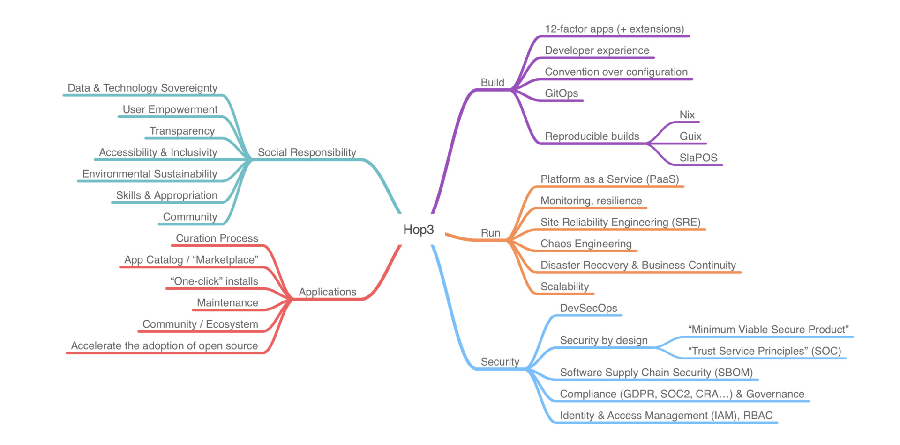
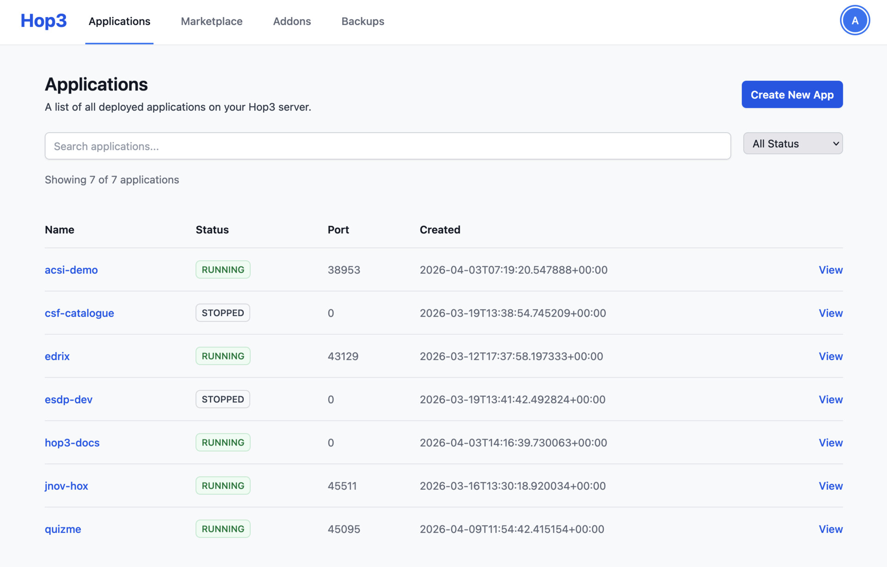
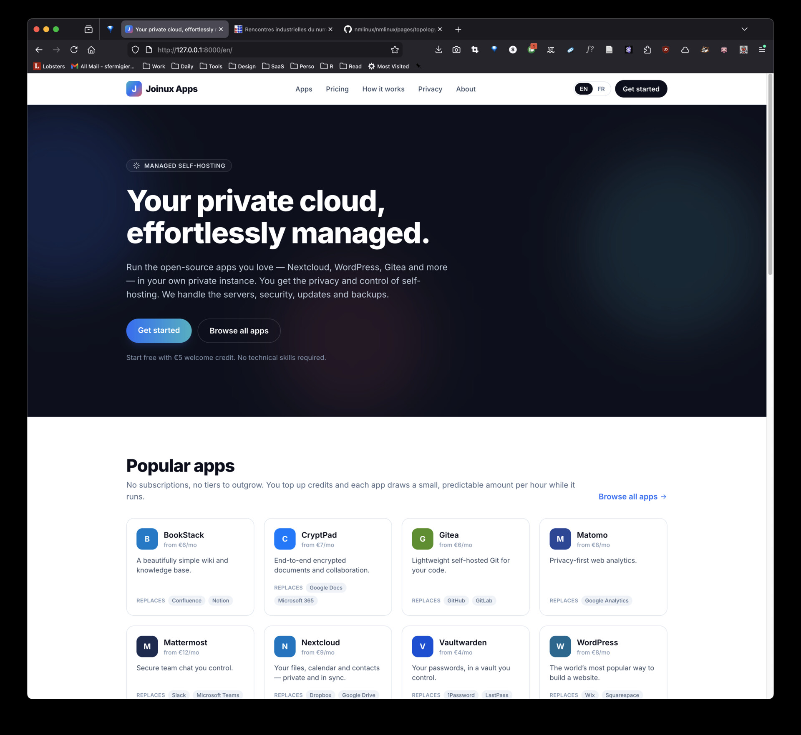

<!-- prezo
time_budget: 10
show_clock: true
show_elapsed: true
-->

# Hop3

## Sovereign, Reproducible Application Deployment

::: spacer 2
:::

::: center
**Stéfane Fermigier — Abilian SAS**
:::

::: spacer 1
:::

::: center
*NGI Zero peer talk — June 2026*

NGI Zero Commons Fund · #2024-04-365
:::

???

Open cold. Grant number visible for the program reps. 30 seconds. Move quickly into the orientation slide, then the framing.

---
# What is Hop3?

::: center
**The push-to-deploy experience of Heroku — on infrastructure you own.**
:::

- **Push to deploy** — `git push` or `hop3 deploy` and your app is live: built, reverse-proxied, TLS, backups. No DevOps team, no YAML.
- **Your server, your data** — no hyperscaler lock-in, no per-seat SaaS tax, nothing phones home.
- **Any app, one command** — your own code, or one-click installs from an open **catalogue** *(in progress)*.
- No Kubernetes. No mandatory Docker. No cluster (yet?).

::: center
**Why now:** rising SaaS bills, vendor lock-in and digital-sovereignty rules are pushing workloads back on-prem.
:::

???

Orientation slide — deliver it as a pitch. The top and bottom lines do *different* jobs, by design: the top is the **product promise** (Heroku-grade DX, but the infra is yours); the bottom is the **why-now** — the market is already moving this way (cloud-cost repatriation, vendor-lock-in fatigue, EU digital-sovereignty / GDPR mandates). Say what it is, then why the timing is right.

Mechanics, only if asked: `git push` (developer) or one-click install from a **catalogue** of pre-packaged app profiles (operator — the catalogue subsystem is post-NGI / 0.6; the 57-app catalogue exists today). Self-hosted, no phone-home, no cluster needed. What the NGI grant funded is its own slide later — don't pre-empt it.

Reality check for this room: the DX and the thesis are real; **paying users are not here yet** (that's the business-model slide). Don't imply traction you don't have — VCs will probe it.

~30 seconds. Land the headline and the closing tension line; move on.

---

???

The Hop3 concept map — the whole scope at a glance: **Build · Run · Security**, plus **Applications** (catalogue / one-click) and **Social Responsibility** (sovereignty, inclusivity, sustainability). Use it to show Hop3 is more than a deploy tool — it's a take on sovereign self-hosting. Don't read every branch; point at Build / Run / Security and move on.

---

???

The actual web UI — deployed apps with live status, ports, one-click "Create New App", plus Marketplace / Addons / Backups tabs. Concrete proof it's a real product, not slideware (screenshot from a running instance). Let it speak; a few seconds is enough.

---
# Architecture : Backend-agnostic, all the way down

Every layer is a plugin you can swap — and each row composes independently of the others:

| Layer       | Plugin choices   (currently)                    |
|-------------|-------------------------------------------------|
| Build       | Native · Docker · Nix                           |
| Toolchains  | 12 languages (Python, Node, Ruby, Go, Rust, …)  |
| Runtime     | uWSGI · static · containerized                  |
| Proxy       | Nginx · Caddy · Traefik                         |
| Addons      | Postgres · MySQL · Redis · BLOB-storage ("S3")  |
| OS          | Debian-family · Red Hat-family                  |

::: center
Adding a language is a toolchain. Adding a backend is one engine, twelve languages.
:::

???

The "what is it / git push / Heroku" pitch now lives on slide 2 — don't repeat it here; go straight to the table.

Read the table top to bottom. This is the structural claim of the project: every layer is an independent plugin axis. The orthogonality is what lets us claim "57 apps packaged" with a straight face — each new app probes a single row, not the whole grid.

---
# What NGI funded

One project — *Nix Integration for Hop3* — five work packages, three thrusts:

::: columns
::: column

::: box "Nix — build → runtime"

Reproducible **builds** *and* reproducible **runtimes** — an app's build and its running environment, both verifiable.

*Work packages T1 + T2*
:::

:::
::: column

::: box "Security & resilience"

Backing services, backups, network firewall + WAF, a web UI, and a redesigned CLI.

*Work package T3*
:::

:::
::: column

::: box "Apps & dissemination"

**20 real F/OSS apps** as the test bed — plus docs, a paper, and talks like this one.

*Work packages T4 + T5*
:::

:::
:::

::: center

**40 apps packaged** · **8 Nix templates** · **4 addons** · **1 WAF**

:::

???

The grant is formally **five** work packages (T1–T5) — too many to show this early, so they're condensed into three thrusts that match the annex's own framing:

- **Nix, build → runtime** = T1 (build plugins) + T2 (runtime). The core deliverable: reproducible builds *and* reproducible runtimes.
- **Security & resilience** = T3: backing-service addons (Postgres / MySQL / Redis / S3), backups, network firewall + WAF, the web UI, and the CLI redesign.
- **Apps & dissemination** = T4 (package 20 F/OSS apps as the test bed) + T5 (website, docs, the paper, talks like this one).

Keep this slide high-level. The technical detail — templates, `runtime.json`, `hop3-rootd`, ADR numbers — belongs in the lessons and the deep-dive material, not here. Read the stats line as proof; don't elaborate unless asked.

If the WAF comes up: it **implements the OWASP Core Rule Set** — do not call it "Coraza-based."

Numbers: 57 apps = 32 hand-crafted `hop3.nix` + 25 template-generated; the formal T4 target was 20 apps, comfortably exceeded.

---
# Two spin-off projects

Reusable on their own — each with a different tie to the grant:

::: columns
::: column

::: box "LeWAF"

*NGI-funded*

Python Web Application Firewall

- OWASP Core Rule Set
- 1,258 tests · Apache 2.0
- Drop-in middleware for any Python web app

:::

:::
::: column

::: box "Validoc"

*NGI-adjacent — built to ship a deliverable*

Documentation testing

- Annotated markdown becomes runnable tests
- Catches doc rot at CI time
- "The tutorial *is* the test"

:::

:::
:::

???

Two reusable releases, with different ties to the grant — be precise, the audience are program reps: **LeWAF was NGI-funded**; **Validoc is NGI-adjacent** — built to ship a funded deliverable (doc / tutorial testing), but it stands alone. Don't let "spin-off" blur into "all NGI-funded."

(Punix — the third spin-off — now lives on the Future-work slide, so it's mentioned once, in context.)

Link to watch for: **LeWAF is the WAF that fulfils Hop3's T3 firewall deliverable** (the "What NGI funded" slide). Same code, two roles — a standalone Python library *and* Hop3's integrated WAF. If someone asks "is the WAF part of Hop3 or a separate project?", that's the answer.

---
# Testing — how the platform earns trust

A platform makes a promise on every deploy. Making good on that promise was one of the two largest sustained efforts of the grant — alongside Nix reproducibility — and it runs at two altitudes.

::: columns
::: column

::: box "Code-level pyramid · ~2,000 tests"
- **Unit** — functions & classes, deps mocked
- **Integration** — real in-memory DB, HTTP client
- **System** — full server + CLI in Docker
- **E2E** — complete deploy workflows
:::

:::
::: column

::: box "System-level harnesses"
- **`hop3-test`** — deploy real apps to Docker / SSH / Hetzner, verify HTTP + logs
- **App corpus** — 169 apps × {native · docker · nix · nix-gen}, **+12 negative cases**
- **Docs-as-tests** — 10 tutorials run via **Validoc** · 58 demos
:::

:::
:::

::: center
Fast (?) tests on CI · E2E + multi-distro nightly (hours).

**Packaging an app *is* a test — each real one finds an edge the synthetic fixtures never hit.**
:::

???

This is the slide where the testing effort becomes legible. Two altitudes is the structuring idea: the pytest pyramid checks the code; the deployment harnesses check the *promise* — that a real app, on a real OS, behind a real proxy, actually serves traffic.

Numbers are defensible from the repo, but lead with the shape, not the count. ~2,000 pytest functions across the packages (unit + integration + system + E2E). `hop3-test` is its own CLI and framework (`packages/hop3-testing`) — it deploys Hop3 to a target, then deploys apps and curls them; targets are Docker, SSH and Hetzner Cloud.

The corpus line ties back to packaging-as-validation: 169 real apps packaged across four build variants, **plus** a `bad/` tree of apps that are *expected to fail* — negative tests that prove the error paths fire. Validoc is the "the tutorial is the test" mechanism: tutorial markdown code blocks are executed as tests, so doc rot fails CI.

The closing line's real point: packaging *real* apps surfaces edges that toy fixtures never reach — that's why we do it (system-validation, not a feature checklist). When one *does* fail, triage which layer broke — a **platform** gap (missing toolchain, inexpressible config, opaque error), a **packaging** mistake (the `hop3.toml` / `hop3.nix` profile we wrote is wrong, platform fine), or the **app / upstream** itself (archived, incompatible licence, no frontend → `bad/*/DEFERRED.md`). Avoid "platform bug, not app bug" — it ignores packaging and overclaims; and avoid "most failures are ours," which is just a tautology (we wrote the packaging).

Three app numbers appear across the deck and they measure different things — be ready to reconcile them if asked: **57** (the NGI-funded slide) is the Nix-packaged grant deliverable; **40** (the "Where we are" slide) is distinct real-world apps with smoke tests; **169** (this slide) is total entries across all four build variants, where each variant counts separately. Same apps, different denominators — not a contradiction. Confirm the exact figures against the catalogue before presenting; they drift as apps land.

If asked "why so much testing for a one-server PaaS?" — because the whole sovereignty claim is empty if you can't *reproduce and verify* what you deployed. Testing is where auditability and reproducibility stop being slogans.

---
# Where we are

**v0.3** (Jun 2025) → **v0.4** (Mar 2026) matured the plugin architecture. The **v0.4 → v0.5** cycle (tagged this week) was load-bearing *trust* work — reproducibility, a real privilege boundary, security, testing — not feature polish.

::: columns
::: column

**Tagged · v0.5**

- T1 (Nix build) and T2 (Nix runtime)
- T3 (Security & Resilience): mostly delivered
  - Addons, backups, WAF, firewall, `hop3-rootd`, system testing
  - Web UI: shipped, under final review
- 40 "real worlds" apps packaged with smoke tests
- Three internal security audits
- 42 ADRs, 1 tech report, 10 blog posts, 3 slide decks

:::
::: column

**Still in flight**

- Final 0.5 blog post + release announcement
- Real-world tests of 20 of the apps
- The "marketplace"
- Web-UI and CLI UX reviews
- NGI external audit hand-off
- Wrap-up the remaining tasks in June (-> 0.6)

:::
:::

???

This slide now also carries the old "feature-complete is not done" lesson — the framing line *is* the lesson: v0.3 (Jun 2025) → v0.4 (Mar 2026) matured the plugin architecture; the v0.4 → v0.5 cycle was dominated by Nix reproducibility (~40% of effort) and testing / real-app validation (~47%), with security and the privileged-ops daemon on top — trust work, not polish. v0.3 → v0.5 spans about a year. Narrate what the year went into; don't bill it as a "lessons" slide.

v0.5 is tagged and the bulk of NGI T1/T2/T3 is delivered — but several items are still open, and the slide says so. The in-flight column: real-world (under-load) tests of ~20 apps, the app marketplace, the web-UI and CLI UX review passes, the NGI external-audit hand-off, and a June wrap-up of the remaining tasks rolling into 0.6.

The two app numbers on this slide measure different things: the left column's **40** are packaged with smoke tests (CI-green); the right column's **20** are the subset getting real-traffic validation — the same corpus as the empirical evaluation. Say "smoke-tested" vs "real-world-tested" out loud so it doesn't read as a regression.

Don't claim "all deliverables landed" — it isn't true yet and the audience can check. The lead line is the credibility beat: the v0.5 tag slipped twice, both times for security findings that mattered. Date discipline is not the same as ship discipline.

---
# Future work — three directions

::: columns
::: column

::: box "Federated agents"

The obvious next step: from one sovereign node to a fleet.

**Promise Theory** (Burgess) as the formal frame — each node cooperates through *voluntary* promises under degraded connectivity, not imposed orchestration.

Sketched in paper §7.4.

:::

:::
::: column

::: box "Punix"

*Long-shot.* A multi-backend builder and deployer inspired by the Nix correctness model.

`+` Core based on the **inheritance-calculus** — composition is commutative, idempotent, associative.

One spec → build → systemd / launchd / docker-compose / SSH.

:::

:::
::: column

::: box "Collaborative R&D"

Joint EU projects on sovereign **cloudm, edge & IoT** infrastructure and applications.

One bid in (JumpGATE, Horizon Europe — *low odds*); we want more like it.

The vehicle to fund and validate the fleet work with partners.

:::

:::
:::

::: center
*None of these is funded yet — NGI funded some of the foundations they build on.*
:::

???

Three concrete next directions, two named theoretical frameworks — and one thing to say plainly: **none of this is financed.** The audience funds research for a living; pretending a submitted proposal is secured money reads as naive at best.

Federated agents — the **most obvious / natural** next step, so lead with it: one node → a fleet. Promise Theory (Burgess) is the chosen formal frame for fleet-level autonomy (voluntary promises, not imposed orchestration). Not built yet; §7.4 sketches it.

Punix — flag it as the **long-shot** of the three. Inheritance calculus; background papers "A Calculus of Inheritance" and "The Monotonicity Frontier". Composition is CIA (commutative, idempotent, associative), so the overlay-ordering bug class is gone by construction. Real idea, but speculative and unfunded — don't oversell it.

Collaborative R&D — a *direction*, not a specific win. The domain is **edge & IoT** sovereign infrastructure — that's the point of JumpGATE (Horizon Europe; Lojika coordinating, Abilian on packaging), one submitted bid with **low odds**. Name it as an example, not a headline; we want Hop3 in more such projects. Nothing awarded; don't imply funding.

---
# Business model

Open source today; the commercial side is still ahead of us. Three models we'd weigh once (if?) we get traction:

::: columns
::: column

::: box "Service"

Support, integration & deployment around the kernel — Abilian's existing consulting model.

Best fit: public sector & regulated orgs where sovereignty is a *procurement requirement*.

:::

:::
::: column

::: box "Subscription"

Access to a marketplace of premium apps — **plus** CRA (Cyber Resilience Act) compliance, security updates and SLAs.

Recurring revenue, not project-by-project.

:::

:::
::: column

::: box "SaaS marketplace"

A hosted product sold under **its own brand** — Hop3 is the underlying tech.

Already designed — mockup on the next slide.

:::

:::
:::

???

These are directions, not a plan — and it's premature to rank them or talk about which "wins" or scales, because we're **pre-traction**. Don't get ahead on this slide. If asked directly about users or revenue, be straight (it's early; nothing pays yet), but don't lead with it. The three:

- **Service** — support / integration / deployment; Abilian's consulting model. Near-term, doesn't scale on its own. Buyers: sovereignty-as-procurement (public sector, regulated).
- **Subscription** — a recurring tier bundling access to a (premium) marketplace with **CRA** (EU Cyber Resilience Act) compliance, security updates and SLAs. For many businesses the compliance guarantee is the real hook, not the apps.
- **SaaS marketplace** — a hosted product under its *own brand*, Hop3 as the underlying tech. Not hypothetical: a polished landing-page mockup already exists (next slide), so don't call it far-off. The three models aren't exclusive — a company can run all three.

Keep grant / consortium funding off this slide — that's Future work. Grants fund R&D, not a business.

Confirm before presenting: what the subscription's "marketplace" actually contains (premium / not-yet-public apps?) and how it relates to the *free* Hop3 catalogue. I've described it as premium access — correct me if that's wrong.

---

???

The SaaS marketplace — full-page mockup, shown without commentary; let the screenshot speak. It's concrete proof the commercial direction is real: a working landing page for the branded SaaS ("Joinux Apps" in the mock — brand not final). Hop3 is the engine; sold as *managed self-hosting*, credit-based pay-per-app-hour, "replaces Google Docs / GitHub / Notion …". This is why "furthest from today" was wrong.

The **Hop3 marketplace** (the free, self-host catalogue) shares this look & feel — its screenshot can get the same full-page treatment when ready.

Layout: `![bg fit]` shows the whole page scaled to the slide; switch to `![bg]` for edge-to-edge. Renders in the PDF/HTML export even if the terminal shows a placeholder.

---
# What works — and what's next

::: columns
::: column

::: box "What works (by the close of NGI)"

- It's **real and in use** - we run our own production apps on Hop3.
- The method: package real software → it surfaces the gaps → fix the platform.
- A usable, trustworthy platform - not just a prototype.
- **Tens of applications**

:::

:::
::: column

::: box "What's next"

- **Branding · marketing · communication** - we built it; now we have to make it known.
- **Adoption** - the first external users (today, we're user zero).
- **Revenue** - service, subscription, or a branded SaaS marketplace (prior slide) - once there are users.
- **Federation** - the longer, research horizon.

:::

:::
:::

::: center
Hop3 is real and runs today. The open question was never the idea — it's **adoption, then revenue.**
:::

???

Two-part close, by request: **what works** (high-level — the *idea* and the *method*, not the feature list) and **what's next**.

"What works": there's no "bet" here — the concept was sound from day one; a single sovereign server is obviously useful. What's new is that it's **real and in use** (we're our own production user) and that the package-real-apps method works. By the close of NGI it's a usable platform, not a prototype. Don't re-list Nix / WAF / addons.

"What's next" is the open question: **adoption / traction first, then revenue.** The next move is non-technical — **branding, marketing, communication** — to turn "it works" into external users. Revenue has three candidate shapes (prior slide): service, subscription, a branded SaaS marketplace. **Federation** is the only true longer / research-horizon item here. Headlines only.

Don't conflate the two "marketplaces": the **Hop3 marketplace** is the *free* catalogue of app profiles for your own server (no money) — a product feature; the **SaaS marketplace** (prior slide) is a *hosted, branded* commercial product. Different things.

Land the closing line and stop: the idea was never in doubt — adoption is. Take questions.

---
# Thank you

::: spacer 2
:::

::: columns
::: column

**Hop3**

github.com/abilian/hop3

hop3.cloud

:::
::: column

**Adjacent projects**

LeWAF · Validoc · Punix (soon)

on the Abilian SourceHut and GitHub

:::
:::

::: spacer 2
:::

::: center
**NGI Zero Commons Fund · #2024-04-365**

*Questions?*
:::

???

Have an asciinema demo cued as a fallback to "can you show me?" Do not autoplay anything from this slide.
