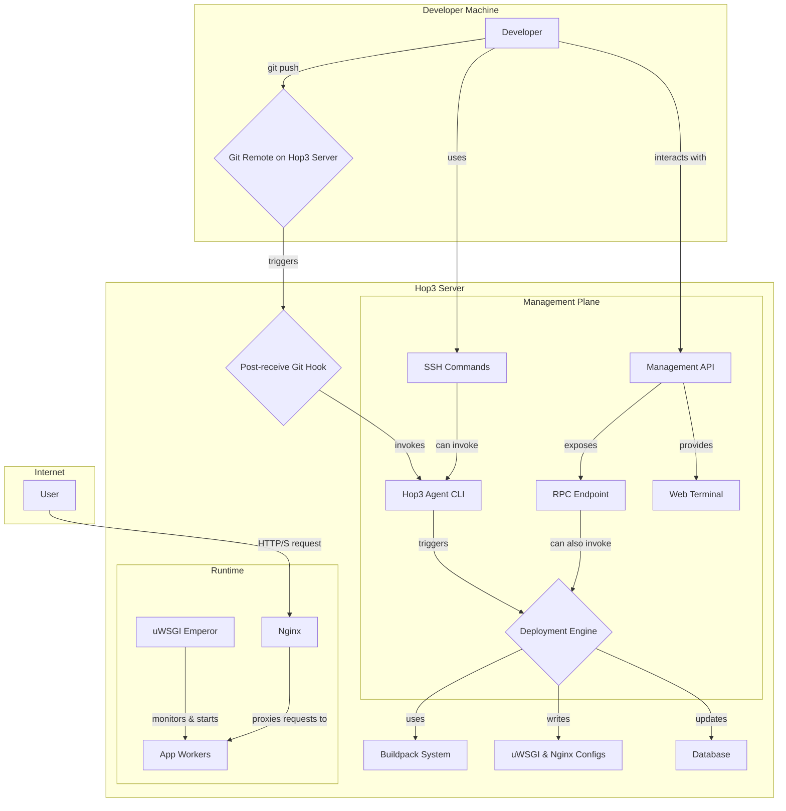

# hop3-server

This subproject provides the main server for the HOP3 project (aka the orchestrator).

It features a Web server that exposes an API used by the CLI.

Optionnally (if extended with the `hop3-web` subproject), it also serves a Web interface.

Note the `hop3-web` is not yet implemented.

This document provides a technical overview of the Hop3 server application. It is intended for developers who want to understand, maintain, or contribute to the project.

## 1. Overview

Hop3 is a lightweight, self-hosted Platform-as-a-Service (PaaS) inspired by Heroku. It allows developers to deploy, manage, and scale applications using a simple `git push` workflow and/or CLI interface. The platform is written in Python and leverages a suite of robust tools like Nginx, uWSGI, and SQLAlchemy.

### Core Features

*   **Git-Push Deployments**: Applications are deployed by pushing code to a Git repository on the Hop3 server.
*   **Automatic Build System**: A buildpack-like system automatically detects the application's language (Python, Node.js, Ruby, Go, etc.) and builds it accordingly.
*   **Process Management**: Manages application processes based on a `Procfile`, similar to Heroku. It supports scaling web workers and running background tasks.
*   **Configuration Management**: Securely manage application-specific environment variables and configurations.
*   **Reverse Proxy & SSL**: Uses Nginx as a reverse proxy, with automated SSL certificate management via Certbot or self-signed certificates.
*   **Database & Addons**: Includes a pluggable architecture for addons, with initial support for PostgreSQL and Redis management commands (currently in development).
*   **Remote Management**: An ASGI-based server provides an RPC endpoint and a web-based terminal for remote management.

## 2. Architecture

Hop3's architecture is composed of several key components that work together to provide a seamless deployment and hosting experience.



### Architectural Flow

1.  **Deployment**: A developer pushes their code to a Git remote URL provided by the Hop3 server.
2.  **Git Hook**: The push triggers a `post-receive` Git hook on the server. This hook pipes the push information to the **Hop3 Agent CLI**.
3.  **Agent CLI (`old_cli`)**: This is the primary workhorse. The `git-hook` command processes the push, identifies the application, and initiates the deployment process.
4.  **Deployment Engine (`hop3.deploy`)**:
    *   It checks out the new code revision into the application's source directory.
    *   It parses the project configuration, including the `Procfile`.
    *   It invokes the **Build System**.
5.  **Build System (`hop3.builders`)**:
    *   It inspects the source code to detect the project type (e.g., checks for `requirements.txt`, `package.json`).
    *   The corresponding builder runs to install dependencies and compile assets (e.g., `pip install`, `npm install`).
6.  **Configuration & Spawning (`hop3.run`)**:
    *   After a successful build, the system generates configuration files.
    *   **Nginx**: A virtual host configuration is created for the application, handling reverse proxying, static file serving, and SSL termination.
    *   **uWSGI**: An `.ini` file is generated for each process type defined in the `Procfile`. These files are placed in `/uwsgi-available` and symlinked to `/uwsgi-enabled`.
7.  **Process Management (uWSGI Emperor)**: The uWSGI Emperor process monitors the `/uwsgi-enabled` directory. When a new app configuration appears, it automatically starts (or restarts) the application's workers.
8.  **Database (ORM)**: The state of each application (name, status, port, environment variables) is persisted in a SQLite database using SQLAlchemy and the `advanced-alchemy` repository pattern.

## 3. Key Components Deep-Dive

### Project Structure

*   `src/hop3/`: The main source code for the Hop3 library.
    *   `builders/`: Contains the language-specific build logic. Each builder implements a common `Builder` interface with an `accept()` and `build()` method.
    *   `commands/`: A newer, class-based command structure for the RPC/API server.
    *   `core/`: Core data structures like `Env` and Git management logic.
    *   `orm/`: SQLAlchemy models (`App`, `EnvVar`) and repositories.
    *   `plugins/`: Extensible functionality. The `nginx` plugin is a core part of the proxy system. `postgresql` and `redis` are placeholders for future addon services.
    *   `project/`: Logic for parsing project-specific files like `Procfile`.
    *   `run/`: Code responsible for spawning and managing runtime processes, primarily by generating uWSGI configurations.
    *   `services/`: Manages system-level services, like the `CertificatesManager` for SSL.
    *   `src/hop3/server/`: A modern, separate ASGI (Litestar) application that provides a management API.
        *   `cli/`: A CLI for managing the Litestar server itself (e.g., `serve`, `routes`).
        *   `views/`: API endpoints, including the `/rpc` endpoint and a WebSocket-based `/terminal`.
*   `tests/`: Unit and integration tests for the platform.
*   `noxfile.py`: CI script for linting and testing using `nox`.
*   `old_cli/`: The legacy/agent command-line interface. This is the core component triggered by Git hooks and SSH commands to manage applications on the server.

### Filesystem Layout

The server's file structure is defined in `src/hop3/config.py` and is crucial to its operation. By default, it is rooted at `/home/hop3` (or `/tmp/hop3` in tests).

```
/home/hop3/
├── apps/
│   └── <app_name>/
│       ├── git/          # Bare git repository for the app
│       ├── src/          # Checked-out source code
│       ├── data/         # Persistent data directory
│       ├── log/          # Log files for each worker
│       ├── venv/         # Python virtualenv or other language-specific env
│       ├── ENV           # App-specific environment variables file
│       └── SCALING       # Worker scaling configuration
├── nginx/                # Nginx virtual host configs and SSL certs
├── uwsgi/                # uWSGI emperor configuration and logs
├── uwsgi-available/      # Generated uWSGI configs for app workers
├── uwsgi-enabled/        # Symlinks to configs in uwsgi-available
├── acme/                 # Root for ACME challenges (Let's Encrypt)
├── cache/                # Nginx cache directory
├── certificates/         # Stored SSL certificates and keys
└── hop3.db               # SQLite database
```

### Command-Line Interface (CLI)

The Server CLI (`src/hop3/server/cli/`):

*   **Purpose**: To manage the management API server itself.
*   **Invocation**: Run manually by a system administrator.
*   **Commands**: `serve` (to launch the API server), `routes` (to list API routes).


## 4. Development and Testing

### Prerequisites

*   Python 3.10+
*   `nox`
*   `make`

### Setup

1.  Clone the repository.
2.  Install dependencies in a virtual environment:
    ```bash
    python -m venv .venv
    source .venv/bin/activate
    pip install -e .[dev]
    ```

### Running Tests

Tests are managed with `nox` and `pytest`.

```bash
# Run all tests against all supported Python versions
nox

# Run tests for a specific Python version
nox -s pytest-3.12

# Run linters
nox -s lint
# or
make lint
```

## 5. Areas for Future Work

*   **Addon Services**: The `postgresql` and `redis` plugins contain CLI stubs but lack implementation. This is a major area for expansion.
*   **Security**: The file `src/hop3/orm/security.py` is commented out, indicating that user and role management for the API is a planned feature.
*   **Web Dashboard**: The foundation with Litestar and a web terminal suggests a full web-based UI could be a future goal.
